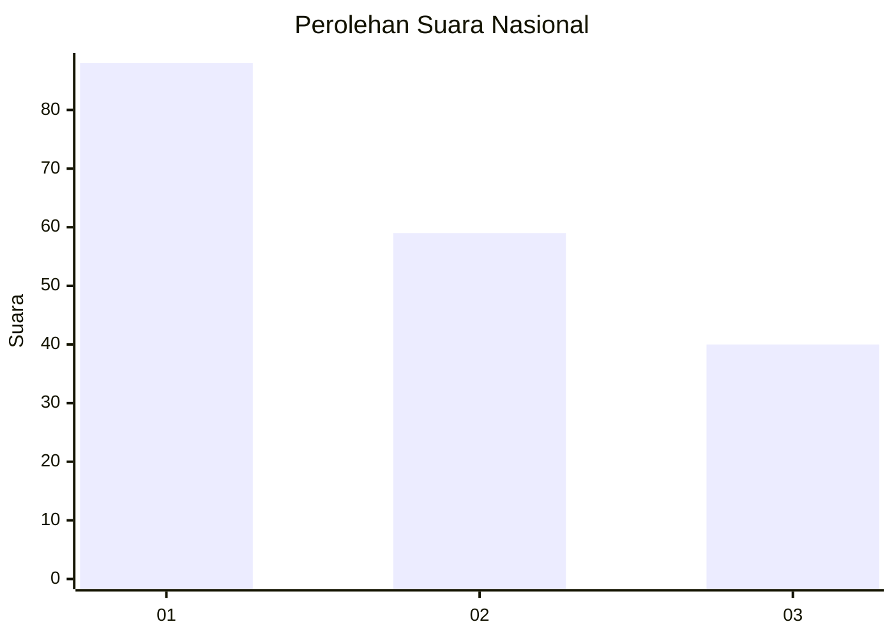
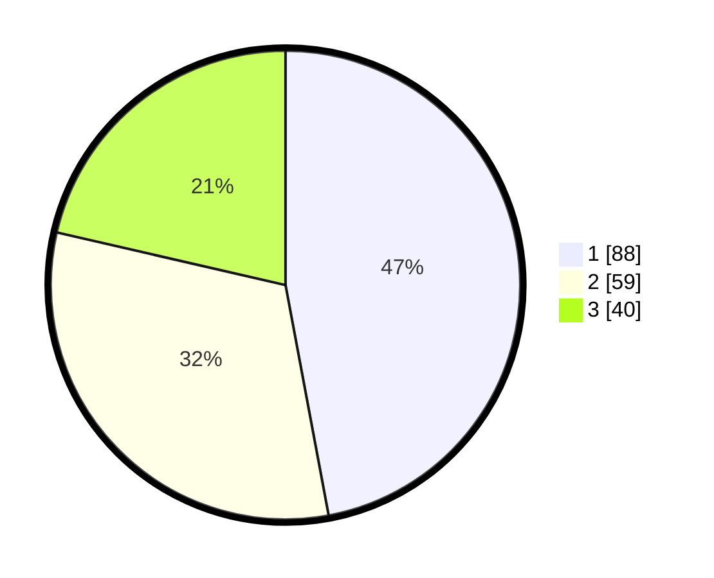

# Hasil

## Grafik

## Tabel

| No.    | Nama Paslon    | Suara | Suara (raw) | Persentase |
|:------ |:-------------- | -----:| -----------:| ----------:|
| 100025 | ANIES MUHAIMIN | 88    | [88][p-1]   | 47,06      |
| 100026 | PRABOWO GIBRAN | 59    | [59][p-2]   | 31,55      |
| 100027 | GANJAR MAHFUD  | 40    | [40][p-3]   | 21,39      |

[p-1]: https://github.com/gigit-pemilu/pemilu-2024/blob/main/pilpres/hitung-suara/sub/31-dki-jakarta/sub/74-jakarta-selatan/sub/01-tebet/sub/1002-tebet-barat/sub/035-tps/sub/paslon-1.txt
[p-2]: https://github.com/gigit-pemilu/pemilu-2024/blob/main/pilpres/hitung-suara/sub/31-dki-jakarta/sub/74-jakarta-selatan/sub/01-tebet/sub/1002-tebet-barat/sub/035-tps/sub/paslon-2.txt
[p-3]: https://github.com/gigit-pemilu/pemilu-2024/blob/main/pilpres/hitung-suara/sub/31-dki-jakarta/sub/74-jakarta-selatan/sub/01-tebet/sub/1002-tebet-barat/sub/035-tps/sub/paslon-3.txt

## Foto C Plano

https://sirekap-obj-formc.kpu.go.id/016a/pemilu/ppwp/31/74/01/10/02/3174011002035-20240214-214638--266fdb8d-2f2c-43aa-87c9-5366a0288f40.jpg

https://sirekap-obj-formc.kpu.go.id/016a/pemilu/ppwp/31/74/01/10/02/3174011002035-20240214-214713--1eaaf44c-3a9e-4473-bf83-853e1c81b303.jpg

https://sirekap-obj-formc.kpu.go.id/016a/pemilu/ppwp/31/74/01/10/02/3174011002035-20240214-204830--9bbb76f1-07eb-4bb2-891d-d85ce32e2064.jpg

## Metadata

| Key        | Value               |
| ---------- | ------------------- |
| Time Stamp | 2024-02-24 22:31:28 |

