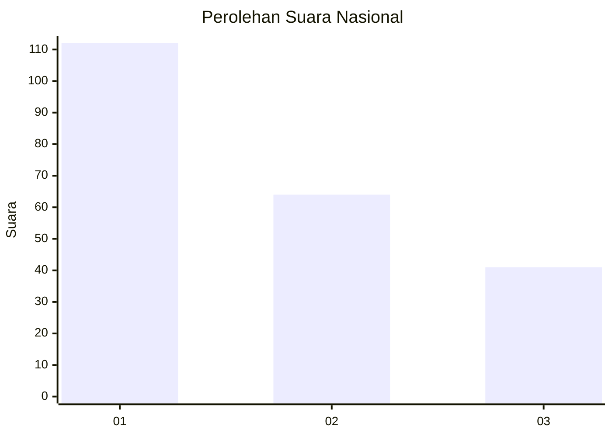
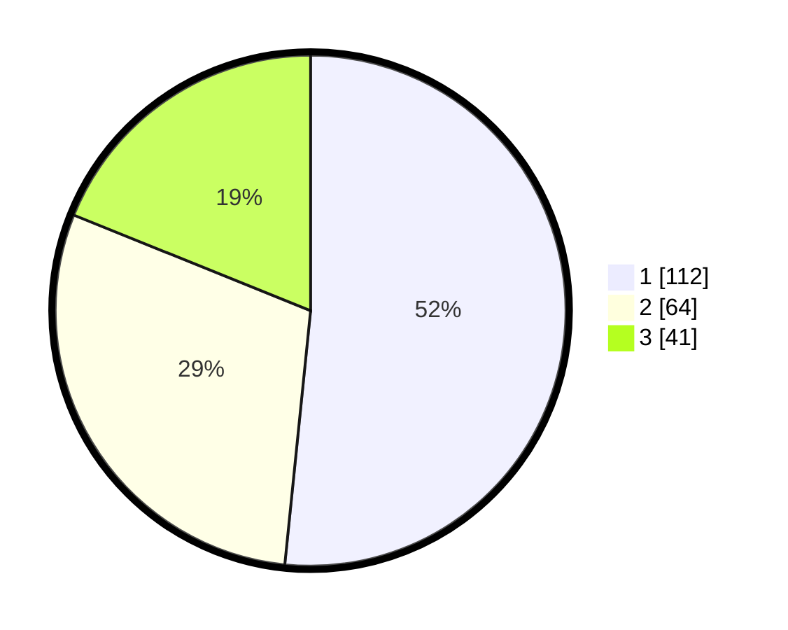

# Hasil

## Grafik

## Tabel

| No.    | Nama Paslon    | Suara | Suara (raw) | Persentase |
|:------ |:-------------- | -----:| -----------:| ----------:|
| 100025 | ANIES MUHAIMIN | 112   | [112][p-1]  | 51,61      |
| 100026 | PRABOWO GIBRAN | 64    | [64][p-2]   | 29,49      |
| 100027 | GANJAR MAHFUD  | 41    | [41][p-3]   | 18,89      |

[p-1]: https://github.com/gigit-pemilu/pemilu-2024/blob/main/pilpres/hitung-suara/sub/31-dki-jakarta/sub/74-jakarta-selatan/sub/01-tebet/sub/1002-tebet-barat/sub/047-tps/sub/paslon-1.txt
[p-2]: https://github.com/gigit-pemilu/pemilu-2024/blob/main/pilpres/hitung-suara/sub/31-dki-jakarta/sub/74-jakarta-selatan/sub/01-tebet/sub/1002-tebet-barat/sub/047-tps/sub/paslon-2.txt
[p-3]: https://github.com/gigit-pemilu/pemilu-2024/blob/main/pilpres/hitung-suara/sub/31-dki-jakarta/sub/74-jakarta-selatan/sub/01-tebet/sub/1002-tebet-barat/sub/047-tps/sub/paslon-3.txt

## Foto C Plano

https://sirekap-obj-formc.kpu.go.id/bae8/pemilu/ppwp/31/74/01/10/02/3174011002047-20240215-150053--fd3e1988-0d0e-4570-b26b-39058204f381.jpg

https://sirekap-obj-formc.kpu.go.id/bae8/pemilu/ppwp/31/74/01/10/02/3174011002047-20240215-152416--9643cc4d-7345-4298-83e9-337c10c9708d.jpg

https://sirekap-obj-formc.kpu.go.id/bae8/pemilu/ppwp/31/74/01/10/02/3174011002047-20240215-152112--759d8e36-aa67-4f11-9082-350978115732.jpg

## Metadata

| Key        | Value               |
| ---------- | ------------------- |
| Time Stamp | 2024-02-25 10:00:00 |

