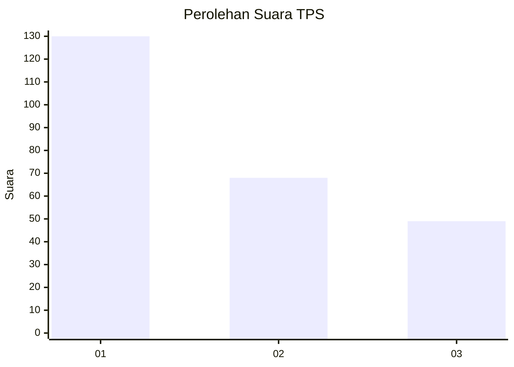
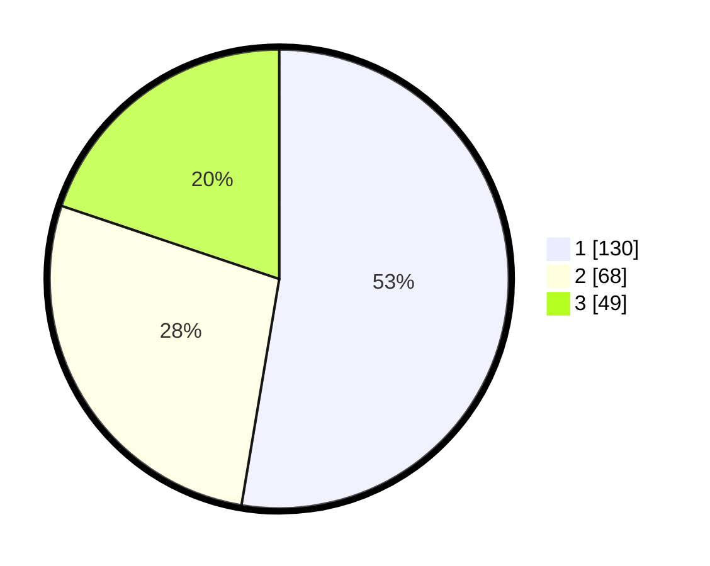

# Hasil

## Grafik

## Tabel

| No. | Nama Paslon    | Suara | Suara (raw) | Persentase |
|:--- |:-------------- | -----:| -----------:| ----------:|
| 1   | ANIES MUHAIMIN | 130   | [130][p-1]  | 52,63      |
| 2   | PRABOWO GIBRAN | 68    | [68][p-2]   | 27,53      |
| 3   | GANJAR MAHFUD  | 49    | [49][p-3]   | 19,84      |

[p-1]: https://github.com/gigit-pemilu/pemilu-2024-31-dki-jakarta/blob/main/pilpres/hitung-suara/sub/31-dki-jakarta/sub/74-jakarta-selatan/sub/01-tebet/sub/1002-tebet-barat/sub/052-tps/sub/paslon-1.txt
[p-2]: https://github.com/gigit-pemilu/pemilu-2024-31-dki-jakarta/blob/main/pilpres/hitung-suara/sub/31-dki-jakarta/sub/74-jakarta-selatan/sub/01-tebet/sub/1002-tebet-barat/sub/052-tps/sub/paslon-2.txt
[p-3]: https://github.com/gigit-pemilu/pemilu-2024-31-dki-jakarta/blob/main/pilpres/hitung-suara/sub/31-dki-jakarta/sub/74-jakarta-selatan/sub/01-tebet/sub/1002-tebet-barat/sub/052-tps/sub/paslon-3.txt

## Foto C Plano

https://sirekap-obj-formc.kpu.go.id/e5b8/pemilu/ppwp/31/74/01/10/02/3174011002052-20240215-221554--ea29aaf1-fd36-44ea-99f3-feb373207339.jpg

https://sirekap-obj-formc.kpu.go.id/e5b8/pemilu/ppwp/31/74/01/10/02/3174011002052-20240215-222256--24699fa1-3276-4a17-814e-00ad24145d03.jpg

https://sirekap-obj-formc.kpu.go.id/e5b8/pemilu/ppwp/31/74/01/10/02/3174011002052-20240215-222406--5d88cf56-f1d9-4b3f-82a4-09e10f939a05.jpg

## Metadata

| Key        | Value               |
| ---------- | ------------------- |
| Time Stamp | 2024-02-17 16:36:25 |

