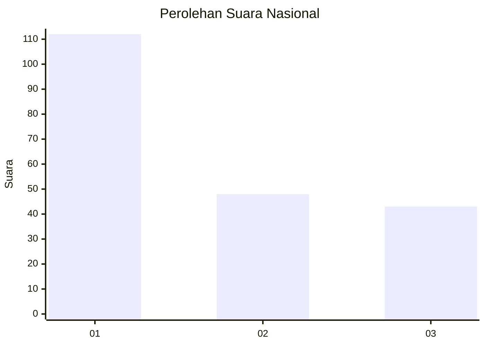
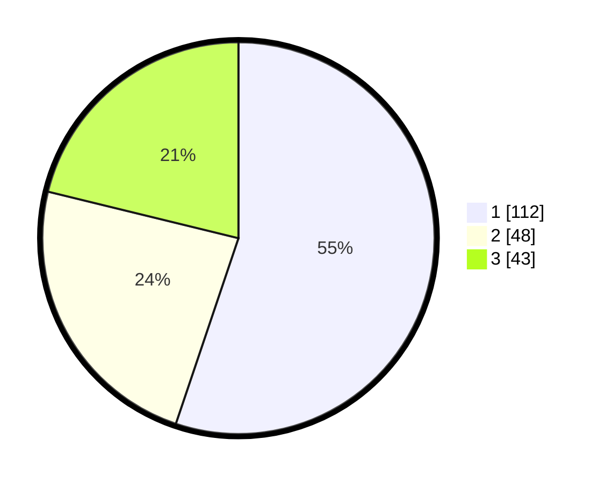

# Hasil

## Grafik

## Tabel

| No.    | Nama Paslon    | Suara | Suara (raw) | Persentase |
|:------ |:-------------- | -----:| -----------:| ----------:|
| 100025 | ANIES MUHAIMIN | 112   | [112][p-1]  | 55,17      |
| 100026 | PRABOWO GIBRAN | 48    | [48][p-2]   | 23,65      |
| 100027 | GANJAR MAHFUD  | 43    | [43][p-3]   | 21,18      |

[p-1]: https://github.com/gigit-pemilu/pemilu-2024/blob/main/pilpres/hitung-suara/sub/31-dki-jakarta/sub/74-jakarta-selatan/sub/01-tebet/sub/1002-tebet-barat/sub/061-tps/sub/paslon-1.txt
[p-2]: https://github.com/gigit-pemilu/pemilu-2024/blob/main/pilpres/hitung-suara/sub/31-dki-jakarta/sub/74-jakarta-selatan/sub/01-tebet/sub/1002-tebet-barat/sub/061-tps/sub/paslon-2.txt
[p-3]: https://github.com/gigit-pemilu/pemilu-2024/blob/main/pilpres/hitung-suara/sub/31-dki-jakarta/sub/74-jakarta-selatan/sub/01-tebet/sub/1002-tebet-barat/sub/061-tps/sub/paslon-3.txt

## Foto C Plano

https://sirekap-obj-formc.kpu.go.id/c966/pemilu/ppwp/31/74/01/10/02/3174011002061-20240214-204942--93a78e7b-84b7-437d-abc4-e319db7870cb.jpg

https://sirekap-obj-formc.kpu.go.id/c966/pemilu/ppwp/31/74/01/10/02/3174011002061-20240214-205155--ac335285-b12e-4473-8e76-8cfdff234bc5.jpg

https://sirekap-obj-formc.kpu.go.id/c966/pemilu/ppwp/31/74/01/10/02/3174011002061-20240214-205318--1939b55c-6675-423d-b4a8-8f7d5d755a78.jpg

## Metadata

| Key        | Value               |
| ---------- | ------------------- |
| Time Stamp | 2024-02-25 16:00:00 |

