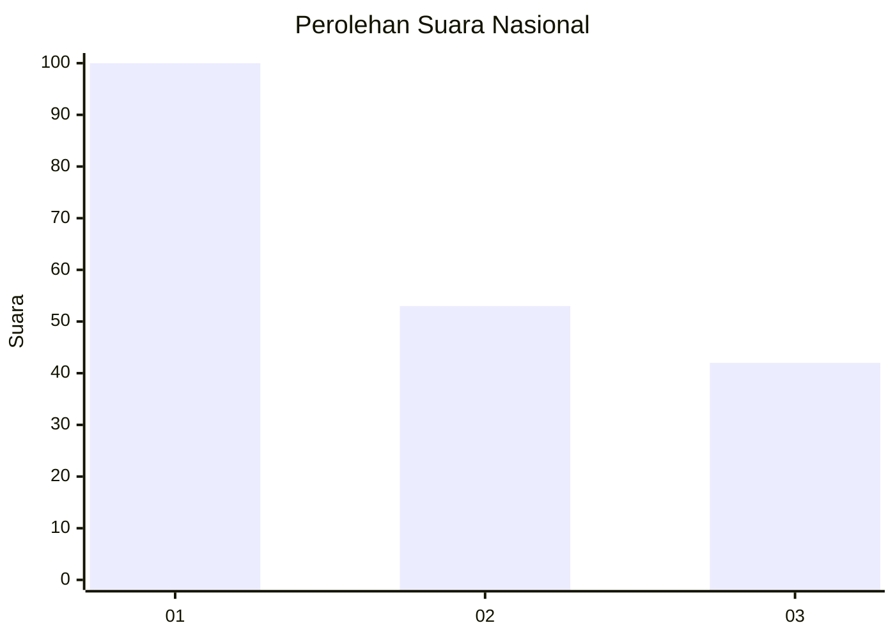
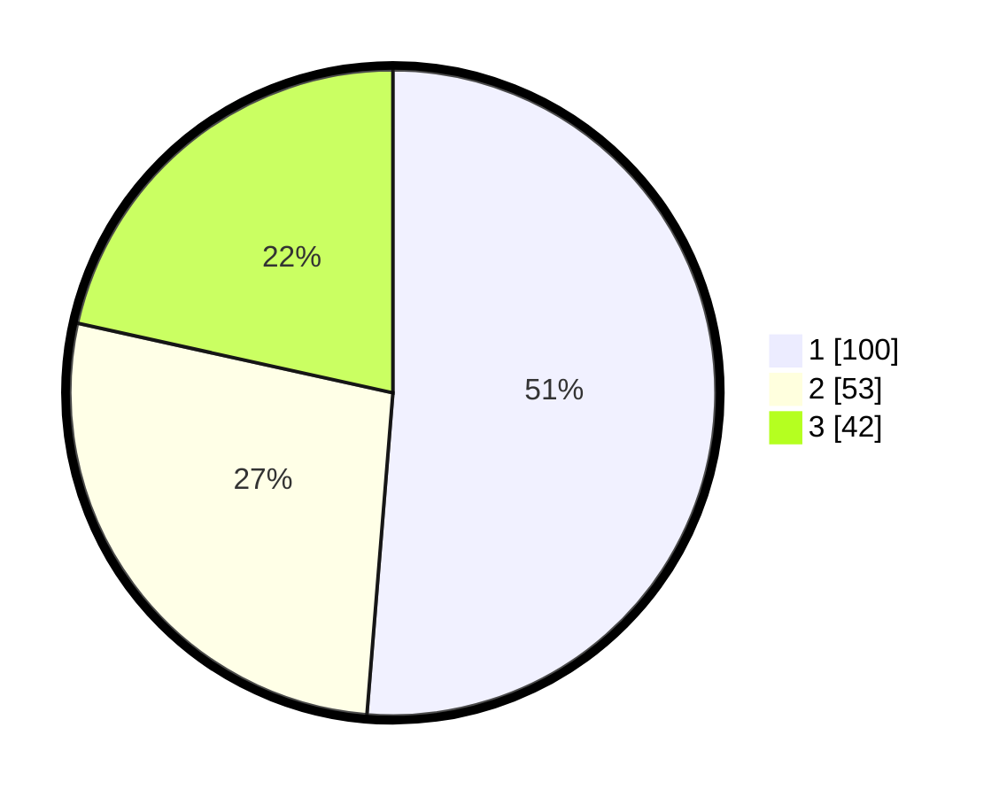

# Hasil

## Grafik

## Tabel

| No.    | Nama Paslon    | Suara | Suara (raw) | Persentase |
|:------ |:-------------- | -----:| -----------:| ----------:|
| 100025 | ANIES MUHAIMIN | 100   | [100][p-1]  | 51,28      |
| 100026 | PRABOWO GIBRAN | 53    | [53][p-2]   | 27,18      |
| 100027 | GANJAR MAHFUD  | 42    | [42][p-3]   | 21,54      |

[p-1]: https://github.com/gigit-pemilu/pemilu-2024/blob/main/pilpres/hitung-suara/sub/31-dki-jakarta/sub/74-jakarta-selatan/sub/01-tebet/sub/1002-tebet-barat/sub/062-tps/sub/paslon-1.txt
[p-2]: https://github.com/gigit-pemilu/pemilu-2024/blob/main/pilpres/hitung-suara/sub/31-dki-jakarta/sub/74-jakarta-selatan/sub/01-tebet/sub/1002-tebet-barat/sub/062-tps/sub/paslon-2.txt
[p-3]: https://github.com/gigit-pemilu/pemilu-2024/blob/main/pilpres/hitung-suara/sub/31-dki-jakarta/sub/74-jakarta-selatan/sub/01-tebet/sub/1002-tebet-barat/sub/062-tps/sub/paslon-3.txt

## Foto C Plano

https://sirekap-obj-formc.kpu.go.id/8583/pemilu/ppwp/31/74/01/10/02/3174011002062-20240214-213100--94b73563-b7c6-48aa-813a-f55bb62e91fa.jpg

https://sirekap-obj-formc.kpu.go.id/8583/pemilu/ppwp/31/74/01/10/02/3174011002062-20240214-213309--43b603d0-d817-4aad-a735-2dc23e5f8902.jpg

https://sirekap-obj-formc.kpu.go.id/8583/pemilu/ppwp/31/74/01/10/02/3174011002062-20240214-213342--5521affc-97a4-42c1-a748-b2bf4be602a7.jpg

## Metadata

| Key        | Value               |
| ---------- | ------------------- |
| Time Stamp | 2024-02-25 11:00:00 |

