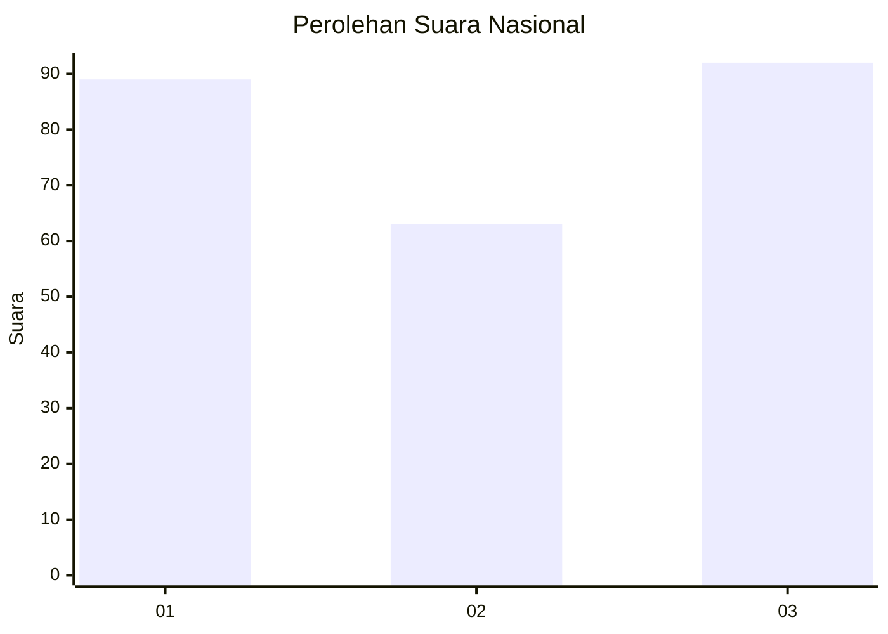
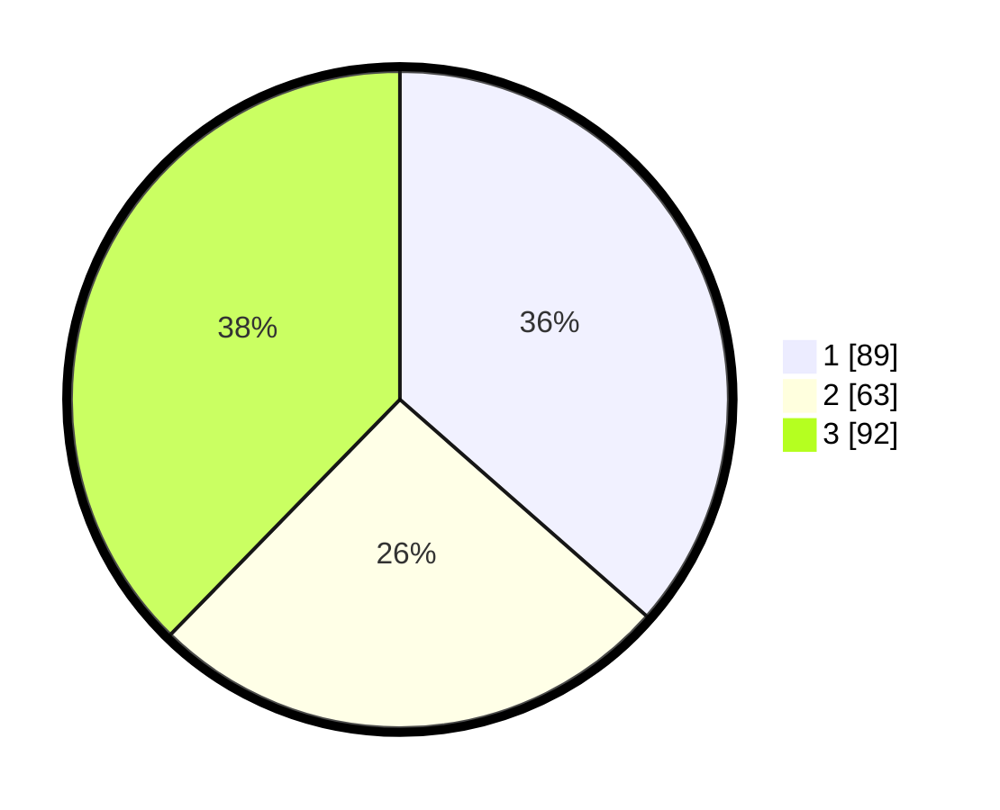

# Hasil

## Grafik

## Tabel

| No.    | Nama Paslon    | Suara | Suara (raw) | Persentase |
|:------ |:-------------- | -----:| -----------:| ----------:|
| 100025 | ANIES MUHAIMIN | 89    | [89][p-1]   | 36,48      |
| 100026 | PRABOWO GIBRAN | 63    | [63][p-2]   | 25,82      |
| 100027 | GANJAR MAHFUD  | 92    | [92][p-3]   | 37,70      |

[p-1]: https://github.com/gigit-pemilu/pemilu-2024/blob/main/pilpres/hitung-suara/sub/31-dki-jakarta/sub/74-jakarta-selatan/sub/01-tebet/sub/1002-tebet-barat/sub/063-tps/sub/paslon-1.txt
[p-2]: https://github.com/gigit-pemilu/pemilu-2024/blob/main/pilpres/hitung-suara/sub/31-dki-jakarta/sub/74-jakarta-selatan/sub/01-tebet/sub/1002-tebet-barat/sub/063-tps/sub/paslon-2.txt
[p-3]: https://github.com/gigit-pemilu/pemilu-2024/blob/main/pilpres/hitung-suara/sub/31-dki-jakarta/sub/74-jakarta-selatan/sub/01-tebet/sub/1002-tebet-barat/sub/063-tps/sub/paslon-3.txt

## Foto C Plano

https://sirekap-obj-formc.kpu.go.id/5901/pemilu/ppwp/31/74/01/10/02/3174011002063-20240214-233649--f57cd81e-8912-40d9-adf3-b1b22d639089.jpg

https://sirekap-obj-formc.kpu.go.id/5901/pemilu/ppwp/31/74/01/10/02/3174011002063-20240214-233741--168657af-83c0-4f08-b701-ce8a246a79fe.jpg

https://sirekap-obj-formc.kpu.go.id/5901/pemilu/ppwp/31/74/01/10/02/3174011002063-20240214-233828--bd792a68-968a-48bf-a5a3-b7f5a0206c3b.jpg

## Metadata

| Key        | Value               |
| ---------- | ------------------- |
| Time Stamp | 2024-02-24 22:31:28 |

