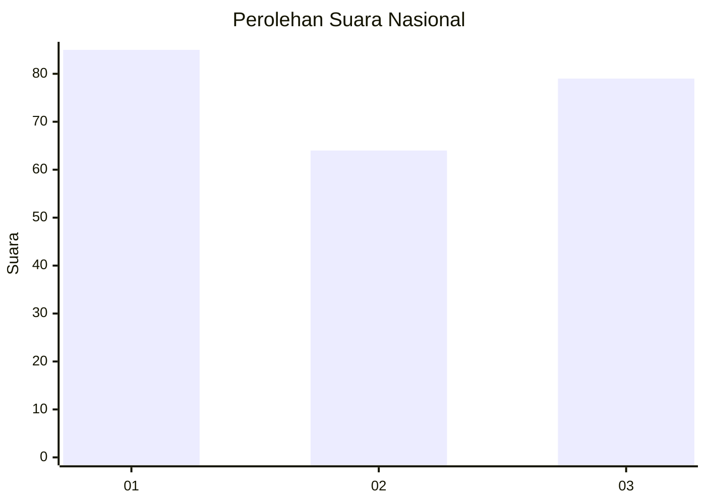
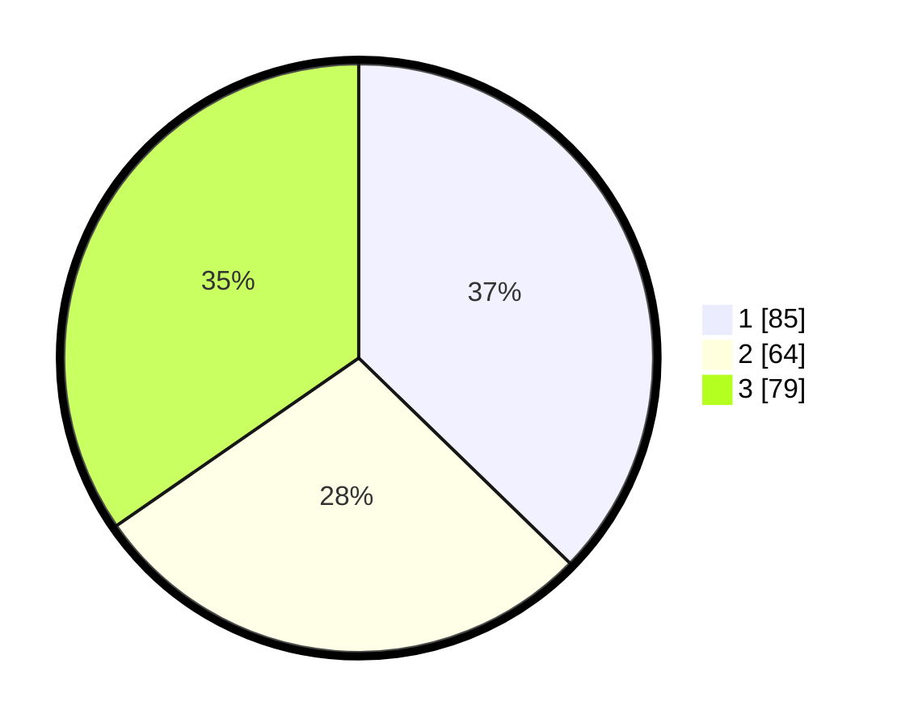

# Hasil

## Grafik

## Tabel

| No.    | Nama Paslon    | Suara | Suara (raw) | Persentase |
|:------ |:-------------- | -----:| -----------:| ----------:|
| 100025 | ANIES MUHAIMIN | 85    | [85][p-1]   | 37,28      |
| 100026 | PRABOWO GIBRAN | 64    | [64][p-2]   | 28,07      |
| 100027 | GANJAR MAHFUD  | 79    | [79][p-3]   | 34,65      |

[p-1]: https://github.com/gigit-pemilu/pemilu-2024/blob/main/pilpres/hitung-suara/sub/31-dki-jakarta/sub/74-jakarta-selatan/sub/01-tebet/sub/1002-tebet-barat/sub/064-tps/sub/paslon-1.txt
[p-2]: https://github.com/gigit-pemilu/pemilu-2024/blob/main/pilpres/hitung-suara/sub/31-dki-jakarta/sub/74-jakarta-selatan/sub/01-tebet/sub/1002-tebet-barat/sub/064-tps/sub/paslon-2.txt
[p-3]: https://github.com/gigit-pemilu/pemilu-2024/blob/main/pilpres/hitung-suara/sub/31-dki-jakarta/sub/74-jakarta-selatan/sub/01-tebet/sub/1002-tebet-barat/sub/064-tps/sub/paslon-3.txt

## Foto C Plano

https://sirekap-obj-formc.kpu.go.id/11e6/pemilu/ppwp/31/74/01/10/02/3174011002064-20240214-214557--4da1ef1e-dbc9-4c97-91f3-8072d18e2c43.jpg

https://sirekap-obj-formc.kpu.go.id/11e6/pemilu/ppwp/31/74/01/10/02/3174011002064-20240214-214820--7dd37998-5db3-4ed1-a442-bebabf632315.jpg

https://sirekap-obj-formc.kpu.go.id/11e6/pemilu/ppwp/31/74/01/10/02/3174011002064-20240214-215105--afe8910e-3d55-4922-aea6-bffce856e5d1.jpg

## Metadata

| Key        | Value               |
| ---------- | ------------------- |
| Time Stamp | 2024-02-25 18:00:00 |

