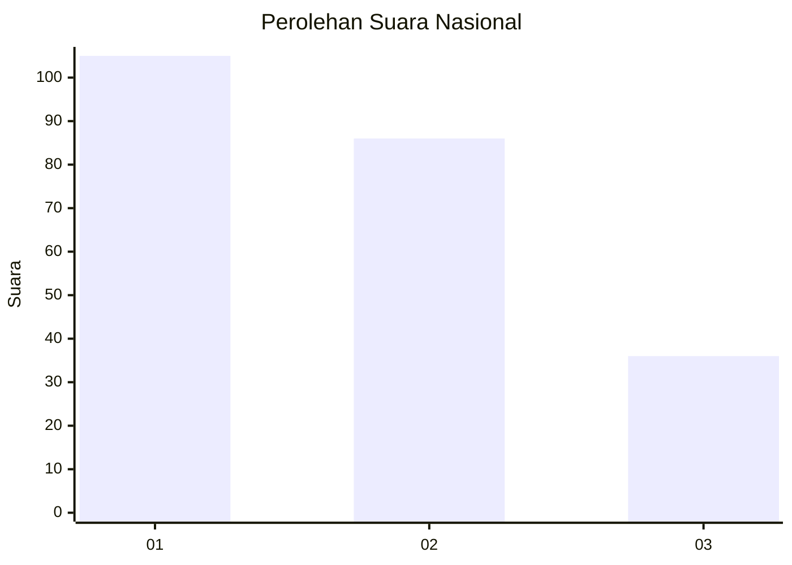
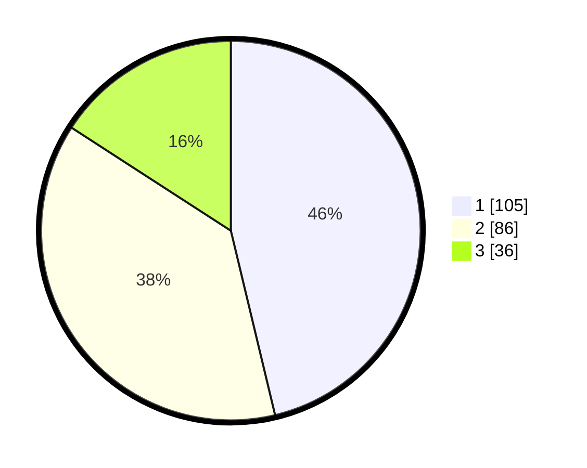

# Hasil

## Grafik

## Tabel

| No.    | Nama Paslon    | Suara | Suara (raw) | Persentase |
|:------ |:-------------- | -----:| -----------:| ----------:|
| 100025 | ANIES MUHAIMIN | 105   | [105][p-1]  | 46,26      |
| 100026 | PRABOWO GIBRAN | 86    | [86][p-2]   | 37,89      |
| 100027 | GANJAR MAHFUD  | 36    | [36][p-3]   | 15,86      |

[p-1]: https://github.com/gigit-pemilu/pemilu-2024/blob/main/pilpres/hitung-suara/sub/31-dki-jakarta/sub/74-jakarta-selatan/sub/01-tebet/sub/1002-tebet-barat/sub/067-tps/sub/paslon-1.txt
[p-2]: https://github.com/gigit-pemilu/pemilu-2024/blob/main/pilpres/hitung-suara/sub/31-dki-jakarta/sub/74-jakarta-selatan/sub/01-tebet/sub/1002-tebet-barat/sub/067-tps/sub/paslon-2.txt
[p-3]: https://github.com/gigit-pemilu/pemilu-2024/blob/main/pilpres/hitung-suara/sub/31-dki-jakarta/sub/74-jakarta-selatan/sub/01-tebet/sub/1002-tebet-barat/sub/067-tps/sub/paslon-3.txt

## Foto C Plano

https://sirekap-obj-formc.kpu.go.id/6425/pemilu/ppwp/31/74/01/10/02/3174011002067-20240215-003934--6a1e7204-42d0-48f6-ac60-7fc1b205b568.jpg

https://sirekap-obj-formc.kpu.go.id/6425/pemilu/ppwp/31/74/01/10/02/3174011002067-20240214-203525--245e801a-1f7d-4ef9-bae8-dca96fb8995f.jpg

https://sirekap-obj-formc.kpu.go.id/6425/pemilu/ppwp/31/74/01/10/02/3174011002067-20240214-200234--c1bdaf07-cd08-499d-8ba8-e61c75f4edc6.jpg

## Metadata

| Key        | Value               |
| ---------- | ------------------- |
| Time Stamp | 2024-02-24 22:31:28 |

