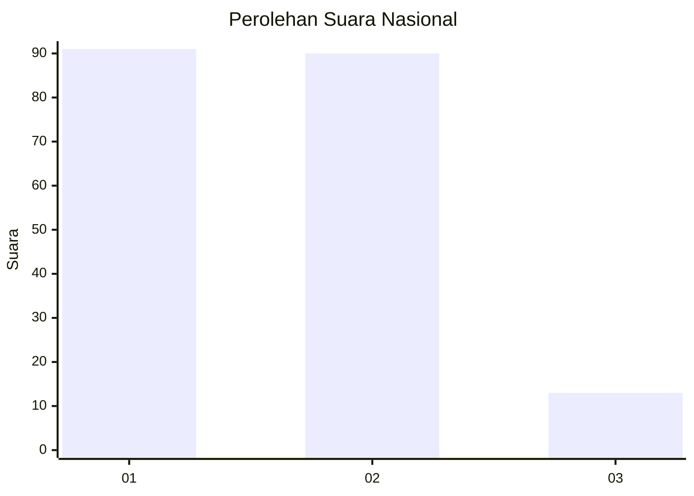
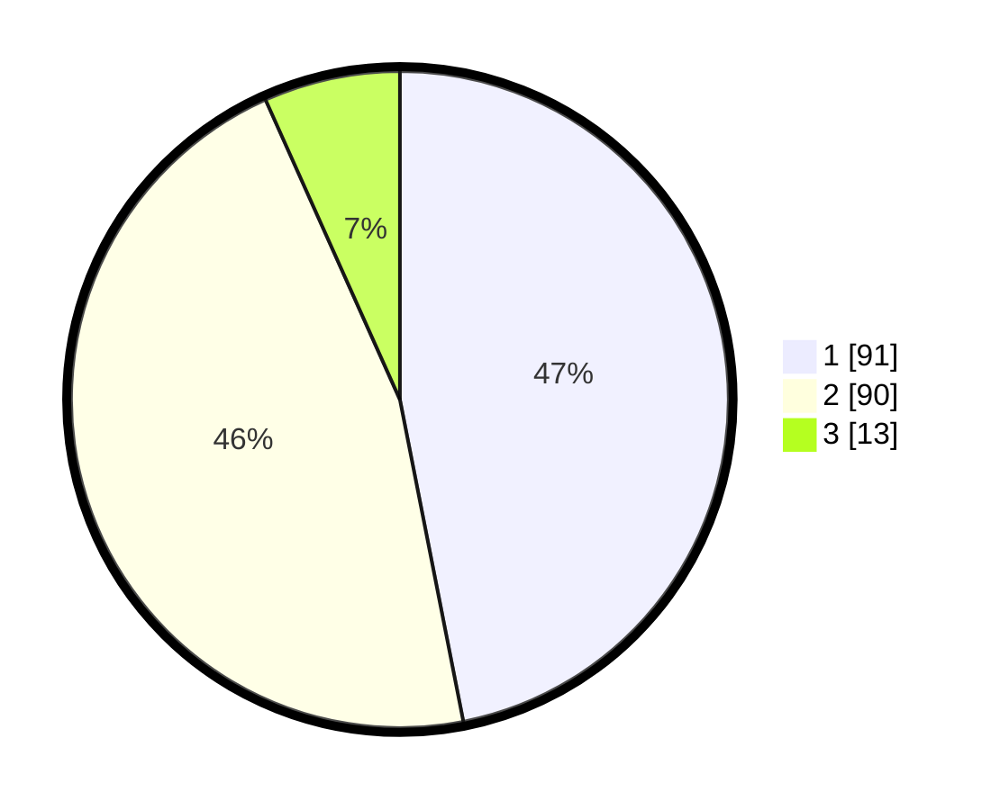

# Hasil

## Grafik

## Tabel

| No.    | Nama Paslon    | Suara | Suara (raw) | Persentase |
|:------ |:-------------- | -----:| -----------:| ----------:|
| 100025 | ANIES MUHAIMIN | 91    | [91][p-1]   | 46,91      |
| 100026 | PRABOWO GIBRAN | 90    | [90][p-2]   | 46,39      |
| 100027 | GANJAR MAHFUD  | 13    | [13][p-3]   | 6,70       |

[p-1]: https://github.com/gigit-pemilu/pemilu-2024/blob/main/pilpres/hitung-suara/sub/31-dki-jakarta/sub/74-jakarta-selatan/sub/01-tebet/sub/1002-tebet-barat/sub/074-tps/sub/paslon-1.txt
[p-2]: https://github.com/gigit-pemilu/pemilu-2024/blob/main/pilpres/hitung-suara/sub/31-dki-jakarta/sub/74-jakarta-selatan/sub/01-tebet/sub/1002-tebet-barat/sub/074-tps/sub/paslon-2.txt
[p-3]: https://github.com/gigit-pemilu/pemilu-2024/blob/main/pilpres/hitung-suara/sub/31-dki-jakarta/sub/74-jakarta-selatan/sub/01-tebet/sub/1002-tebet-barat/sub/074-tps/sub/paslon-3.txt

## Foto C Plano

https://sirekap-obj-formc.kpu.go.id/8502/pemilu/ppwp/31/74/01/10/02/3174011002074-20240214-233350--63660e51-7b51-4fee-8613-2f42b38be990.jpg

https://sirekap-obj-formc.kpu.go.id/8502/pemilu/ppwp/31/74/01/10/02/3174011002074-20240214-233204--ab13ce11-4ae8-431d-b9e6-11d454765605.jpg

https://sirekap-obj-formc.kpu.go.id/8502/pemilu/ppwp/31/74/01/10/02/3174011002074-20240214-233343--aca9a767-698a-4af6-a9db-dc498ad66422.jpg

## Metadata

| Key        | Value               |
| ---------- | ------------------- |
| Time Stamp | 2024-02-26 12:00:00 |

