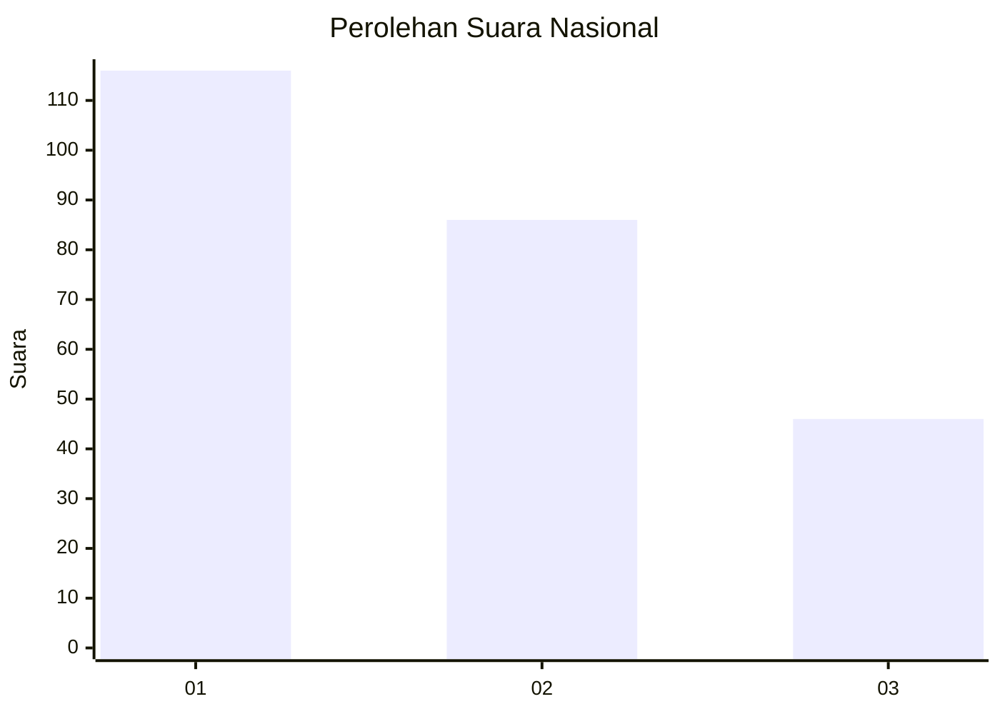
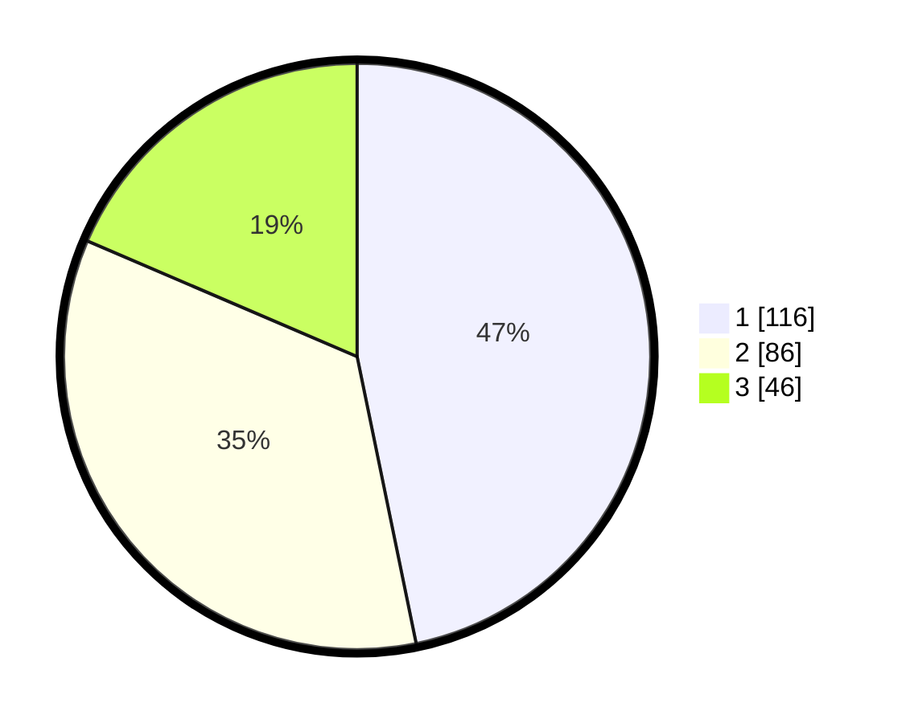

# Hasil

## Grafik

## Tabel

| No.    | Nama Paslon    | Suara | Suara (raw) | Persentase |
|:------ |:-------------- | -----:| -----------:| ----------:|
| 100025 | ANIES MUHAIMIN | 116   | [116][p-1]  | 46,77      |
| 100026 | PRABOWO GIBRAN | 86    | [86][p-2]   | 34,68      |
| 100027 | GANJAR MAHFUD  | 46    | [46][p-3]   | 18,55      |

[p-1]: https://github.com/gigit-pemilu/pemilu-2024/blob/main/pilpres/hitung-suara/sub/31-dki-jakarta/sub/74-jakarta-selatan/sub/01-tebet/sub/1003-menteng-dalam/sub/003-tps/sub/paslon-1.txt
[p-2]: https://github.com/gigit-pemilu/pemilu-2024/blob/main/pilpres/hitung-suara/sub/31-dki-jakarta/sub/74-jakarta-selatan/sub/01-tebet/sub/1003-menteng-dalam/sub/003-tps/sub/paslon-2.txt
[p-3]: https://github.com/gigit-pemilu/pemilu-2024/blob/main/pilpres/hitung-suara/sub/31-dki-jakarta/sub/74-jakarta-selatan/sub/01-tebet/sub/1003-menteng-dalam/sub/003-tps/sub/paslon-3.txt

## Foto C Plano

https://sirekap-obj-formc.kpu.go.id/00ad/pemilu/ppwp/31/74/01/10/03/3174011003003-20240214-234003--46a03b2c-ec06-42ef-8f46-84a087123555.jpg

https://sirekap-obj-formc.kpu.go.id/00ad/pemilu/ppwp/31/74/01/10/03/3174011003003-20240214-233749--27cca346-914d-4f41-bb4c-2224947b7a39.jpg

https://sirekap-obj-formc.kpu.go.id/00ad/pemilu/ppwp/31/74/01/10/03/3174011003003-20240214-234208--3f09e808-3949-4c0f-a73a-debaba7262a4.jpg

## Metadata

| Key        | Value               |
| ---------- | ------------------- |
| Time Stamp | 2024-02-24 22:31:28 |

