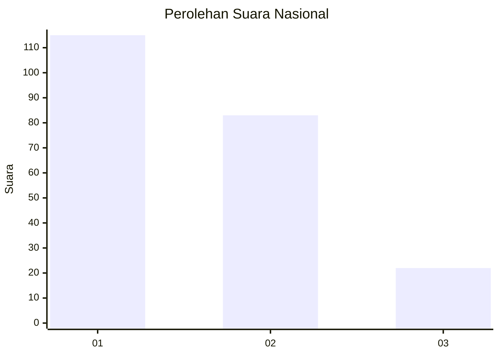
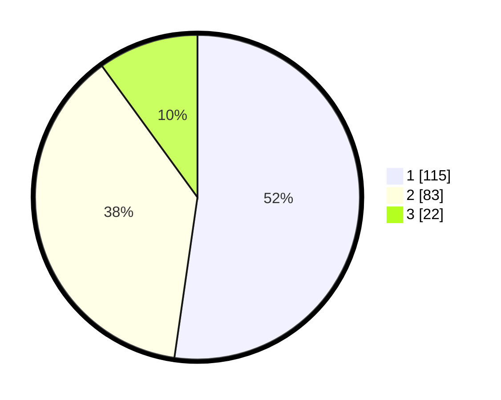

# Hasil

## Grafik

## Tabel

| No.    | Nama Paslon    | Suara | Suara (raw) | Persentase |
|:------ |:-------------- | -----:| -----------:| ----------:|
| 100025 | ANIES MUHAIMIN | 115   | [115][p-1]  | 52,27      |
| 100026 | PRABOWO GIBRAN | 83    | [83][p-2]   | 37,73      |
| 100027 | GANJAR MAHFUD  | 22    | [22][p-3]   | 10,00      |

[p-1]: https://github.com/gigit-pemilu/pemilu-2024/blob/main/pilpres/hitung-suara/sub/31-dki-jakarta/sub/74-jakarta-selatan/sub/01-tebet/sub/1003-menteng-dalam/sub/009-tps/sub/paslon-1.txt
[p-2]: https://github.com/gigit-pemilu/pemilu-2024/blob/main/pilpres/hitung-suara/sub/31-dki-jakarta/sub/74-jakarta-selatan/sub/01-tebet/sub/1003-menteng-dalam/sub/009-tps/sub/paslon-2.txt
[p-3]: https://github.com/gigit-pemilu/pemilu-2024/blob/main/pilpres/hitung-suara/sub/31-dki-jakarta/sub/74-jakarta-selatan/sub/01-tebet/sub/1003-menteng-dalam/sub/009-tps/sub/paslon-3.txt

## Foto C Plano

https://sirekap-obj-formc.kpu.go.id/ef46/pemilu/ppwp/31/74/01/10/03/3174011003009-20240214-190303--3d3ed8ea-eba7-4efa-be62-abccd1c61b77.jpg

https://sirekap-obj-formc.kpu.go.id/ef46/pemilu/ppwp/31/74/01/10/03/3174011003009-20240214-191725--7deafe99-73e8-4342-881f-3a2467db4648.jpg

https://sirekap-obj-formc.kpu.go.id/ef46/pemilu/ppwp/31/74/01/10/03/3174011003009-20240214-191209--a0c8fb9c-6ed9-4f5e-84f3-b44491f78760.jpg

## Metadata

| Key        | Value               |
| ---------- | ------------------- |
| Time Stamp | 2024-02-24 22:31:28 |

