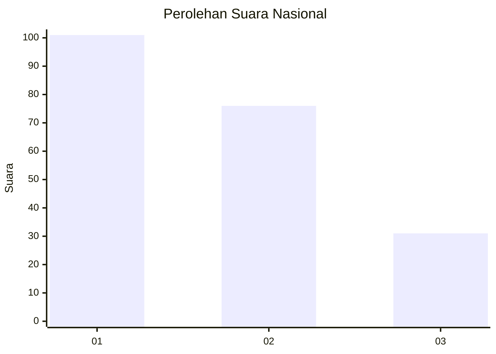
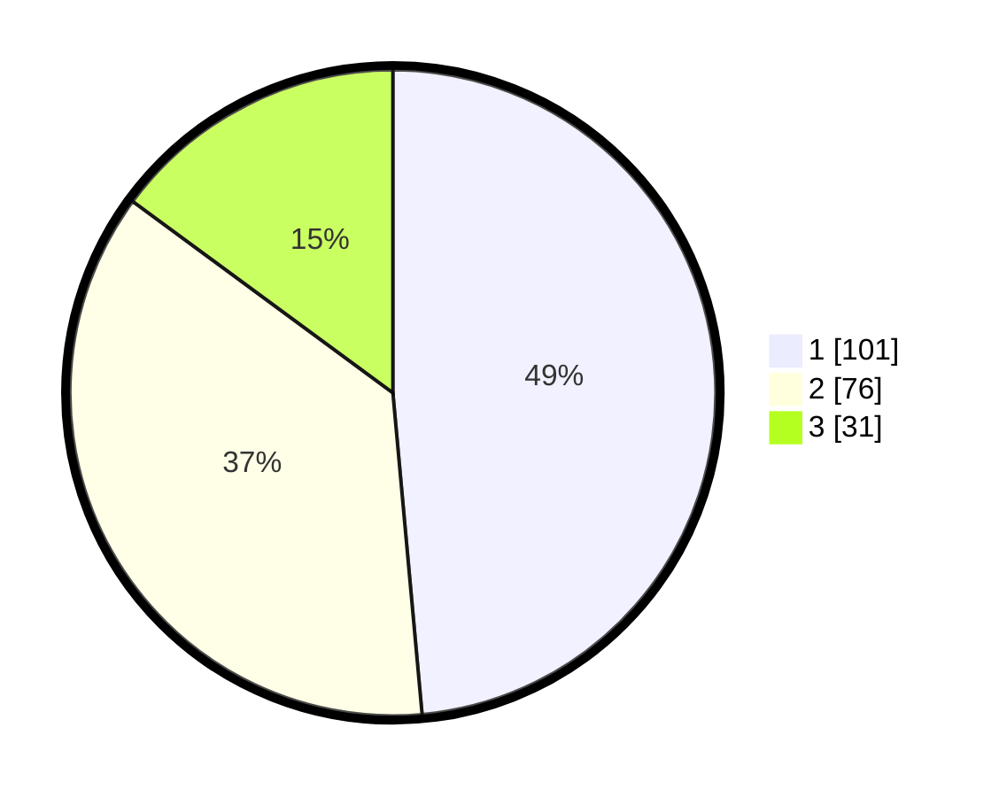

# Hasil

## Grafik

## Tabel

| No.    | Nama Paslon    | Suara | Suara (raw) | Persentase |
|:------ |:-------------- | -----:| -----------:| ----------:|
| 100025 | ANIES MUHAIMIN | 101   | [101][p-1]  | 48,56      |
| 100026 | PRABOWO GIBRAN | 76    | [76][p-2]   | 36,54      |
| 100027 | GANJAR MAHFUD  | 31    | [31][p-3]   | 14,90      |

[p-1]: https://github.com/gigit-pemilu/pemilu-2024/blob/main/pilpres/hitung-suara/sub/31-dki-jakarta/sub/74-jakarta-selatan/sub/01-tebet/sub/1003-menteng-dalam/sub/010-tps/sub/paslon-1.txt
[p-2]: https://github.com/gigit-pemilu/pemilu-2024/blob/main/pilpres/hitung-suara/sub/31-dki-jakarta/sub/74-jakarta-selatan/sub/01-tebet/sub/1003-menteng-dalam/sub/010-tps/sub/paslon-2.txt
[p-3]: https://github.com/gigit-pemilu/pemilu-2024/blob/main/pilpres/hitung-suara/sub/31-dki-jakarta/sub/74-jakarta-selatan/sub/01-tebet/sub/1003-menteng-dalam/sub/010-tps/sub/paslon-3.txt

## Foto C Plano

https://sirekap-obj-formc.kpu.go.id/87a4/pemilu/ppwp/31/74/01/10/03/3174011003010-20240215-043845--354d5803-3213-458e-bd3b-6447f94e69e0.jpg

https://sirekap-obj-formc.kpu.go.id/87a4/pemilu/ppwp/31/74/01/10/03/3174011003010-20240215-043306--2a3f9fe5-90f5-4dbc-919c-3c625d70ec4d.jpg

https://sirekap-obj-formc.kpu.go.id/87a4/pemilu/ppwp/31/74/01/10/03/3174011003010-20240215-025508--0e5f1a3f-69d8-401f-b35d-04b1487083aa.jpg

## Metadata

| Key        | Value               |
| ---------- | ------------------- |
| Time Stamp | 2024-02-25 15:00:00 |

