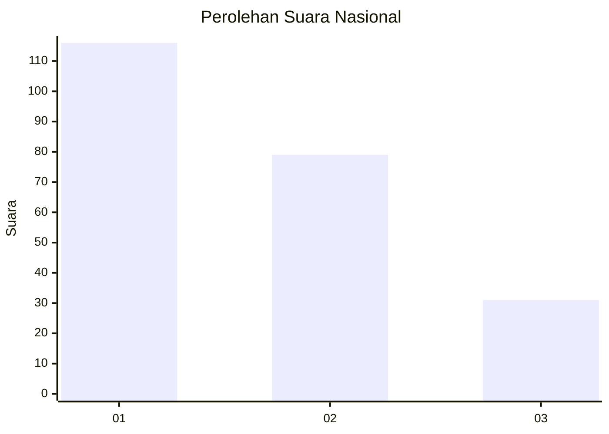
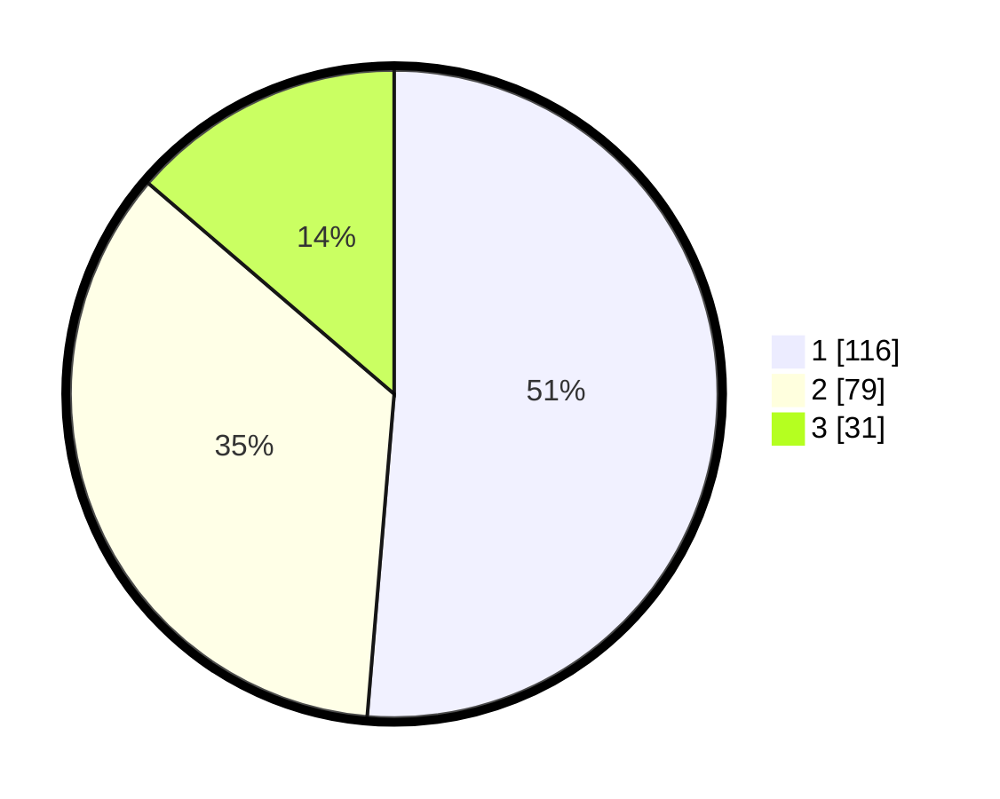

# Hasil

## Grafik

## Tabel

| No.    | Nama Paslon    | Suara | Suara (raw) | Persentase |
|:------ |:-------------- | -----:| -----------:| ----------:|
| 100025 | ANIES MUHAIMIN | 116   | [116][p-1]  | 51,33      |
| 100026 | PRABOWO GIBRAN | 79    | [79][p-2]   | 34,96      |
| 100027 | GANJAR MAHFUD  | 31    | [31][p-3]   | 13,72      |

[p-1]: https://github.com/gigit-pemilu/pemilu-2024/blob/main/pilpres/hitung-suara/sub/31-dki-jakarta/sub/74-jakarta-selatan/sub/01-tebet/sub/1003-menteng-dalam/sub/011-tps/sub/paslon-1.txt
[p-2]: https://github.com/gigit-pemilu/pemilu-2024/blob/main/pilpres/hitung-suara/sub/31-dki-jakarta/sub/74-jakarta-selatan/sub/01-tebet/sub/1003-menteng-dalam/sub/011-tps/sub/paslon-2.txt
[p-3]: https://github.com/gigit-pemilu/pemilu-2024/blob/main/pilpres/hitung-suara/sub/31-dki-jakarta/sub/74-jakarta-selatan/sub/01-tebet/sub/1003-menteng-dalam/sub/011-tps/sub/paslon-3.txt

## Foto C Plano

https://sirekap-obj-formc.kpu.go.id/8e4f/pemilu/ppwp/31/74/01/10/03/3174011003011-20240215-053823--d953f73b-80bb-4235-a2dd-7f1e2fd77270.jpg

https://sirekap-obj-formc.kpu.go.id/8e4f/pemilu/ppwp/31/74/01/10/03/3174011003011-20240215-010919--54864f8e-5652-4800-b73a-ac67b32517d7.jpg

https://sirekap-obj-formc.kpu.go.id/8e4f/pemilu/ppwp/31/74/01/10/03/3174011003011-20240215-011209--5ba32dd0-6e15-477a-99ee-38efa8bd213c.jpg

## Metadata

| Key        | Value               |
| ---------- | ------------------- |
| Time Stamp | 2024-02-24 22:31:28 |

