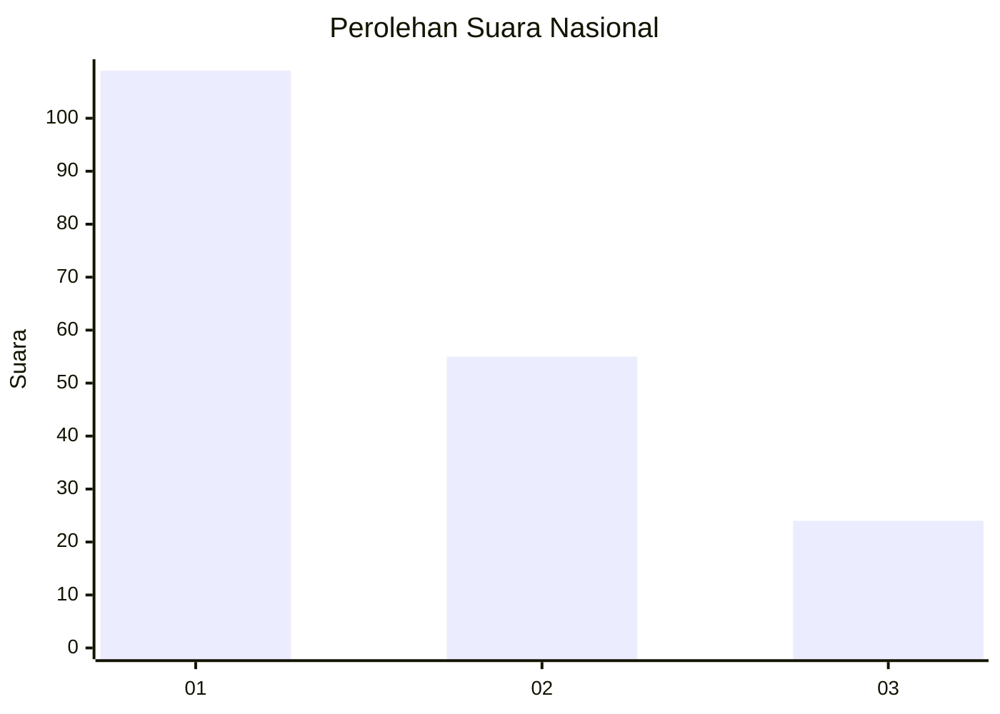
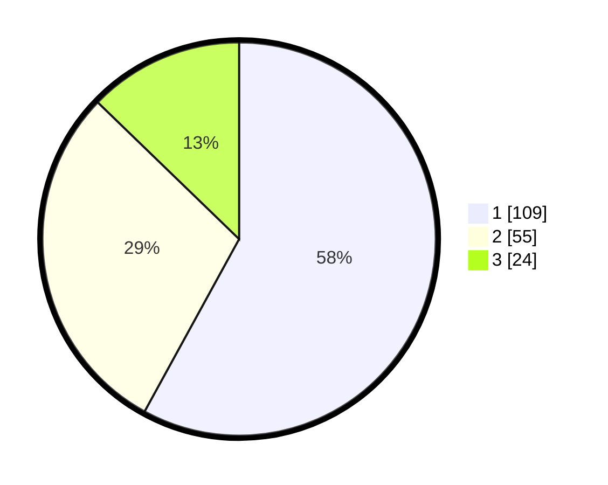

# Hasil

## Grafik

## Tabel

| No.    | Nama Paslon    | Suara | Suara (raw) | Persentase |
|:------ |:-------------- | -----:| -----------:| ----------:|
| 100025 | ANIES MUHAIMIN | 109   | [109][p-1]  | 57,98      |
| 100026 | PRABOWO GIBRAN | 55    | [55][p-2]   | 29,26      |
| 100027 | GANJAR MAHFUD  | 24    | [24][p-3]   | 12,77      |

[p-1]: https://github.com/gigit-pemilu/pemilu-2024/blob/main/pilpres/hitung-suara/sub/31-dki-jakarta/sub/74-jakarta-selatan/sub/01-tebet/sub/1003-menteng-dalam/sub/013-tps/sub/paslon-1.txt
[p-2]: https://github.com/gigit-pemilu/pemilu-2024/blob/main/pilpres/hitung-suara/sub/31-dki-jakarta/sub/74-jakarta-selatan/sub/01-tebet/sub/1003-menteng-dalam/sub/013-tps/sub/paslon-2.txt
[p-3]: https://github.com/gigit-pemilu/pemilu-2024/blob/main/pilpres/hitung-suara/sub/31-dki-jakarta/sub/74-jakarta-selatan/sub/01-tebet/sub/1003-menteng-dalam/sub/013-tps/sub/paslon-3.txt

## Foto C Plano

https://sirekap-obj-formc.kpu.go.id/9e4a/pemilu/ppwp/31/74/01/10/03/3174011003013-20240215-001837--4449a6f0-b5d6-4e10-9a47-b703a27ac5ec.jpg

https://sirekap-obj-formc.kpu.go.id/9e4a/pemilu/ppwp/31/74/01/10/03/3174011003013-20240215-002103--ba7c705b-a23e-48c1-8f66-e9d5052055bd.jpg

https://sirekap-obj-formc.kpu.go.id/9e4a/pemilu/ppwp/31/74/01/10/03/3174011003013-20240215-002332--9a505019-0f4f-4f47-9856-35a22e244fdf.jpg

## Metadata

| Key        | Value               |
| ---------- | ------------------- |
| Time Stamp | 2024-02-25 21:00:00 |

