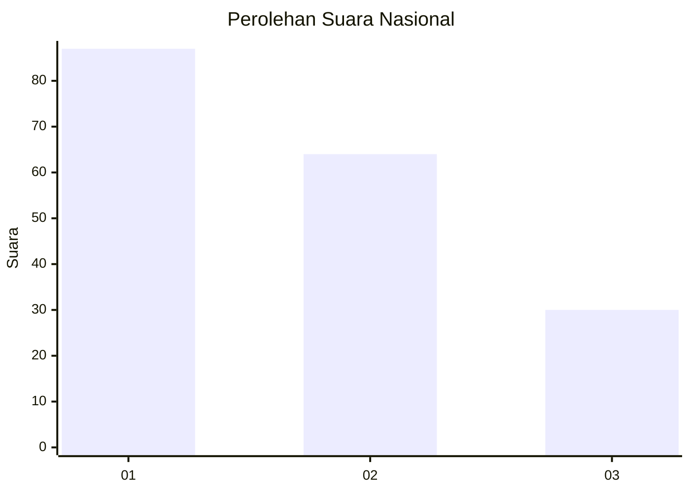
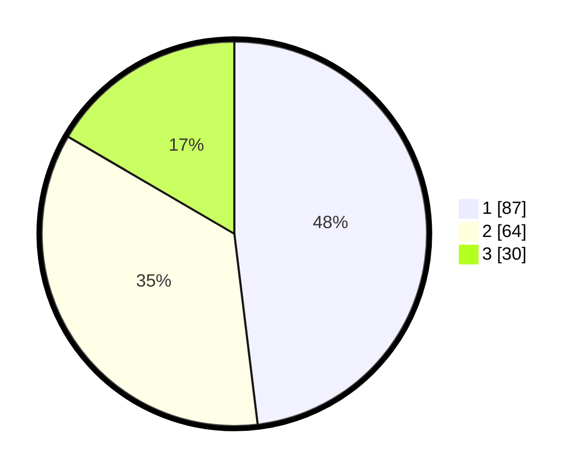

# Hasil

## Grafik

## Tabel

| No.    | Nama Paslon    | Suara | Suara (raw) | Persentase |
|:------ |:-------------- | -----:| -----------:| ----------:|
| 100025 | ANIES MUHAIMIN | 87    | [87][p-1]   | 48,07      |
| 100026 | PRABOWO GIBRAN | 64    | [64][p-2]   | 35,36      |
| 100027 | GANJAR MAHFUD  | 30    | [30][p-3]   | 16,57      |

[p-1]: https://github.com/gigit-pemilu/pemilu-2024/blob/main/pilpres/hitung-suara/sub/31-dki-jakarta/sub/74-jakarta-selatan/sub/01-tebet/sub/1003-menteng-dalam/sub/018-tps/sub/paslon-1.txt
[p-2]: https://github.com/gigit-pemilu/pemilu-2024/blob/main/pilpres/hitung-suara/sub/31-dki-jakarta/sub/74-jakarta-selatan/sub/01-tebet/sub/1003-menteng-dalam/sub/018-tps/sub/paslon-2.txt
[p-3]: https://github.com/gigit-pemilu/pemilu-2024/blob/main/pilpres/hitung-suara/sub/31-dki-jakarta/sub/74-jakarta-selatan/sub/01-tebet/sub/1003-menteng-dalam/sub/018-tps/sub/paslon-3.txt

## Foto C Plano

https://sirekap-obj-formc.kpu.go.id/aa16/pemilu/ppwp/31/74/01/10/03/3174011003018-20240215-032952--c57cdf97-27ab-468d-b726-235359327165.jpg

https://sirekap-obj-formc.kpu.go.id/aa16/pemilu/ppwp/31/74/01/10/03/3174011003018-20240215-033142--3e4dcbd9-dd9d-452f-8a2a-986461866014.jpg

https://sirekap-obj-formc.kpu.go.id/aa16/pemilu/ppwp/31/74/01/10/03/3174011003018-20240215-033103--3b2ab2f3-b1bf-40cb-84ff-8a19e16b2496.jpg

## Metadata

| Key        | Value               |
| ---------- | ------------------- |
| Time Stamp | 2024-02-24 22:31:28 |

