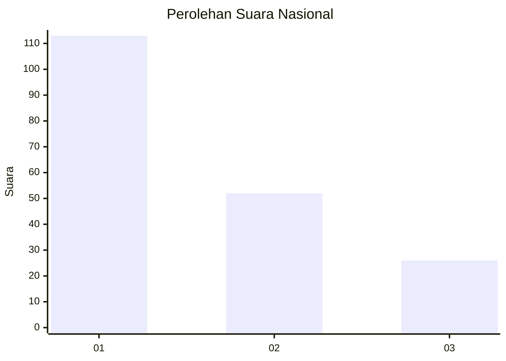
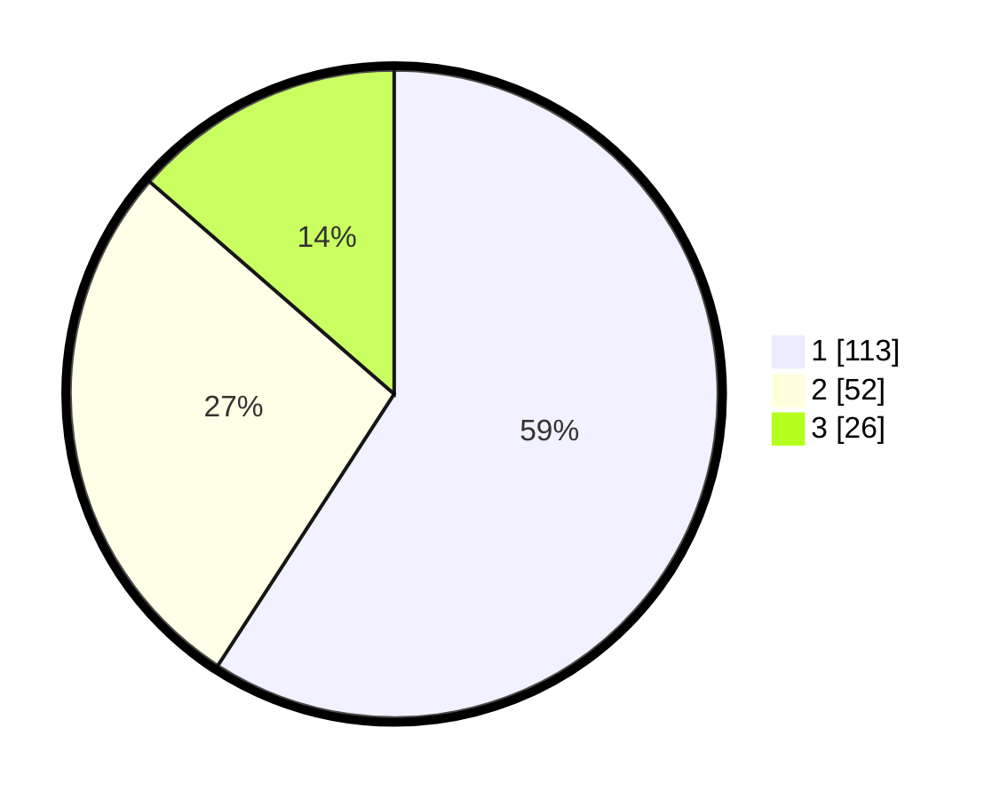

# Hasil

## Grafik

## Tabel

| No.    | Nama Paslon    | Suara | Suara (raw) | Persentase |
|:------ |:-------------- | -----:| -----------:| ----------:|
| 100025 | ANIES MUHAIMIN | 113   | [113][p-1]  | 59,16      |
| 100026 | PRABOWO GIBRAN | 52    | [52][p-2]   | 27,23      |
| 100027 | GANJAR MAHFUD  | 26    | [26][p-3]   | 13,61      |

[p-1]: https://github.com/gigit-pemilu/pemilu-2024/blob/main/pilpres/hitung-suara/sub/31-dki-jakarta/sub/74-jakarta-selatan/sub/01-tebet/sub/1003-menteng-dalam/sub/026-tps/sub/paslon-1.txt
[p-2]: https://github.com/gigit-pemilu/pemilu-2024/blob/main/pilpres/hitung-suara/sub/31-dki-jakarta/sub/74-jakarta-selatan/sub/01-tebet/sub/1003-menteng-dalam/sub/026-tps/sub/paslon-2.txt
[p-3]: https://github.com/gigit-pemilu/pemilu-2024/blob/main/pilpres/hitung-suara/sub/31-dki-jakarta/sub/74-jakarta-selatan/sub/01-tebet/sub/1003-menteng-dalam/sub/026-tps/sub/paslon-3.txt

## Foto C Plano

https://sirekap-obj-formc.kpu.go.id/0685/pemilu/ppwp/31/74/01/10/03/3174011003026-20240215-001331--ca6e1d1a-1813-4610-b6b3-dc3e28bc72f5.jpg

https://sirekap-obj-formc.kpu.go.id/0685/pemilu/ppwp/31/74/01/10/03/3174011003026-20240215-001455--65bb4a31-97ea-41b0-8c17-48e73b8d3deb.jpg

https://sirekap-obj-formc.kpu.go.id/0685/pemilu/ppwp/31/74/01/10/03/3174011003026-20240215-001624--949b2436-c5ff-4e30-9e34-f181736bde06.jpg

## Metadata

| Key        | Value               |
| ---------- | ------------------- |
| Time Stamp | 2024-02-24 22:31:28 |

