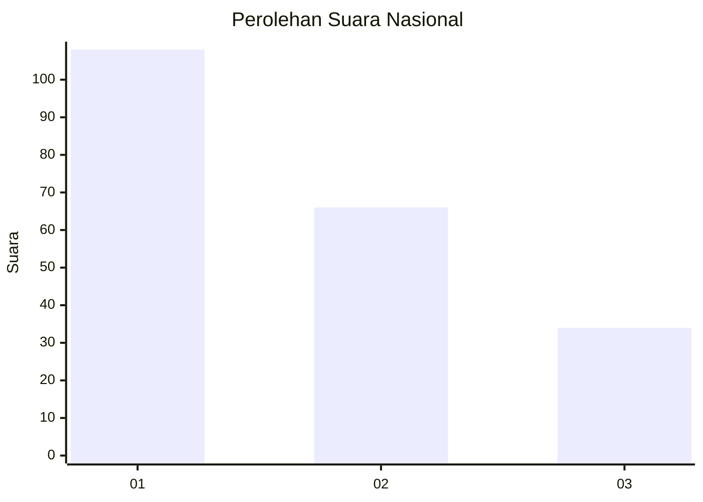
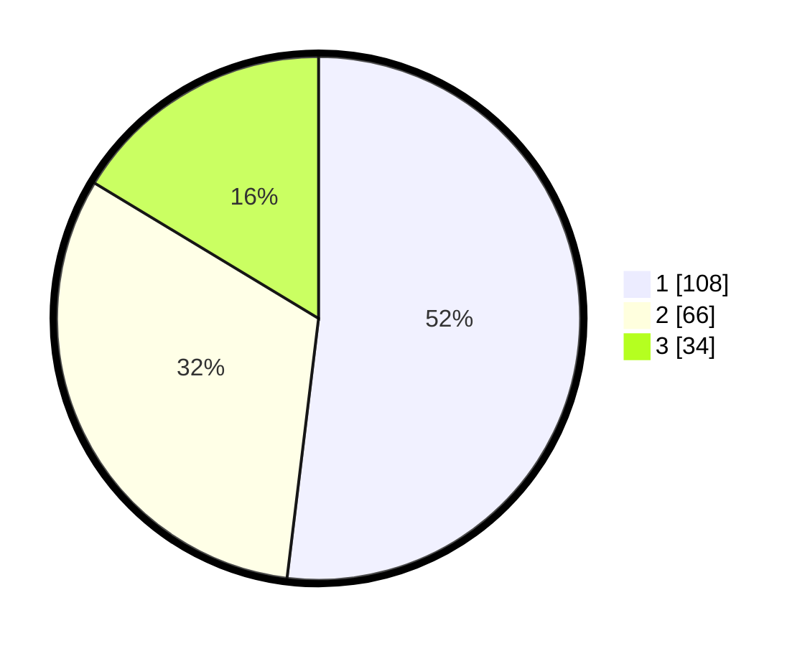

# Hasil

## Grafik

## Tabel

| No.    | Nama Paslon    | Suara | Suara (raw) | Persentase |
|:------ |:-------------- | -----:| -----------:| ----------:|
| 100025 | ANIES MUHAIMIN | 108   | [108][p-1]  | 51,92      |
| 100026 | PRABOWO GIBRAN | 66    | [66][p-2]   | 31,73      |
| 100027 | GANJAR MAHFUD  | 34    | [34][p-3]   | 16,35      |

[p-1]: https://github.com/gigit-pemilu/pemilu-2024/blob/main/pilpres/hitung-suara/sub/31-dki-jakarta/sub/74-jakarta-selatan/sub/01-tebet/sub/1003-menteng-dalam/sub/027-tps/sub/paslon-1.txt
[p-2]: https://github.com/gigit-pemilu/pemilu-2024/blob/main/pilpres/hitung-suara/sub/31-dki-jakarta/sub/74-jakarta-selatan/sub/01-tebet/sub/1003-menteng-dalam/sub/027-tps/sub/paslon-2.txt
[p-3]: https://github.com/gigit-pemilu/pemilu-2024/blob/main/pilpres/hitung-suara/sub/31-dki-jakarta/sub/74-jakarta-selatan/sub/01-tebet/sub/1003-menteng-dalam/sub/027-tps/sub/paslon-3.txt

## Foto C Plano

https://sirekap-obj-formc.kpu.go.id/b9ed/pemilu/ppwp/31/74/01/10/03/3174011003027-20240214-220157--705e41a0-03f9-454e-913b-a6dc72e3c4c3.jpg

https://sirekap-obj-formc.kpu.go.id/b9ed/pemilu/ppwp/31/74/01/10/03/3174011003027-20240214-220624--c000b309-0a9f-459c-9bfb-58dbe7e9a41b.jpg

https://sirekap-obj-formc.kpu.go.id/b9ed/pemilu/ppwp/31/74/01/10/03/3174011003027-20240214-221507--e5612efe-35ad-436b-98f9-04439c90ed12.jpg

## Metadata

| Key        | Value               |
| ---------- | ------------------- |
| Time Stamp | 2024-02-24 22:31:28 |

