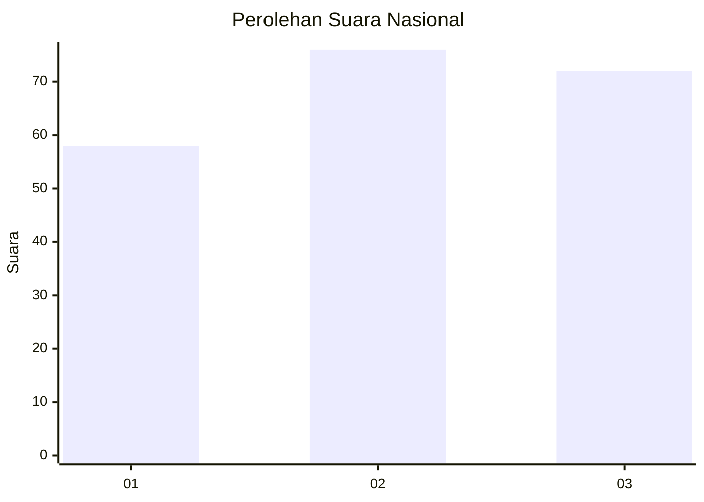
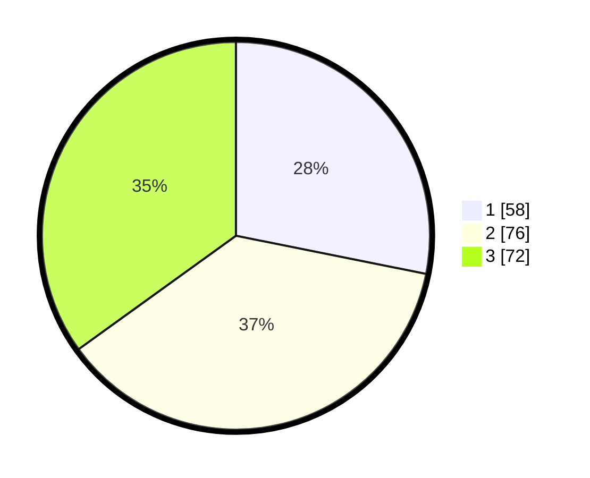

# Hasil

## Grafik

## Tabel

| No.    | Nama Paslon    | Suara | Suara (raw) | Persentase |
|:------ |:-------------- | -----:| -----------:| ----------:|
| 100025 | ANIES MUHAIMIN | 58    | [58][p-1]   | 28,16      |
| 100026 | PRABOWO GIBRAN | 76    | [76][p-2]   | 36,89      |
| 100027 | GANJAR MAHFUD  | 72    | [72][p-3]   | 34,95      |

[p-1]: https://github.com/gigit-pemilu/pemilu-2024/blob/main/pilpres/hitung-suara/sub/31-dki-jakarta/sub/74-jakarta-selatan/sub/01-tebet/sub/1003-menteng-dalam/sub/028-tps/sub/paslon-1.txt
[p-2]: https://github.com/gigit-pemilu/pemilu-2024/blob/main/pilpres/hitung-suara/sub/31-dki-jakarta/sub/74-jakarta-selatan/sub/01-tebet/sub/1003-menteng-dalam/sub/028-tps/sub/paslon-2.txt
[p-3]: https://github.com/gigit-pemilu/pemilu-2024/blob/main/pilpres/hitung-suara/sub/31-dki-jakarta/sub/74-jakarta-selatan/sub/01-tebet/sub/1003-menteng-dalam/sub/028-tps/sub/paslon-3.txt

## Foto C Plano

https://sirekap-obj-formc.kpu.go.id/eddf/pemilu/ppwp/31/74/01/10/03/3174011003028-20240214-220229--8c6e16f7-0414-4208-a17c-c3c5a648c963.jpg

https://sirekap-obj-formc.kpu.go.id/eddf/pemilu/ppwp/31/74/01/10/03/3174011003028-20240214-220341--d6efb0ba-0254-4f43-b12e-6de833924e63.jpg

https://sirekap-obj-formc.kpu.go.id/eddf/pemilu/ppwp/31/74/01/10/03/3174011003028-20240214-220504--ac323e27-0320-4c40-bbdc-ce4678d2388f.jpg

## Metadata

| Key        | Value               |
| ---------- | ------------------- |
| Time Stamp | 2024-02-25 18:00:00 |

