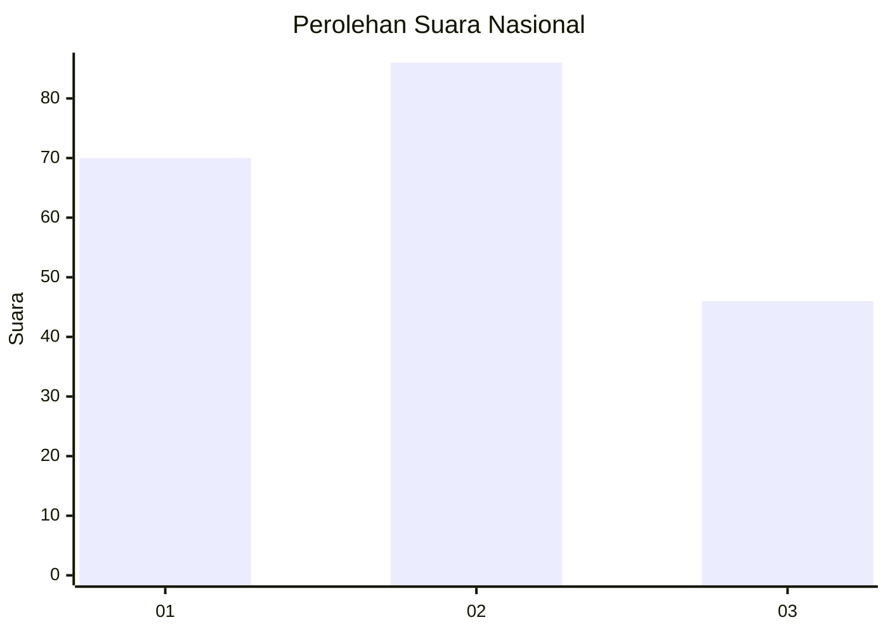
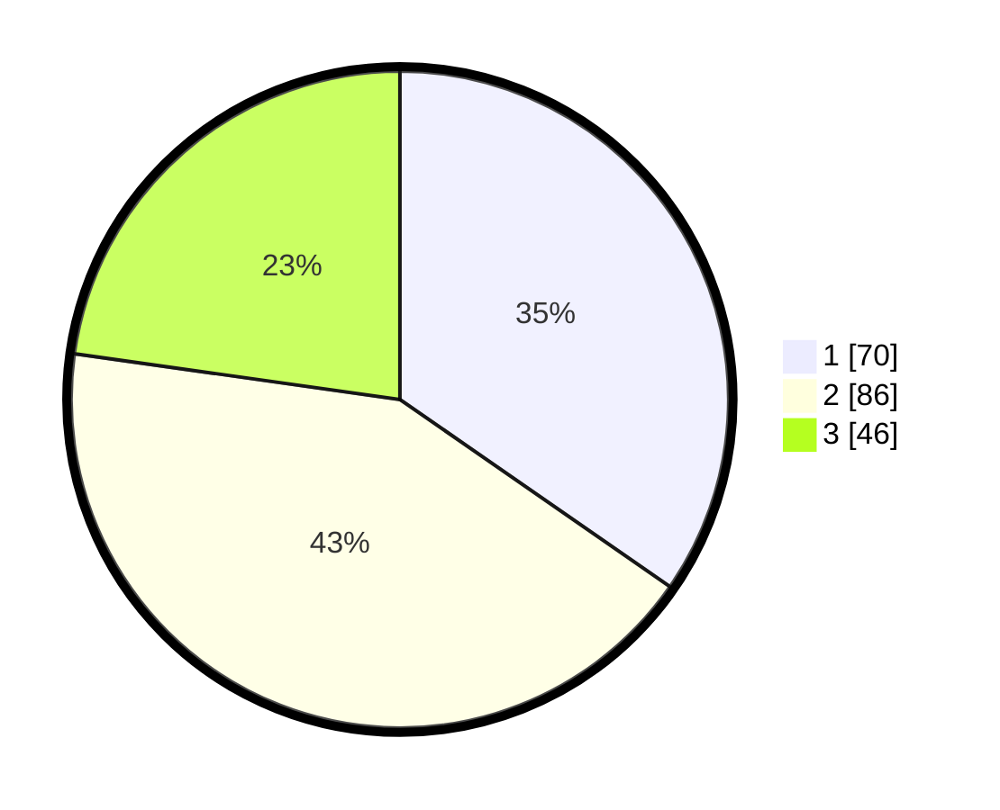

# Hasil

## Grafik

## Tabel

| No.    | Nama Paslon    | Suara | Suara (raw) | Persentase |
|:------ |:-------------- | -----:| -----------:| ----------:|
| 100025 | ANIES MUHAIMIN | 70    | [70][p-1]   | 34,65      |
| 100026 | PRABOWO GIBRAN | 86    | [86][p-2]   | 42,57      |
| 100027 | GANJAR MAHFUD  | 46    | [46][p-3]   | 22,77      |

[p-1]: https://github.com/gigit-pemilu/pemilu-2024/blob/main/pilpres/hitung-suara/sub/31-dki-jakarta/sub/74-jakarta-selatan/sub/01-tebet/sub/1003-menteng-dalam/sub/046-tps/sub/paslon-1.txt
[p-2]: https://github.com/gigit-pemilu/pemilu-2024/blob/main/pilpres/hitung-suara/sub/31-dki-jakarta/sub/74-jakarta-selatan/sub/01-tebet/sub/1003-menteng-dalam/sub/046-tps/sub/paslon-2.txt
[p-3]: https://github.com/gigit-pemilu/pemilu-2024/blob/main/pilpres/hitung-suara/sub/31-dki-jakarta/sub/74-jakarta-selatan/sub/01-tebet/sub/1003-menteng-dalam/sub/046-tps/sub/paslon-3.txt

## Foto C Plano

https://sirekap-obj-formc.kpu.go.id/38fe/pemilu/ppwp/31/74/01/10/03/3174011003046-20240214-214757--5ccbae48-48f7-4ba2-b64c-33c1a6d202de.jpg

https://sirekap-obj-formc.kpu.go.id/38fe/pemilu/ppwp/31/74/01/10/03/3174011003046-20240214-214805--357e3f54-0dc4-41bb-acce-03d42f31a5ea.jpg

https://sirekap-obj-formc.kpu.go.id/38fe/pemilu/ppwp/31/74/01/10/03/3174011003046-20240214-214809--400216c1-1940-4182-b2a8-c63de3cf9528.jpg

## Metadata

| Key        | Value               |
| ---------- | ------------------- |
| Time Stamp | 2024-02-25 11:00:00 |

