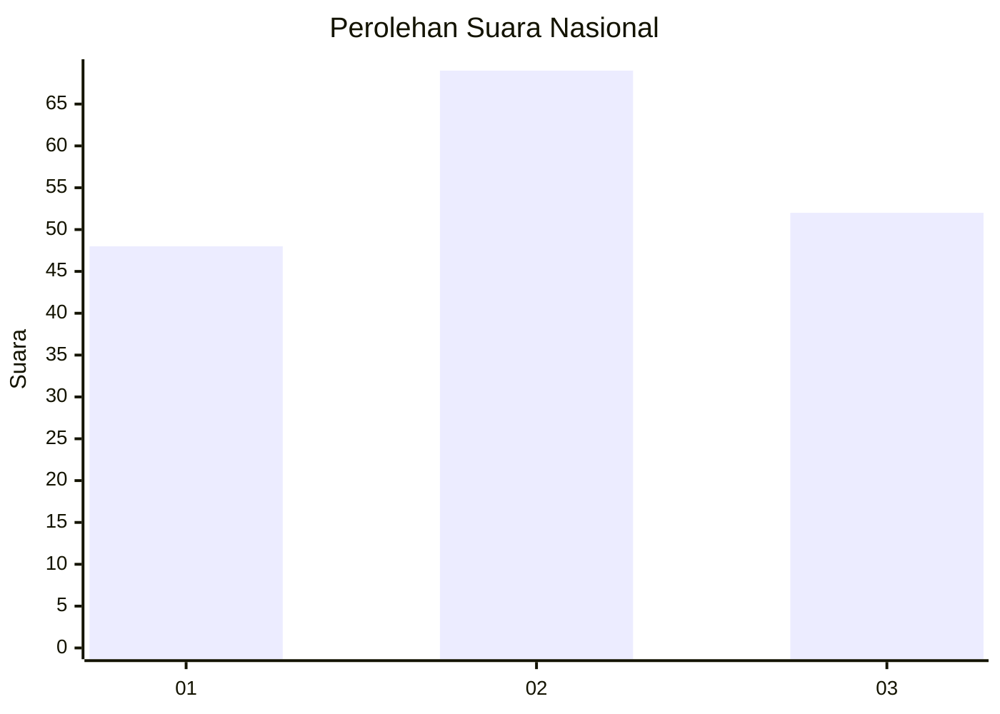
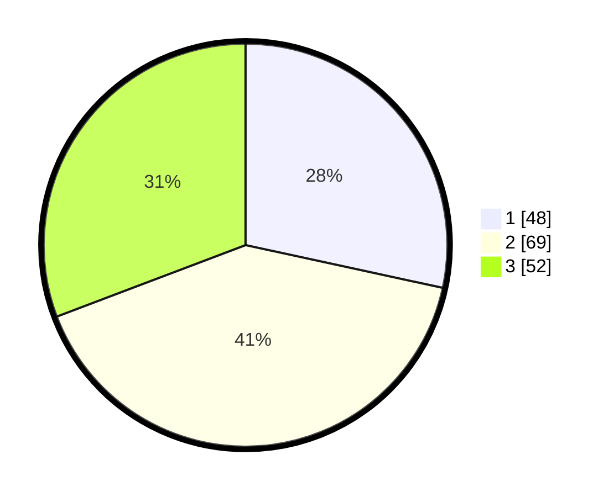

# Hasil

## Grafik

## Tabel

| No.    | Nama Paslon    | Suara | Suara (raw) | Persentase |
|:------ |:-------------- | -----:| -----------:| ----------:|
| 100025 | ANIES MUHAIMIN | 48    | [48][p-1]   | 28,40      |
| 100026 | PRABOWO GIBRAN | 69    | [69][p-2]   | 40,83      |
| 100027 | GANJAR MAHFUD  | 52    | [52][p-3]   | 30,77      |

[p-1]: https://github.com/gigit-pemilu/pemilu-2024/blob/main/pilpres/hitung-suara/sub/31-dki-jakarta/sub/74-jakarta-selatan/sub/01-tebet/sub/1003-menteng-dalam/sub/053-tps/sub/paslon-1.txt
[p-2]: https://github.com/gigit-pemilu/pemilu-2024/blob/main/pilpres/hitung-suara/sub/31-dki-jakarta/sub/74-jakarta-selatan/sub/01-tebet/sub/1003-menteng-dalam/sub/053-tps/sub/paslon-2.txt
[p-3]: https://github.com/gigit-pemilu/pemilu-2024/blob/main/pilpres/hitung-suara/sub/31-dki-jakarta/sub/74-jakarta-selatan/sub/01-tebet/sub/1003-menteng-dalam/sub/053-tps/sub/paslon-3.txt

## Foto C Plano

https://sirekap-obj-formc.kpu.go.id/26e1/pemilu/ppwp/31/74/01/10/03/3174011003053-20240214-195033--86211dcb-893f-4f2f-a6e7-8cb11edba823.jpg

https://sirekap-obj-formc.kpu.go.id/26e1/pemilu/ppwp/31/74/01/10/03/3174011003053-20240214-195659--0a0c1035-f5cc-44c8-a805-c574da06a047.jpg

https://sirekap-obj-formc.kpu.go.id/26e1/pemilu/ppwp/31/74/01/10/03/3174011003053-20240214-195803--4f9a5f74-1ed6-47be-a4fb-695df903bd9e.jpg

## Metadata

| Key        | Value               |
| ---------- | ------------------- |
| Time Stamp | 2024-02-14 21:46:01 |

