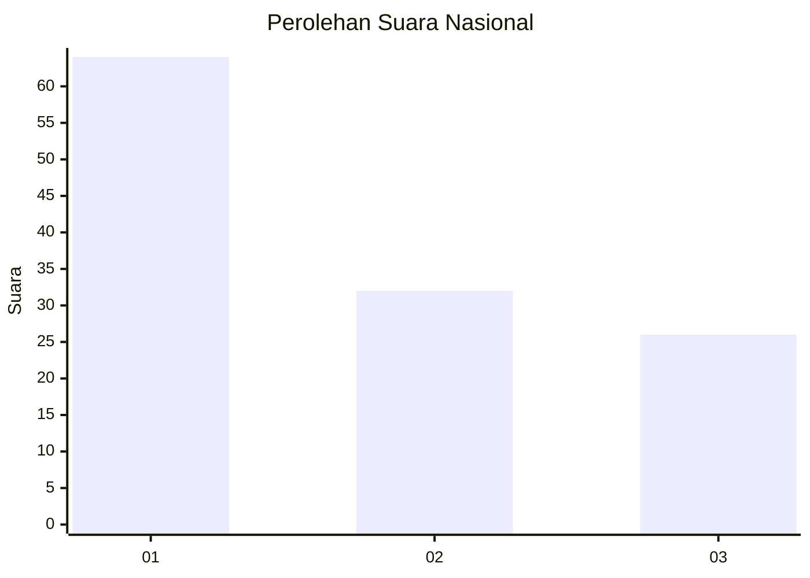
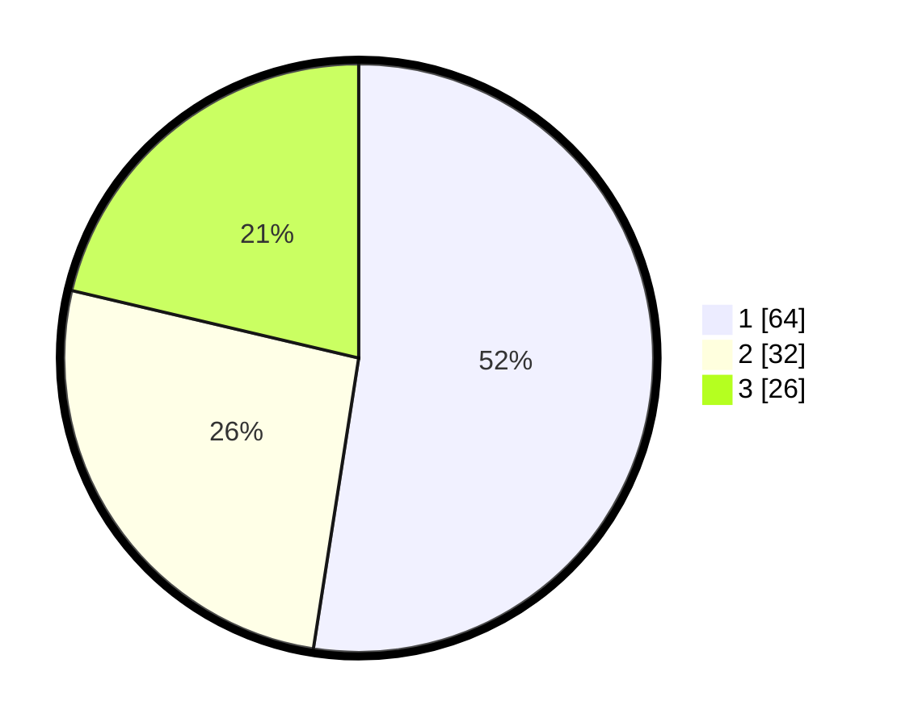

# Hasil

## Grafik

## Tabel

| No. | Nama Paslon    | Suara | Suara (raw) | Persentase |
|:--- |:-------------- | -----:| -----------:| ----------:|
| 1   | ANIES MUHAIMIN | 64    | [64][p-1]   | 52,46      |
| 2   | PRABOWO GIBRAN | 32    | [32][p-2]   | 26,23      |
| 3   | GANJAR MAHFUD  | 26    | [26][p-3]   | 21,31      |

[p-1]: https://github.com/gigit-pemilu/pemilu-2024/blob/main/pilpres/hitung-suara/sub/31-dki-jakarta/sub/74-jakarta-selatan/sub/01-tebet/sub/1003-menteng-dalam/sub/054-tps/sub/paslon-1.txt
[p-2]: https://github.com/gigit-pemilu/pemilu-2024/blob/main/pilpres/hitung-suara/sub/31-dki-jakarta/sub/74-jakarta-selatan/sub/01-tebet/sub/1003-menteng-dalam/sub/054-tps/sub/paslon-2.txt
[p-3]: https://github.com/gigit-pemilu/pemilu-2024/blob/main/pilpres/hitung-suara/sub/31-dki-jakarta/sub/74-jakarta-selatan/sub/01-tebet/sub/1003-menteng-dalam/sub/054-tps/sub/paslon-3.txt

## Foto C Plano

https://sirekap-obj-formc.kpu.go.id/1a70/pemilu/ppwp/31/74/01/10/03/3174011003054-20240214-201114--66d23484-3c24-4f8f-86bf-ffafe4579453.jpg

https://sirekap-obj-formc.kpu.go.id/1a70/pemilu/ppwp/31/74/01/10/03/3174011003054-20240214-201319--18de768f-6021-4a4f-a950-f24ea1c7e824.jpg

https://sirekap-obj-formc.kpu.go.id/1a70/pemilu/ppwp/31/74/01/10/03/3174011003054-20240214-204149--35e0f288-5100-4429-aad5-47ad90b50168.jpg

## Metadata

| Key        | Value               |
| ---------- | ------------------- |
| Time Stamp | 2024-02-14 21:46:01 |

