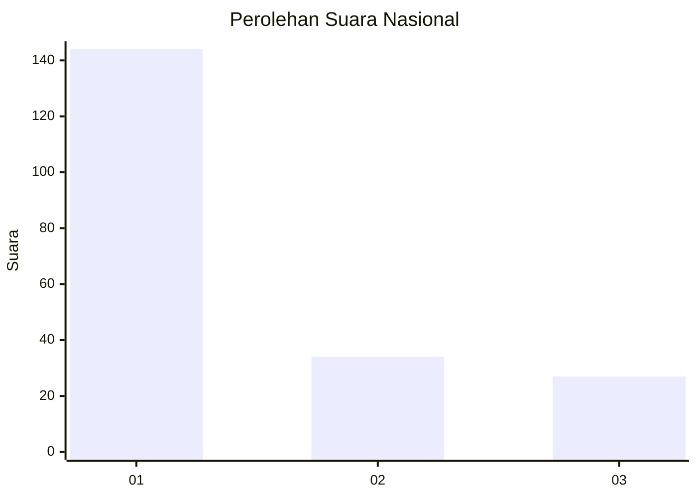
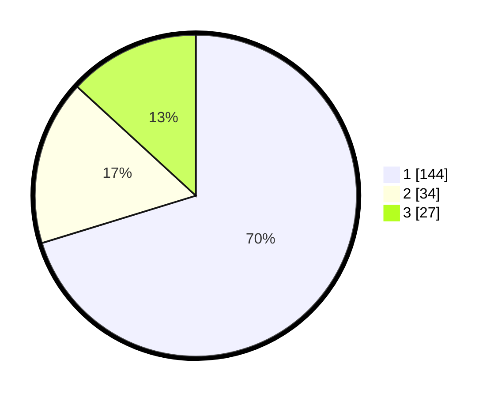

# Hasil

## Grafik

## Tabel

| No.    | Nama Paslon    | Suara | Suara (raw) | Persentase |
|:------ |:-------------- | -----:| -----------:| ----------:|
| 100025 | ANIES MUHAIMIN | 144   | [144][p-1]  | 70,24      |
| 100026 | PRABOWO GIBRAN | 34    | [34][p-2]   | 16,59      |
| 100027 | GANJAR MAHFUD  | 27    | [27][p-3]   | 13,17      |

[p-1]: https://github.com/gigit-pemilu/pemilu-2024/blob/main/pilpres/hitung-suara/sub/31-dki-jakarta/sub/74-jakarta-selatan/sub/01-tebet/sub/1003-menteng-dalam/sub/081-tps/sub/paslon-1.txt
[p-2]: https://github.com/gigit-pemilu/pemilu-2024/blob/main/pilpres/hitung-suara/sub/31-dki-jakarta/sub/74-jakarta-selatan/sub/01-tebet/sub/1003-menteng-dalam/sub/081-tps/sub/paslon-2.txt
[p-3]: https://github.com/gigit-pemilu/pemilu-2024/blob/main/pilpres/hitung-suara/sub/31-dki-jakarta/sub/74-jakarta-selatan/sub/01-tebet/sub/1003-menteng-dalam/sub/081-tps/sub/paslon-3.txt

## Foto C Plano

https://sirekap-obj-formc.kpu.go.id/dbe5/pemilu/ppwp/31/74/01/10/03/3174011003081-20240214-211424--c0ef717b-b163-4da7-86d4-2ef5083624ae.jpg

https://sirekap-obj-formc.kpu.go.id/dbe5/pemilu/ppwp/31/74/01/10/03/3174011003081-20240214-211428--bcc0dbd0-2270-464c-b9d6-dfe49d0239ed.jpg

https://sirekap-obj-formc.kpu.go.id/dbe5/pemilu/ppwp/31/74/01/10/03/3174011003081-20240214-211416--69a7d43f-8560-41b2-a523-628495f13d46.jpg

## Metadata

| Key        | Value               |
| ---------- | ------------------- |
| Time Stamp | 2024-02-24 22:31:28 |

