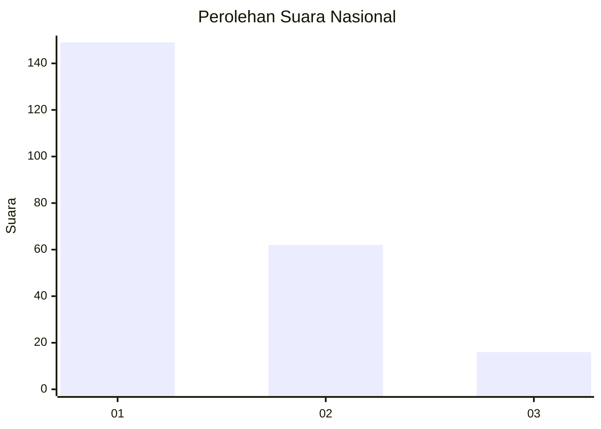
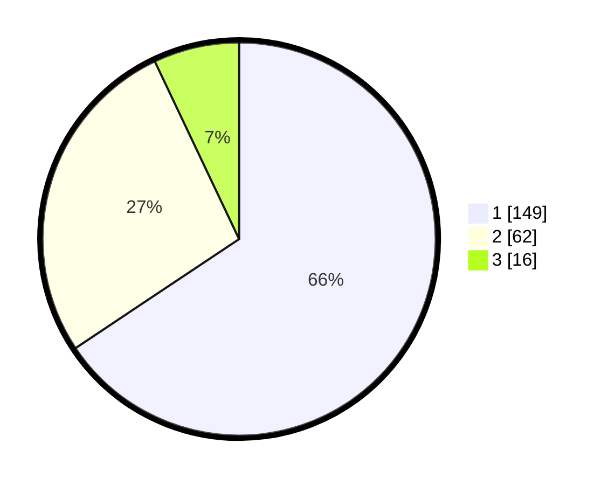

# Hasil

## Grafik

## Tabel

| No.    | Nama Paslon    | Suara | Suara (raw) | Persentase |
|:------ |:-------------- | -----:| -----------:| ----------:|
| 100025 | ANIES MUHAIMIN | 149   | [149][p-1]  | 65,64      |
| 100026 | PRABOWO GIBRAN | 62    | [62][p-2]   | 27,31      |
| 100027 | GANJAR MAHFUD  | 16    | [16][p-3]   | 7,05       |

[p-1]: https://github.com/gigit-pemilu/pemilu-2024/blob/main/pilpres/hitung-suara/sub/31-dki-jakarta/sub/74-jakarta-selatan/sub/01-tebet/sub/1003-menteng-dalam/sub/103-tps/sub/paslon-1.txt
[p-2]: https://github.com/gigit-pemilu/pemilu-2024/blob/main/pilpres/hitung-suara/sub/31-dki-jakarta/sub/74-jakarta-selatan/sub/01-tebet/sub/1003-menteng-dalam/sub/103-tps/sub/paslon-2.txt
[p-3]: https://github.com/gigit-pemilu/pemilu-2024/blob/main/pilpres/hitung-suara/sub/31-dki-jakarta/sub/74-jakarta-selatan/sub/01-tebet/sub/1003-menteng-dalam/sub/103-tps/sub/paslon-3.txt

## Foto C Plano

https://sirekap-obj-formc.kpu.go.id/c13e/pemilu/ppwp/31/74/01/10/03/3174011003103-20240214-234724--72f38963-a277-4338-9492-700ca60dc305.jpg

https://sirekap-obj-formc.kpu.go.id/c13e/pemilu/ppwp/31/74/01/10/03/3174011003103-20240215-013338--5bcdfc24-022d-47c9-88c6-6daece59f974.jpg

https://sirekap-obj-formc.kpu.go.id/c13e/pemilu/ppwp/31/74/01/10/03/3174011003103-20240215-013414--7d365bd0-b4df-40a1-b46e-6bcf339cccbe.jpg

## Metadata

| Key        | Value               |
| ---------- | ------------------- |
| Time Stamp | 2024-02-24 22:31:28 |

