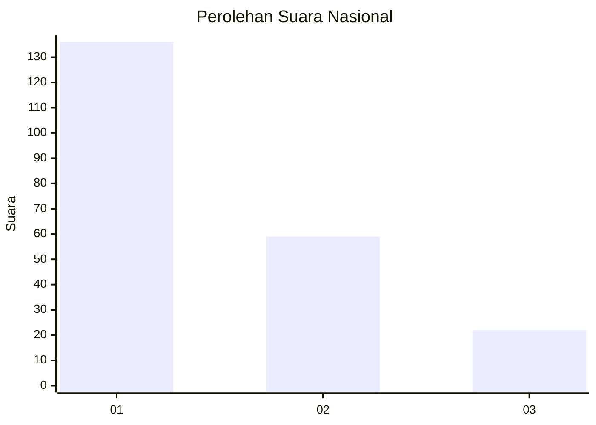
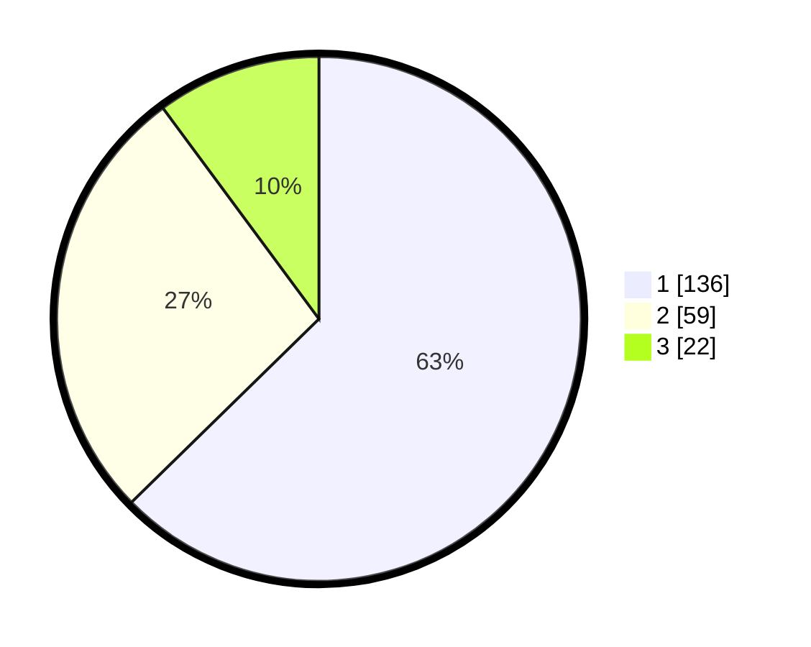

# Hasil

## Grafik

## Tabel

| No.    | Nama Paslon    | Suara | Suara (raw) | Persentase |
|:------ |:-------------- | -----:| -----------:| ----------:|
| 100025 | ANIES MUHAIMIN | 136   | [136][p-1]  | 62,67      |
| 100026 | PRABOWO GIBRAN | 59    | [59][p-2]   | 27,19      |
| 100027 | GANJAR MAHFUD  | 22    | [22][p-3]   | 10,14      |

[p-1]: https://github.com/gigit-pemilu/pemilu-2024/blob/main/pilpres/hitung-suara/sub/31-dki-jakarta/sub/74-jakarta-selatan/sub/01-tebet/sub/1003-menteng-dalam/sub/117-tps/sub/paslon-1.txt
[p-2]: https://github.com/gigit-pemilu/pemilu-2024/blob/main/pilpres/hitung-suara/sub/31-dki-jakarta/sub/74-jakarta-selatan/sub/01-tebet/sub/1003-menteng-dalam/sub/117-tps/sub/paslon-2.txt
[p-3]: https://github.com/gigit-pemilu/pemilu-2024/blob/main/pilpres/hitung-suara/sub/31-dki-jakarta/sub/74-jakarta-selatan/sub/01-tebet/sub/1003-menteng-dalam/sub/117-tps/sub/paslon-3.txt

## Foto C Plano

https://sirekap-obj-formc.kpu.go.id/814a/pemilu/ppwp/31/74/01/10/03/3174011003117-20240214-230124--c3632c76-5f9d-4724-8b86-488949a6ecbd.jpg

https://sirekap-obj-formc.kpu.go.id/814a/pemilu/ppwp/31/74/01/10/03/3174011003117-20240214-230516--bf4124ba-1c28-4e94-b9c7-f9d8835340ef.jpg

https://sirekap-obj-formc.kpu.go.id/814a/pemilu/ppwp/31/74/01/10/03/3174011003117-20240214-230520--3caf983b-2eaa-4998-95da-56ca985d7ea3.jpg

## Metadata

| Key        | Value               |
| ---------- | ------------------- |
| Time Stamp | 2024-02-24 22:31:28 |

