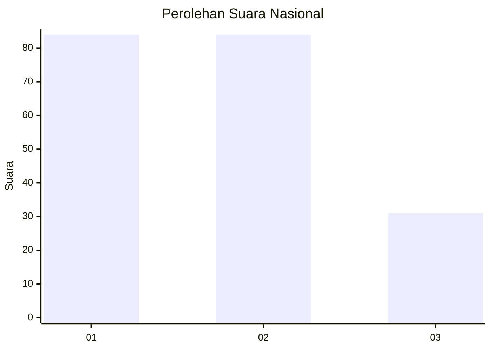
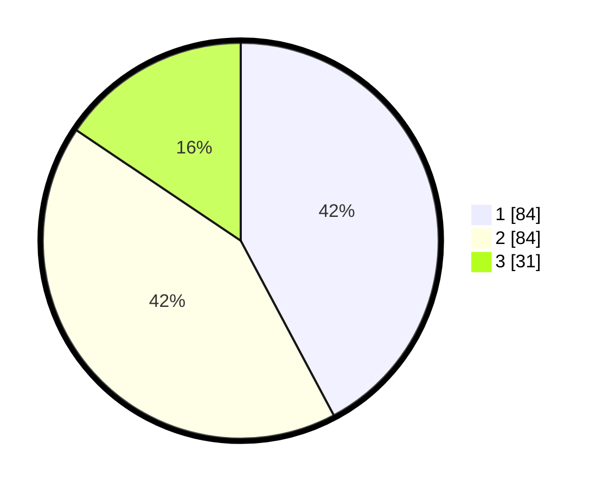

# Hasil

## Grafik

## Tabel

| No.    | Nama Paslon    | Suara | Suara (raw) | Persentase |
|:------ |:-------------- | -----:| -----------:| ----------:|
| 100025 | ANIES MUHAIMIN | 84    | [84][p-1]   | 42,21      |
| 100026 | PRABOWO GIBRAN | 84    | [84][p-2]   | 42,21      |
| 100027 | GANJAR MAHFUD  | 31    | [31][p-3]   | 15,58      |

[p-1]: https://github.com/gigit-pemilu/pemilu-2024/blob/main/pilpres/hitung-suara/sub/31-dki-jakarta/sub/74-jakarta-selatan/sub/01-tebet/sub/1003-menteng-dalam/sub/118-tps/sub/paslon-1.txt
[p-2]: https://github.com/gigit-pemilu/pemilu-2024/blob/main/pilpres/hitung-suara/sub/31-dki-jakarta/sub/74-jakarta-selatan/sub/01-tebet/sub/1003-menteng-dalam/sub/118-tps/sub/paslon-2.txt
[p-3]: https://github.com/gigit-pemilu/pemilu-2024/blob/main/pilpres/hitung-suara/sub/31-dki-jakarta/sub/74-jakarta-selatan/sub/01-tebet/sub/1003-menteng-dalam/sub/118-tps/sub/paslon-3.txt

## Foto C Plano

https://sirekap-obj-formc.kpu.go.id/76b9/pemilu/ppwp/31/74/01/10/03/3174011003118-20240215-014705--efd8a8a4-79b7-4667-ad48-d47caef4a441.jpg

https://sirekap-obj-formc.kpu.go.id/76b9/pemilu/ppwp/31/74/01/10/03/3174011003118-20240215-011327--81875940-f09e-463c-b791-de234f16a083.jpg

https://sirekap-obj-formc.kpu.go.id/76b9/pemilu/ppwp/31/74/01/10/03/3174011003118-20240215-011402--2aa82415-f74d-47ba-a961-2bba202b4eec.jpg

## Metadata

| Key        | Value               |
| ---------- | ------------------- |
| Time Stamp | 2024-02-25 15:00:00 |

