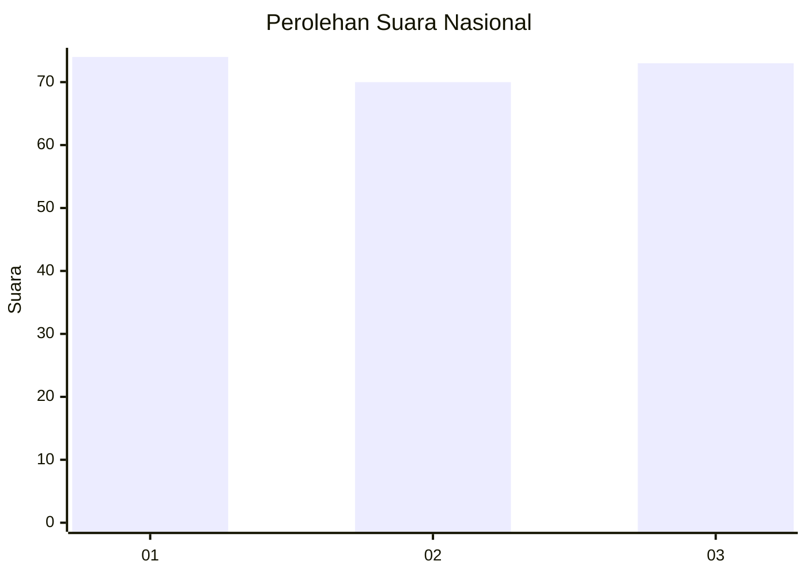
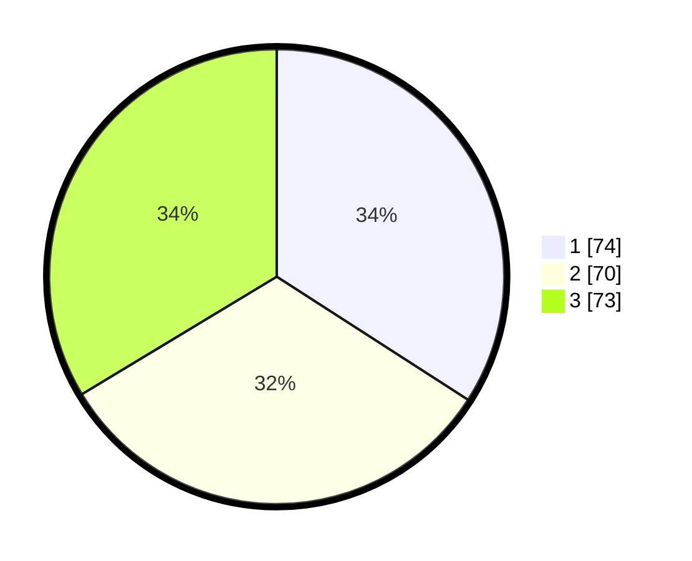

# Hasil

## Grafik

## Tabel

| No.    | Nama Paslon    | Suara | Suara (raw) | Persentase |
|:------ |:-------------- | -----:| -----------:| ----------:|
| 100025 | ANIES MUHAIMIN | 74    | [74][p-1]   | 34,10      |
| 100026 | PRABOWO GIBRAN | 70    | [70][p-2]   | 32,26      |
| 100027 | GANJAR MAHFUD  | 73    | [73][p-3]   | 33,64      |

[p-1]: https://github.com/gigit-pemilu/pemilu-2024/blob/main/pilpres/hitung-suara/sub/31-dki-jakarta/sub/74-jakarta-selatan/sub/01-tebet/sub/1003-menteng-dalam/sub/126-tps/sub/paslon-1.txt
[p-2]: https://github.com/gigit-pemilu/pemilu-2024/blob/main/pilpres/hitung-suara/sub/31-dki-jakarta/sub/74-jakarta-selatan/sub/01-tebet/sub/1003-menteng-dalam/sub/126-tps/sub/paslon-2.txt
[p-3]: https://github.com/gigit-pemilu/pemilu-2024/blob/main/pilpres/hitung-suara/sub/31-dki-jakarta/sub/74-jakarta-selatan/sub/01-tebet/sub/1003-menteng-dalam/sub/126-tps/sub/paslon-3.txt

## Foto C Plano

https://sirekap-obj-formc.kpu.go.id/accd/pemilu/ppwp/31/74/01/10/03/3174011003126-20240214-223743--aff8074c-de29-4883-886f-b888247ced2f.jpg

https://sirekap-obj-formc.kpu.go.id/accd/pemilu/ppwp/31/74/01/10/03/3174011003126-20240214-224013--f0bf6560-c52a-42c3-9db7-9a11863e55b3.jpg

https://sirekap-obj-formc.kpu.go.id/accd/pemilu/ppwp/31/74/01/10/03/3174011003126-20240214-224358--2d5b5901-39e3-4d8e-b725-9141bf37f4e6.jpg

## Metadata

| Key        | Value               |
| ---------- | ------------------- |
| Time Stamp | 2024-02-24 22:31:28 |

