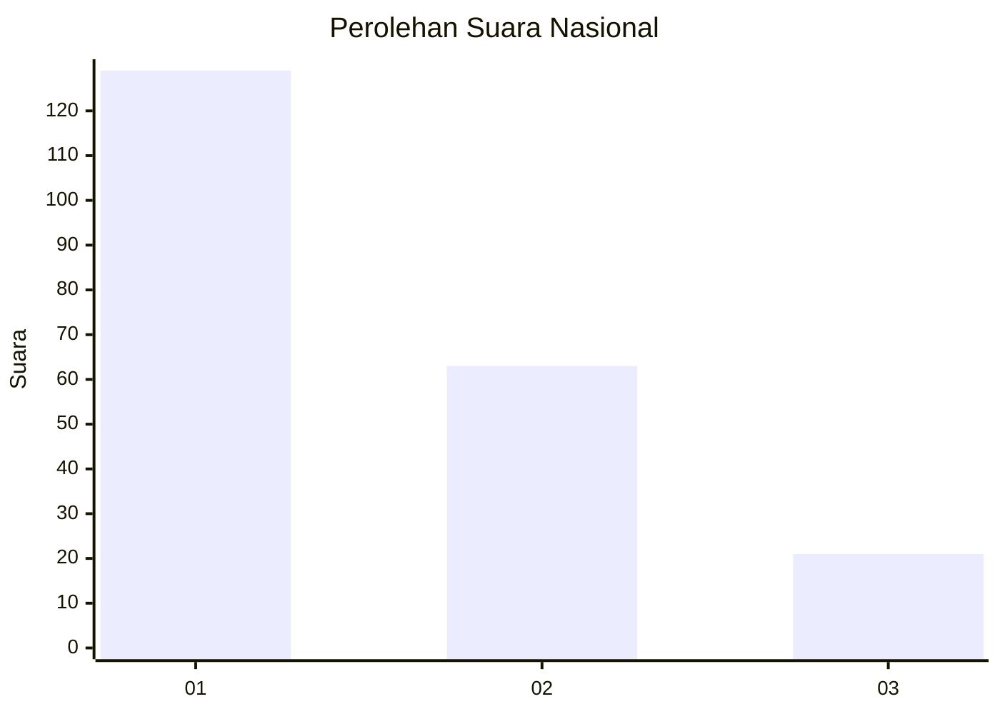
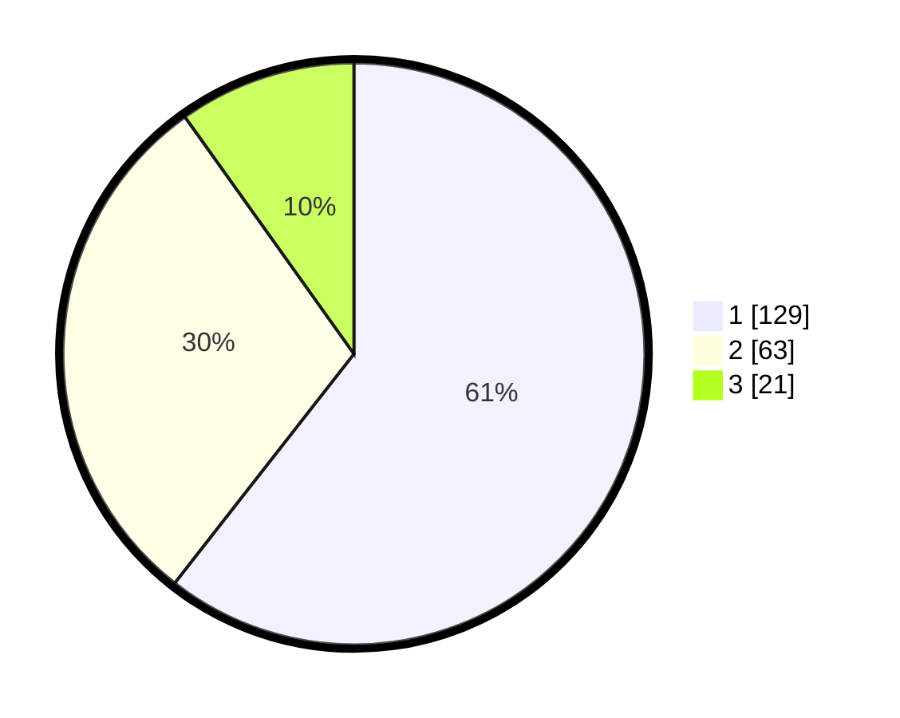

# Hasil

## Grafik

## Tabel

| No.    | Nama Paslon    | Suara | Suara (raw) | Persentase |
|:------ |:-------------- | -----:| -----------:| ----------:|
| 100025 | ANIES MUHAIMIN | 129   | [129][p-1]  | 60,56      |
| 100026 | PRABOWO GIBRAN | 63    | [63][p-2]   | 29,58      |
| 100027 | GANJAR MAHFUD  | 21    | [21][p-3]   | 9,86       |

[p-1]: https://github.com/gigit-pemilu/pemilu-2024/blob/main/pilpres/hitung-suara/sub/31-dki-jakarta/sub/74-jakarta-selatan/sub/01-tebet/sub/1004-kebon-baru/sub/006-tps/sub/paslon-1.txt
[p-2]: https://github.com/gigit-pemilu/pemilu-2024/blob/main/pilpres/hitung-suara/sub/31-dki-jakarta/sub/74-jakarta-selatan/sub/01-tebet/sub/1004-kebon-baru/sub/006-tps/sub/paslon-2.txt
[p-3]: https://github.com/gigit-pemilu/pemilu-2024/blob/main/pilpres/hitung-suara/sub/31-dki-jakarta/sub/74-jakarta-selatan/sub/01-tebet/sub/1004-kebon-baru/sub/006-tps/sub/paslon-3.txt

## Foto C Plano

https://sirekap-obj-formc.kpu.go.id/0c66/pemilu/ppwp/31/74/01/10/04/3174011004006-20240215-015734--2f46adc5-afeb-429a-94fb-cd8707fed5a0.jpg

https://sirekap-obj-formc.kpu.go.id/0c66/pemilu/ppwp/31/74/01/10/04/3174011004006-20240215-015852--e6f258a5-6568-4800-8ee2-0160df9a22e9.jpg

https://sirekap-obj-formc.kpu.go.id/0c66/pemilu/ppwp/31/74/01/10/04/3174011004006-20240215-015953--d6e755f2-90f8-4123-b37e-7a806fc6c5cc.jpg

## Metadata

| Key        | Value               |
| ---------- | ------------------- |
| Time Stamp | 2024-02-24 22:31:28 |

