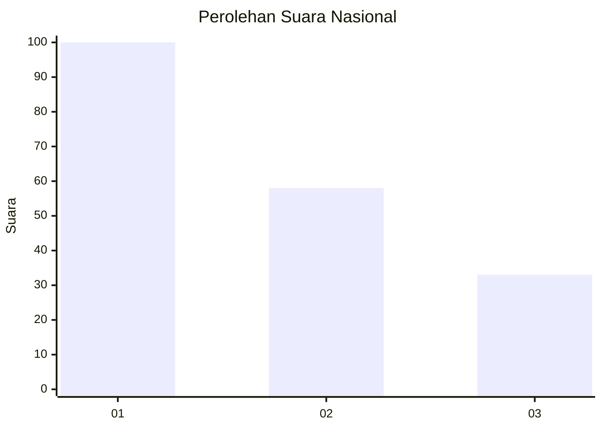
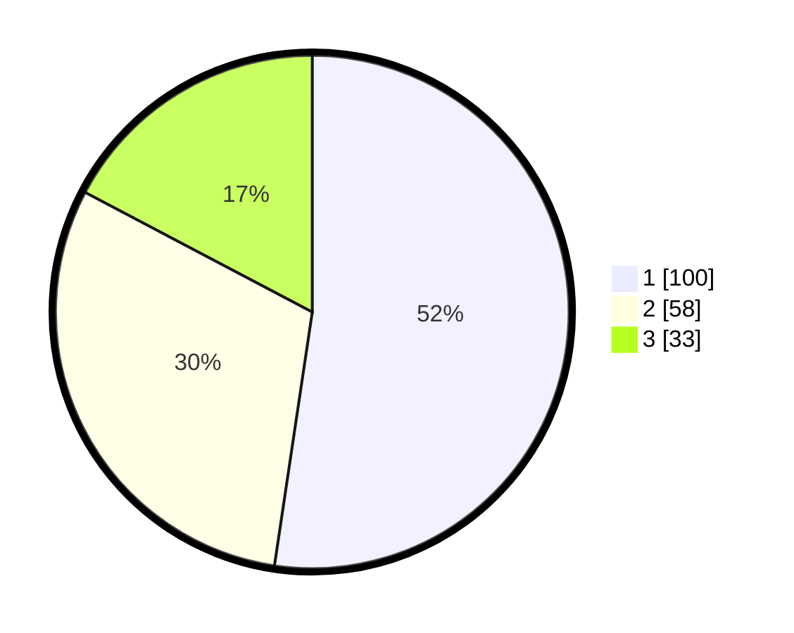

# Hasil

## Grafik

## Tabel

| No.    | Nama Paslon    | Suara | Suara (raw) | Persentase |
|:------ |:-------------- | -----:| -----------:| ----------:|
| 100025 | ANIES MUHAIMIN | 100   | [100][p-1]  | 52,36      |
| 100026 | PRABOWO GIBRAN | 58    | [58][p-2]   | 30,37      |
| 100027 | GANJAR MAHFUD  | 33    | [33][p-3]   | 17,28      |

[p-1]: https://github.com/gigit-pemilu/pemilu-2024/blob/main/pilpres/hitung-suara/sub/31-dki-jakarta/sub/74-jakarta-selatan/sub/01-tebet/sub/1004-kebon-baru/sub/010-tps/sub/paslon-1.txt
[p-2]: https://github.com/gigit-pemilu/pemilu-2024/blob/main/pilpres/hitung-suara/sub/31-dki-jakarta/sub/74-jakarta-selatan/sub/01-tebet/sub/1004-kebon-baru/sub/010-tps/sub/paslon-2.txt
[p-3]: https://github.com/gigit-pemilu/pemilu-2024/blob/main/pilpres/hitung-suara/sub/31-dki-jakarta/sub/74-jakarta-selatan/sub/01-tebet/sub/1004-kebon-baru/sub/010-tps/sub/paslon-3.txt

## Foto C Plano

https://sirekap-obj-formc.kpu.go.id/60f0/pemilu/ppwp/31/74/01/10/04/3174011004010-20240214-222531--e0733570-17a5-4d9e-9fb8-5aac76d552c8.jpg

https://sirekap-obj-formc.kpu.go.id/60f0/pemilu/ppwp/31/74/01/10/04/3174011004010-20240214-223257--f41a8fae-01bc-4d9e-8199-4bbc84653fac.jpg

https://sirekap-obj-formc.kpu.go.id/60f0/pemilu/ppwp/31/74/01/10/04/3174011004010-20240214-223858--5f03bba4-8f9e-44d7-bbc0-d81ddf2a82c9.jpg

## Metadata

| Key        | Value               |
| ---------- | ------------------- |
| Time Stamp | 2024-02-25 15:00:00 |

