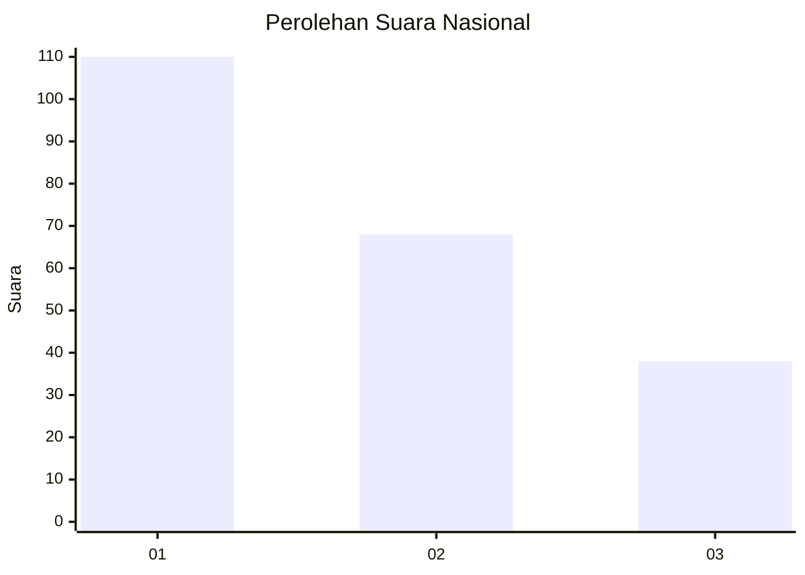
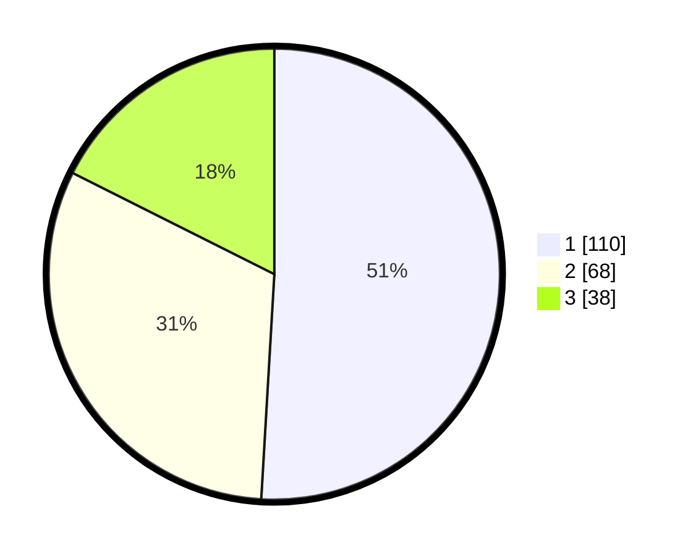

# Hasil

## Grafik

## Tabel

| No.    | Nama Paslon    | Suara | Suara (raw) | Persentase |
|:------ |:-------------- | -----:| -----------:| ----------:|
| 100025 | ANIES MUHAIMIN | 110   | [110][p-1]  | 50,93      |
| 100026 | PRABOWO GIBRAN | 68    | [68][p-2]   | 31,48      |
| 100027 | GANJAR MAHFUD  | 38    | [38][p-3]   | 17,59      |

[p-1]: https://github.com/gigit-pemilu/pemilu-2024/blob/main/pilpres/hitung-suara/sub/31-dki-jakarta/sub/74-jakarta-selatan/sub/01-tebet/sub/1004-kebon-baru/sub/023-tps/sub/paslon-1.txt
[p-2]: https://github.com/gigit-pemilu/pemilu-2024/blob/main/pilpres/hitung-suara/sub/31-dki-jakarta/sub/74-jakarta-selatan/sub/01-tebet/sub/1004-kebon-baru/sub/023-tps/sub/paslon-2.txt
[p-3]: https://github.com/gigit-pemilu/pemilu-2024/blob/main/pilpres/hitung-suara/sub/31-dki-jakarta/sub/74-jakarta-selatan/sub/01-tebet/sub/1004-kebon-baru/sub/023-tps/sub/paslon-3.txt

## Foto C Plano

https://sirekap-obj-formc.kpu.go.id/29cb/pemilu/ppwp/31/74/01/10/04/3174011004023-20240214-223945--e50d38db-c862-40bc-8ae0-c7e14c41264f.jpg

https://sirekap-obj-formc.kpu.go.id/29cb/pemilu/ppwp/31/74/01/10/04/3174011004023-20240214-224201--db1681e5-0af2-410c-877e-607bcc25c41d.jpg

https://sirekap-obj-formc.kpu.go.id/29cb/pemilu/ppwp/31/74/01/10/04/3174011004023-20240214-224404--b9cabf52-8d57-475e-b7c3-dd3cd210afd3.jpg

## Metadata

| Key        | Value               |
| ---------- | ------------------- |
| Time Stamp | 2024-02-24 22:31:28 |

