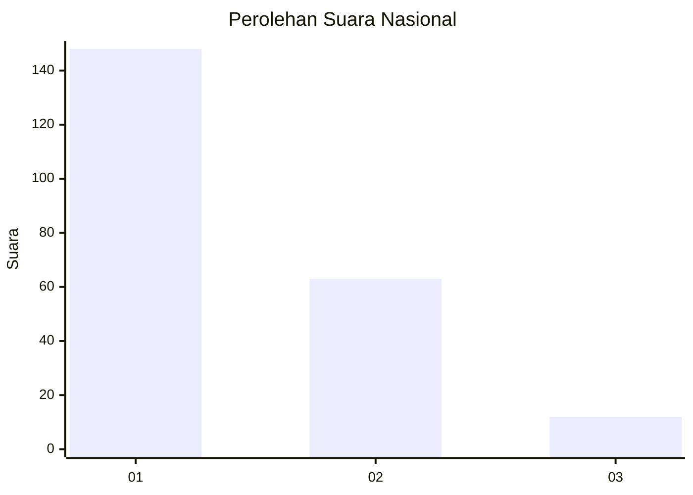
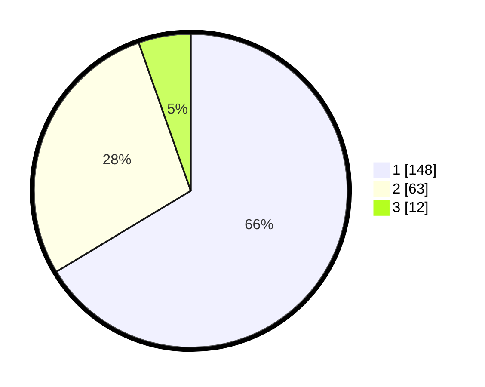

# Hasil

## Grafik

## Tabel

| No.    | Nama Paslon    | Suara | Suara (raw) | Persentase |
|:------ |:-------------- | -----:| -----------:| ----------:|
| 100025 | ANIES MUHAIMIN | 148   | [148][p-1]  | 66,37      |
| 100026 | PRABOWO GIBRAN | 63    | [63][p-2]   | 28,25      |
| 100027 | GANJAR MAHFUD  | 12    | [12][p-3]   | 5,38       |

[p-1]: https://github.com/gigit-pemilu/pemilu-2024/blob/main/pilpres/hitung-suara/sub/31-dki-jakarta/sub/74-jakarta-selatan/sub/01-tebet/sub/1004-kebon-baru/sub/033-tps/sub/paslon-1.txt
[p-2]: https://github.com/gigit-pemilu/pemilu-2024/blob/main/pilpres/hitung-suara/sub/31-dki-jakarta/sub/74-jakarta-selatan/sub/01-tebet/sub/1004-kebon-baru/sub/033-tps/sub/paslon-2.txt
[p-3]: https://github.com/gigit-pemilu/pemilu-2024/blob/main/pilpres/hitung-suara/sub/31-dki-jakarta/sub/74-jakarta-selatan/sub/01-tebet/sub/1004-kebon-baru/sub/033-tps/sub/paslon-3.txt

## Foto C Plano

https://sirekap-obj-formc.kpu.go.id/2b75/pemilu/ppwp/31/74/01/10/04/3174011004033-20240214-231910--9e5dafdb-08e8-4424-8364-4237bc67aeea.jpg

https://sirekap-obj-formc.kpu.go.id/2b75/pemilu/ppwp/31/74/01/10/04/3174011004033-20240214-232151--9fd274de-0a67-4ee4-a401-ea0797bb58cb.jpg

https://sirekap-obj-formc.kpu.go.id/2b75/pemilu/ppwp/31/74/01/10/04/3174011004033-20240214-232355--891e2453-241f-411d-b24b-275ca2216c41.jpg

## Metadata

| Key        | Value               |
| ---------- | ------------------- |
| Time Stamp | 2024-02-24 22:31:28 |

