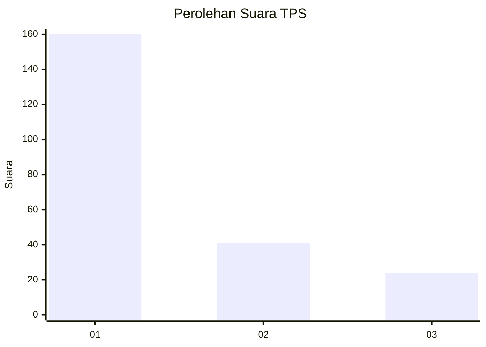
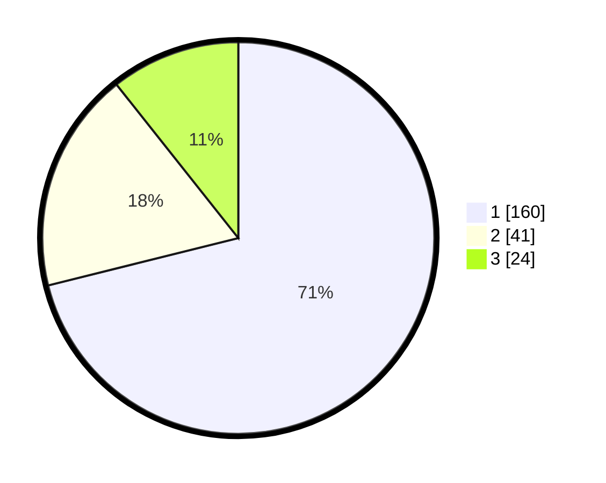

# Hasil

## Grafik

## Tabel

| No. | Nama Paslon    | Suara | Suara (raw) | Persentase |
|:--- |:-------------- | -----:| -----------:| ----------:|
| 1   | ANIES MUHAIMIN | 160   | [160][p-1]  | 71,11      |
| 2   | PRABOWO GIBRAN | 41    | [41][p-2]   | 18,22      |
| 3   | GANJAR MAHFUD  | 24    | [24][p-3]   | 10,67      |

[p-1]: https://github.com/gigit-pemilu/pemilu-2024-31-dki-jakarta/blob/main/pilpres/hitung-suara/sub/31-dki-jakarta/sub/74-jakarta-selatan/sub/01-tebet/sub/1004-kebon-baru/sub/041-tps/sub/paslon-1.txt
[p-2]: https://github.com/gigit-pemilu/pemilu-2024-31-dki-jakarta/blob/main/pilpres/hitung-suara/sub/31-dki-jakarta/sub/74-jakarta-selatan/sub/01-tebet/sub/1004-kebon-baru/sub/041-tps/sub/paslon-2.txt
[p-3]: https://github.com/gigit-pemilu/pemilu-2024-31-dki-jakarta/blob/main/pilpres/hitung-suara/sub/31-dki-jakarta/sub/74-jakarta-selatan/sub/01-tebet/sub/1004-kebon-baru/sub/041-tps/sub/paslon-3.txt

## Foto C Plano

https://sirekap-obj-formc.kpu.go.id/c49a/pemilu/ppwp/31/74/01/10/04/3174011004041-20240214-201811--f6da06e1-d7c6-4a0f-9d41-59a50979aeac.jpg

https://sirekap-obj-formc.kpu.go.id/c49a/pemilu/ppwp/31/74/01/10/04/3174011004041-20240214-202258--ba53c2da-e440-4059-adbb-9d2181e2b50f.jpg

https://sirekap-obj-formc.kpu.go.id/c49a/pemilu/ppwp/31/74/01/10/04/3174011004041-20240214-203123--c049b3e7-9a74-43c1-ba58-6ec760393755.jpg

## Metadata

| Key        | Value               |
| ---------- | ------------------- |
| Time Stamp | 2024-02-24 22:31:28 |

