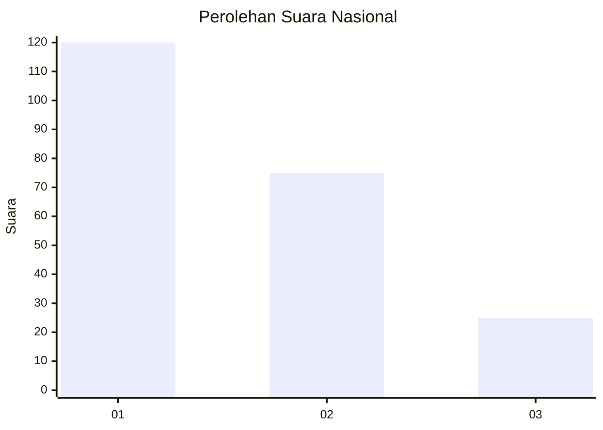
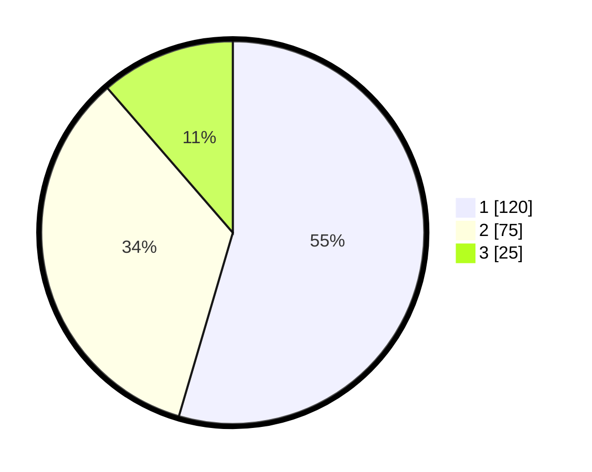

# Hasil

## Grafik

## Tabel

| No.    | Nama Paslon    | Suara | Suara (raw) | Persentase |
|:------ |:-------------- | -----:| -----------:| ----------:|
| 100025 | ANIES MUHAIMIN | 120   | [120][p-1]  | 54,55      |
| 100026 | PRABOWO GIBRAN | 75    | [75][p-2]   | 34,09      |
| 100027 | GANJAR MAHFUD  | 25    | [25][p-3]   | 11,36      |

[p-1]: https://github.com/gigit-pemilu/pemilu-2024/blob/main/pilpres/hitung-suara/sub/31-dki-jakarta/sub/74-jakarta-selatan/sub/01-tebet/sub/1004-kebon-baru/sub/043-tps/sub/paslon-1.txt
[p-2]: https://github.com/gigit-pemilu/pemilu-2024/blob/main/pilpres/hitung-suara/sub/31-dki-jakarta/sub/74-jakarta-selatan/sub/01-tebet/sub/1004-kebon-baru/sub/043-tps/sub/paslon-2.txt
[p-3]: https://github.com/gigit-pemilu/pemilu-2024/blob/main/pilpres/hitung-suara/sub/31-dki-jakarta/sub/74-jakarta-selatan/sub/01-tebet/sub/1004-kebon-baru/sub/043-tps/sub/paslon-3.txt

## Foto C Plano

https://sirekap-obj-formc.kpu.go.id/0f73/pemilu/ppwp/31/74/01/10/04/3174011004043-20240214-211841--aea955a4-9074-42ec-9b26-45adbe11f286.jpg

https://sirekap-obj-formc.kpu.go.id/0f73/pemilu/ppwp/31/74/01/10/04/3174011004043-20240214-211911--9756ec62-a614-4252-9435-fa0b97699abe.jpg

https://sirekap-obj-formc.kpu.go.id/0f73/pemilu/ppwp/31/74/01/10/04/3174011004043-20240214-211942--cef5d3b8-cfac-40cc-91a1-479f20daf989.jpg

## Metadata

| Key        | Value               |
| ---------- | ------------------- |
| Time Stamp | 2024-02-24 22:31:28 |

