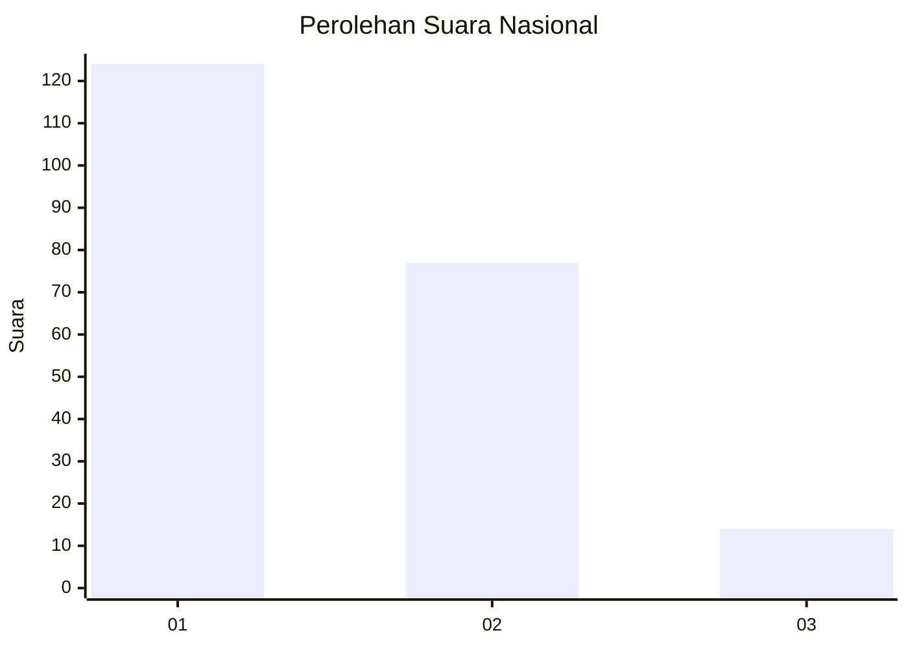
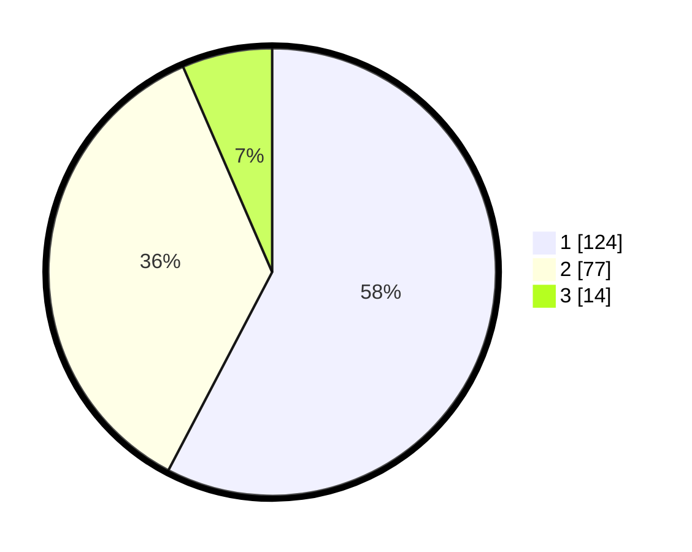

# Hasil

## Grafik

## Tabel

| No.    | Nama Paslon    | Suara | Suara (raw) | Persentase |
|:------ |:-------------- | -----:| -----------:| ----------:|
| 100025 | ANIES MUHAIMIN | 124   | [124][p-1]  | 57,67      |
| 100026 | PRABOWO GIBRAN | 77    | [77][p-2]   | 35,81      |
| 100027 | GANJAR MAHFUD  | 14    | [14][p-3]   | 6,51       |

[p-1]: https://github.com/gigit-pemilu/pemilu-2024/blob/main/pilpres/hitung-suara/sub/31-dki-jakarta/sub/74-jakarta-selatan/sub/01-tebet/sub/1004-kebon-baru/sub/058-tps/sub/paslon-1.txt
[p-2]: https://github.com/gigit-pemilu/pemilu-2024/blob/main/pilpres/hitung-suara/sub/31-dki-jakarta/sub/74-jakarta-selatan/sub/01-tebet/sub/1004-kebon-baru/sub/058-tps/sub/paslon-2.txt
[p-3]: https://github.com/gigit-pemilu/pemilu-2024/blob/main/pilpres/hitung-suara/sub/31-dki-jakarta/sub/74-jakarta-selatan/sub/01-tebet/sub/1004-kebon-baru/sub/058-tps/sub/paslon-3.txt

## Foto C Plano

https://sirekap-obj-formc.kpu.go.id/27c0/pemilu/ppwp/31/74/01/10/04/3174011004058-20240215-020053--d43d1859-3363-49b0-8b6f-5b7f0f0d0bb8.jpg

https://sirekap-obj-formc.kpu.go.id/27c0/pemilu/ppwp/31/74/01/10/04/3174011004058-20240215-020311--1ef28d74-5434-467a-bdf8-91068a1566db.jpg

https://sirekap-obj-formc.kpu.go.id/27c0/pemilu/ppwp/31/74/01/10/04/3174011004058-20240214-212759--ea9c2f62-0c52-41f8-9784-dedb497f2a92.jpg

## Metadata

| Key        | Value               |
| ---------- | ------------------- |
| Time Stamp | 2024-02-25 12:00:00 |

