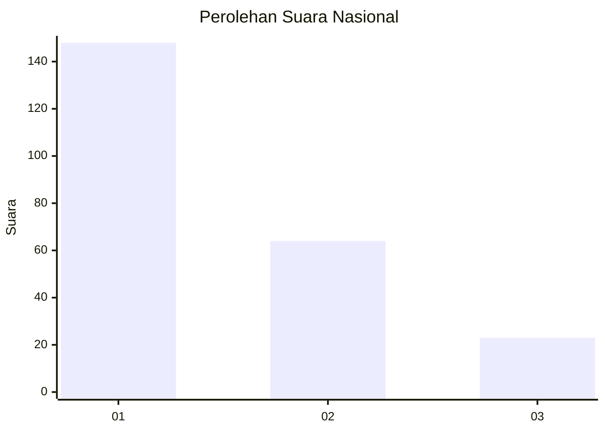
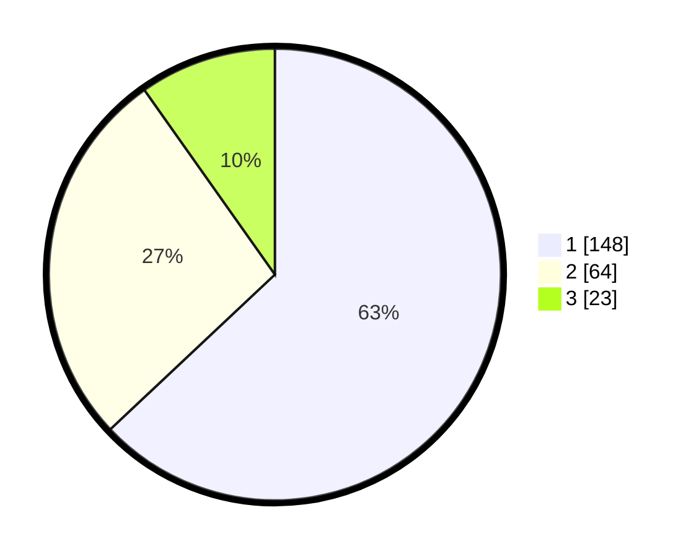

# Hasil

## Grafik

## Tabel

| No.    | Nama Paslon    | Suara | Suara (raw) | Persentase |
|:------ |:-------------- | -----:| -----------:| ----------:|
| 100025 | ANIES MUHAIMIN | 148   | [148][p-1]  | 62,98      |
| 100026 | PRABOWO GIBRAN | 64    | [64][p-2]   | 27,23      |
| 100027 | GANJAR MAHFUD  | 23    | [23][p-3]   | 9,79       |

[p-1]: https://github.com/gigit-pemilu/pemilu-2024/blob/main/pilpres/hitung-suara/sub/31-dki-jakarta/sub/74-jakarta-selatan/sub/01-tebet/sub/1004-kebon-baru/sub/077-tps/sub/paslon-1.txt
[p-2]: https://github.com/gigit-pemilu/pemilu-2024/blob/main/pilpres/hitung-suara/sub/31-dki-jakarta/sub/74-jakarta-selatan/sub/01-tebet/sub/1004-kebon-baru/sub/077-tps/sub/paslon-2.txt
[p-3]: https://github.com/gigit-pemilu/pemilu-2024/blob/main/pilpres/hitung-suara/sub/31-dki-jakarta/sub/74-jakarta-selatan/sub/01-tebet/sub/1004-kebon-baru/sub/077-tps/sub/paslon-3.txt

## Foto C Plano

https://sirekap-obj-formc.kpu.go.id/f8a3/pemilu/ppwp/31/74/01/10/04/3174011004077-20240221-115914--3acbf32c-f1cf-4c0e-9f0a-c07ceaca2fba.jpg

https://sirekap-obj-formc.kpu.go.id/f8a3/pemilu/ppwp/31/74/01/10/04/3174011004077-20240221-115949--c9faeaf3-d5a6-4061-bb67-49a480ba918f.jpg

https://sirekap-obj-formc.kpu.go.id/f8a3/pemilu/ppwp/31/74/01/10/04/3174011004077-20240221-120015--394ed2d5-016f-4357-9b6d-9412b17acd22.jpg

## Metadata

| Key        | Value               |
| ---------- | ------------------- |
| Time Stamp | 2024-02-24 22:31:28 |

