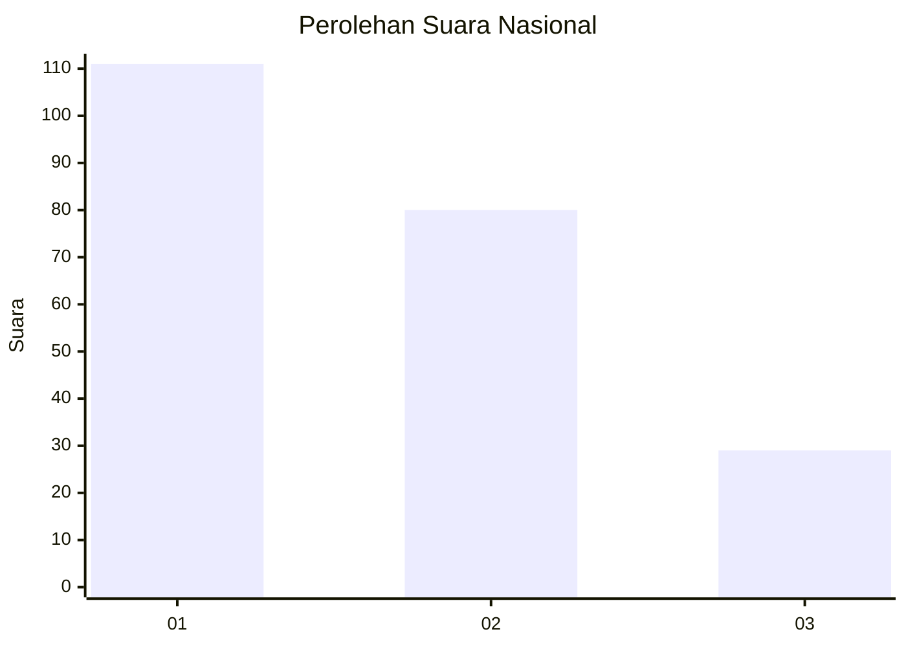
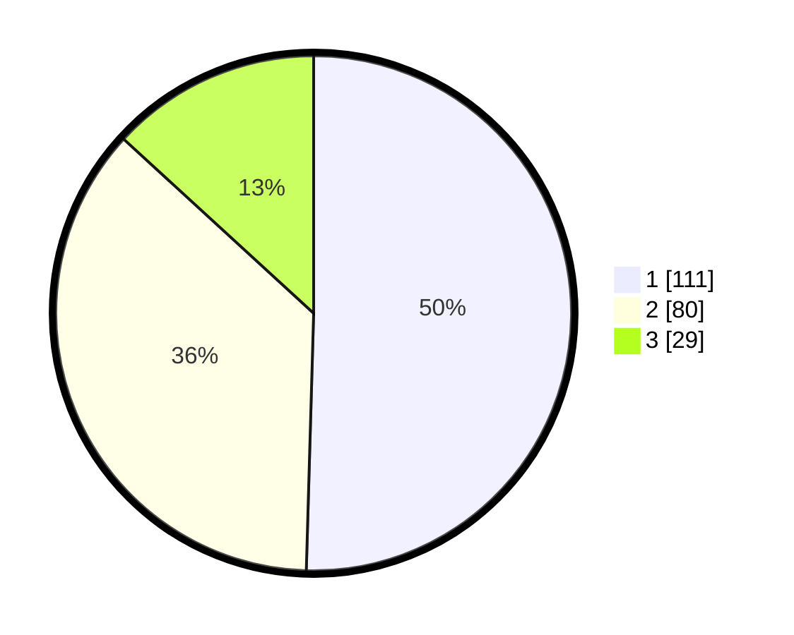

# Hasil

## Grafik

## Tabel

| No.    | Nama Paslon    | Suara | Suara (raw) | Persentase |
|:------ |:-------------- | -----:| -----------:| ----------:|
| 100025 | ANIES MUHAIMIN | 111   | [111][p-1]  | 50,45      |
| 100026 | PRABOWO GIBRAN | 80    | [80][p-2]   | 36,36      |
| 100027 | GANJAR MAHFUD  | 29    | [29][p-3]   | 13,18      |

[p-1]: https://github.com/gigit-pemilu/pemilu-2024/blob/main/pilpres/hitung-suara/sub/31-dki-jakarta/sub/74-jakarta-selatan/sub/01-tebet/sub/1004-kebon-baru/sub/081-tps/sub/paslon-1.txt
[p-2]: https://github.com/gigit-pemilu/pemilu-2024/blob/main/pilpres/hitung-suara/sub/31-dki-jakarta/sub/74-jakarta-selatan/sub/01-tebet/sub/1004-kebon-baru/sub/081-tps/sub/paslon-2.txt
[p-3]: https://github.com/gigit-pemilu/pemilu-2024/blob/main/pilpres/hitung-suara/sub/31-dki-jakarta/sub/74-jakarta-selatan/sub/01-tebet/sub/1004-kebon-baru/sub/081-tps/sub/paslon-3.txt

## Foto C Plano

https://sirekap-obj-formc.kpu.go.id/dce6/pemilu/ppwp/31/74/01/10/04/3174011004081-20240214-201139--e33c616e-0b20-4ade-beec-099f6d008edc.jpg

https://sirekap-obj-formc.kpu.go.id/dce6/pemilu/ppwp/31/74/01/10/04/3174011004081-20240214-201315--aea7e791-6586-48ec-b17b-9c6def90fd5b.jpg

https://sirekap-obj-formc.kpu.go.id/dce6/pemilu/ppwp/31/74/01/10/04/3174011004081-20240214-201358--23e7826f-56f8-4eaf-b344-1074a2a042c5.jpg

## Metadata

| Key        | Value               |
| ---------- | ------------------- |
| Time Stamp | 2024-02-24 22:31:28 |

