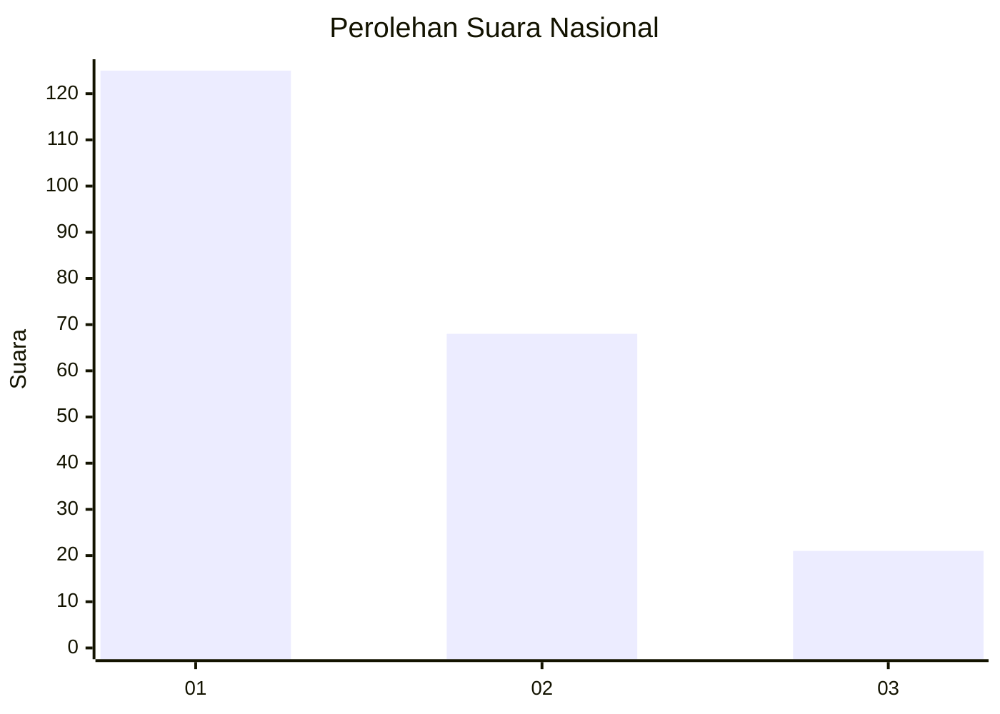
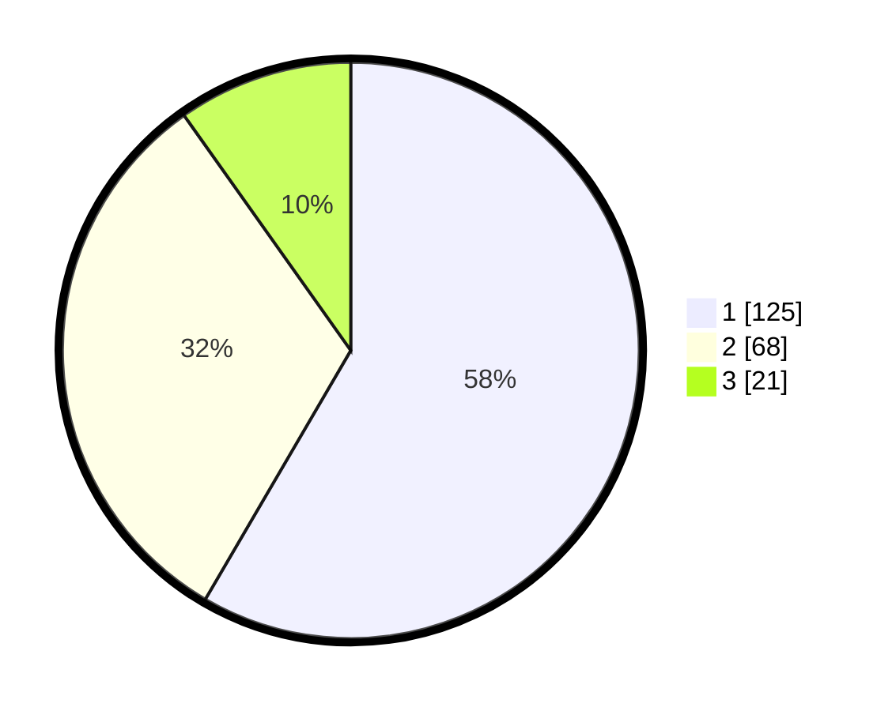

# Hasil

## Grafik

## Tabel

| No.    | Nama Paslon    | Suara | Suara (raw) | Persentase |
|:------ |:-------------- | -----:| -----------:| ----------:|
| 100025 | ANIES MUHAIMIN | 125   | [125][p-1]  | 58,41      |
| 100026 | PRABOWO GIBRAN | 68    | [68][p-2]   | 31,78      |
| 100027 | GANJAR MAHFUD  | 21    | [21][p-3]   | 9,81       |

[p-1]: https://github.com/gigit-pemilu/pemilu-2024/blob/main/pilpres/hitung-suara/sub/31-dki-jakarta/sub/74-jakarta-selatan/sub/01-tebet/sub/1004-kebon-baru/sub/085-tps/sub/paslon-1.txt
[p-2]: https://github.com/gigit-pemilu/pemilu-2024/blob/main/pilpres/hitung-suara/sub/31-dki-jakarta/sub/74-jakarta-selatan/sub/01-tebet/sub/1004-kebon-baru/sub/085-tps/sub/paslon-2.txt
[p-3]: https://github.com/gigit-pemilu/pemilu-2024/blob/main/pilpres/hitung-suara/sub/31-dki-jakarta/sub/74-jakarta-selatan/sub/01-tebet/sub/1004-kebon-baru/sub/085-tps/sub/paslon-3.txt

## Foto C Plano

https://sirekap-obj-formc.kpu.go.id/f3bc/pemilu/ppwp/31/74/01/10/04/3174011004085-20240214-235459--1019c83e-c701-4b32-b0d6-982e86c7b782.jpg

https://sirekap-obj-formc.kpu.go.id/f3bc/pemilu/ppwp/31/74/01/10/04/3174011004085-20240214-233936--f565d1b7-7d15-40e7-8d67-ee54fc4d9fce.jpg

https://sirekap-obj-formc.kpu.go.id/f3bc/pemilu/ppwp/31/74/01/10/04/3174011004085-20240214-235359--970b6326-fc47-490e-9018-47f908ac75cb.jpg

## Metadata

| Key        | Value               |
| ---------- | ------------------- |
| Time Stamp | 2024-02-24 22:31:28 |

