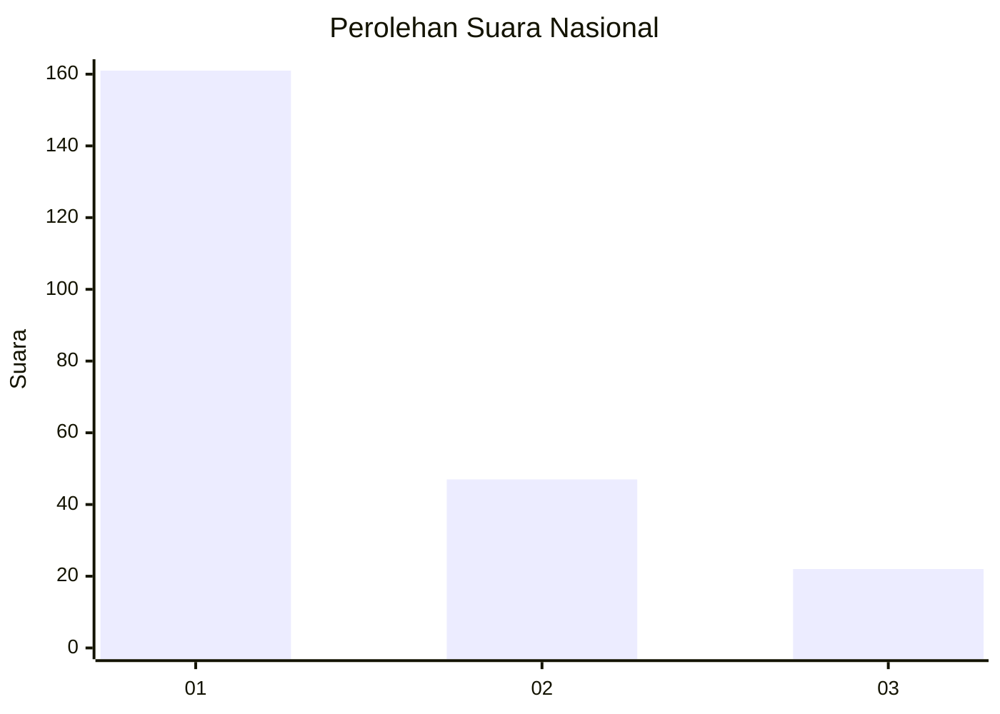
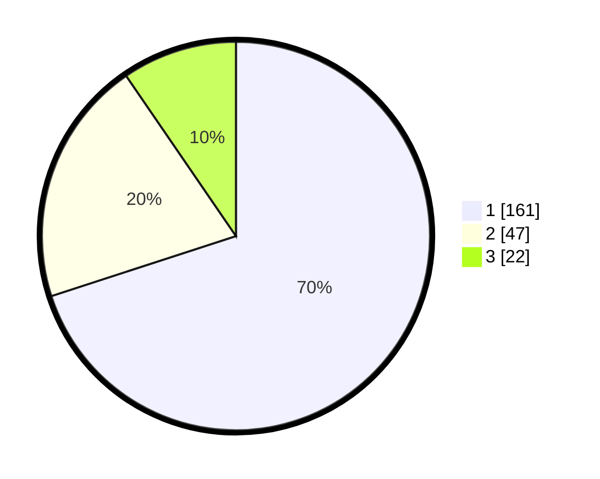

# Hasil

## Grafik

## Tabel

| No. | Nama Paslon    | Suara | Suara (raw) | Persentase |
|:--- |:-------------- | -----:| -----------:| ----------:|
| 1   | ANIES MUHAIMIN | 161   | [161][p-1]  | 70,00      |
| 2   | PRABOWO GIBRAN | 47    | [47][p-2]   | 20,43      |
| 3   | GANJAR MAHFUD  | 22    | [22][p-3]   | 9,57       |

[p-1]: https://github.com/gigit-pemilu/pemilu-2024/blob/main/pilpres/hitung-suara/sub/31-dki-jakarta/sub/74-jakarta-selatan/sub/01-tebet/sub/1004-kebon-baru/sub/090-tps/sub/paslon-1.txt
[p-2]: https://github.com/gigit-pemilu/pemilu-2024/blob/main/pilpres/hitung-suara/sub/31-dki-jakarta/sub/74-jakarta-selatan/sub/01-tebet/sub/1004-kebon-baru/sub/090-tps/sub/paslon-2.txt
[p-3]: https://github.com/gigit-pemilu/pemilu-2024/blob/main/pilpres/hitung-suara/sub/31-dki-jakarta/sub/74-jakarta-selatan/sub/01-tebet/sub/1004-kebon-baru/sub/090-tps/sub/paslon-3.txt

## Foto C Plano

https://sirekap-obj-formc.kpu.go.id/488b/pemilu/ppwp/31/74/01/10/04/3174011004090-20240214-212107--10cab712-6fbb-4ae8-ac4a-c35c4303cd93.jpg

https://sirekap-obj-formc.kpu.go.id/488b/pemilu/ppwp/31/74/01/10/04/3174011004090-20240214-155219--1b3431ca-6fbf-4037-a162-9dda7af9ab2a.jpg

https://sirekap-obj-formc.kpu.go.id/488b/pemilu/ppwp/31/74/01/10/04/3174011004090-20240214-212431--6f081699-2e34-4d52-8099-30c0ada74a3e.jpg

## Metadata

| Key        | Value               |
| ---------- | ------------------- |
| Time Stamp | 2024-02-17 19:00:04 |

