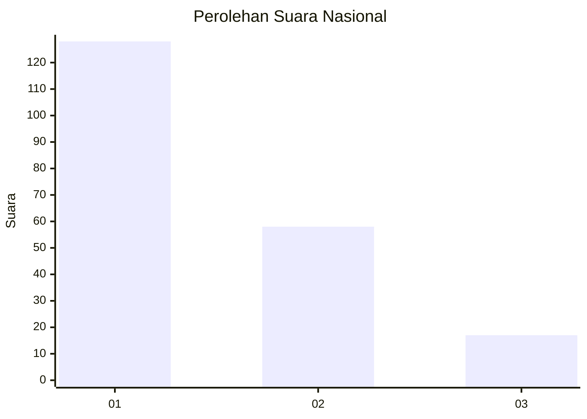
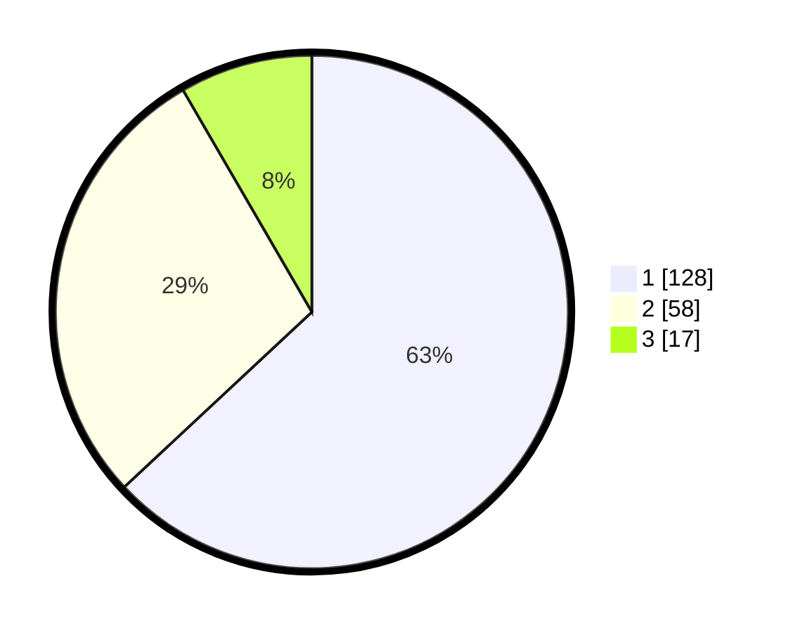

# Hasil

## Grafik

## Tabel

| No.    | Nama Paslon    | Suara | Suara (raw) | Persentase |
|:------ |:-------------- | -----:| -----------:| ----------:|
| 100025 | ANIES MUHAIMIN | 128   | [128][p-1]  | 63,05      |
| 100026 | PRABOWO GIBRAN | 58    | [58][p-2]   | 28,57      |
| 100027 | GANJAR MAHFUD  | 17    | [17][p-3]   | 8,37       |

[p-1]: https://github.com/gigit-pemilu/pemilu-2024/blob/main/pilpres/hitung-suara/sub/31-dki-jakarta/sub/74-jakarta-selatan/sub/01-tebet/sub/1004-kebon-baru/sub/110-tps/sub/paslon-1.txt
[p-2]: https://github.com/gigit-pemilu/pemilu-2024/blob/main/pilpres/hitung-suara/sub/31-dki-jakarta/sub/74-jakarta-selatan/sub/01-tebet/sub/1004-kebon-baru/sub/110-tps/sub/paslon-2.txt
[p-3]: https://github.com/gigit-pemilu/pemilu-2024/blob/main/pilpres/hitung-suara/sub/31-dki-jakarta/sub/74-jakarta-selatan/sub/01-tebet/sub/1004-kebon-baru/sub/110-tps/sub/paslon-3.txt

## Foto C Plano

https://sirekap-obj-formc.kpu.go.id/61d3/pemilu/ppwp/31/74/01/10/04/3174011004110-20240214-231041--3505f3b0-5bc9-419f-8130-1e90ded06e32.jpg

https://sirekap-obj-formc.kpu.go.id/61d3/pemilu/ppwp/31/74/01/10/04/3174011004110-20240214-231057--9173cd3b-800f-4ec8-9e31-aaf47b5bcd9e.jpg

https://sirekap-obj-formc.kpu.go.id/61d3/pemilu/ppwp/31/74/01/10/04/3174011004110-20240214-231108--f4947098-46ab-4f04-8901-210149ee6544.jpg

## Metadata

| Key        | Value               |
| ---------- | ------------------- |
| Time Stamp | 2024-02-24 22:31:28 |

