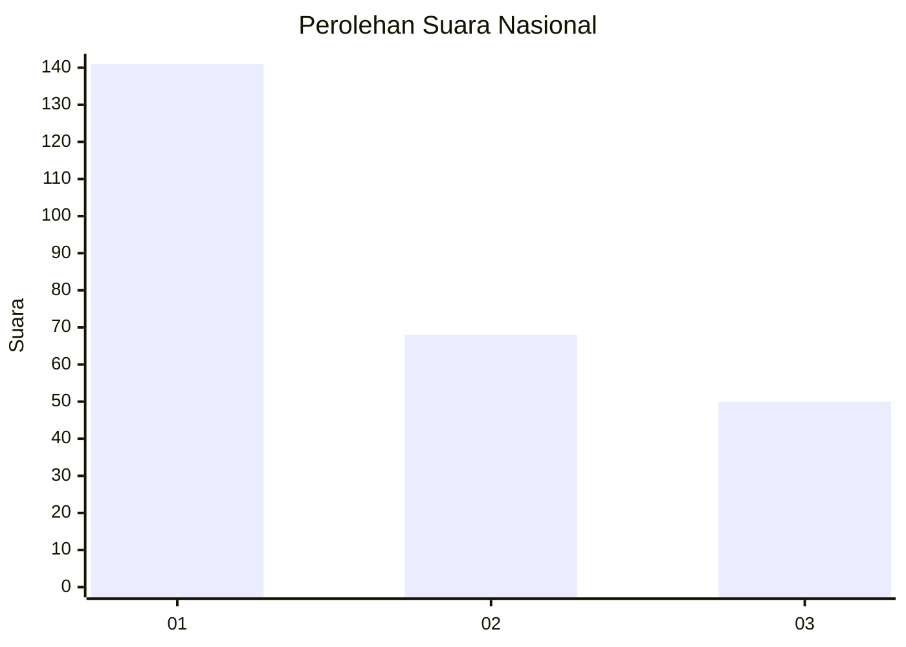
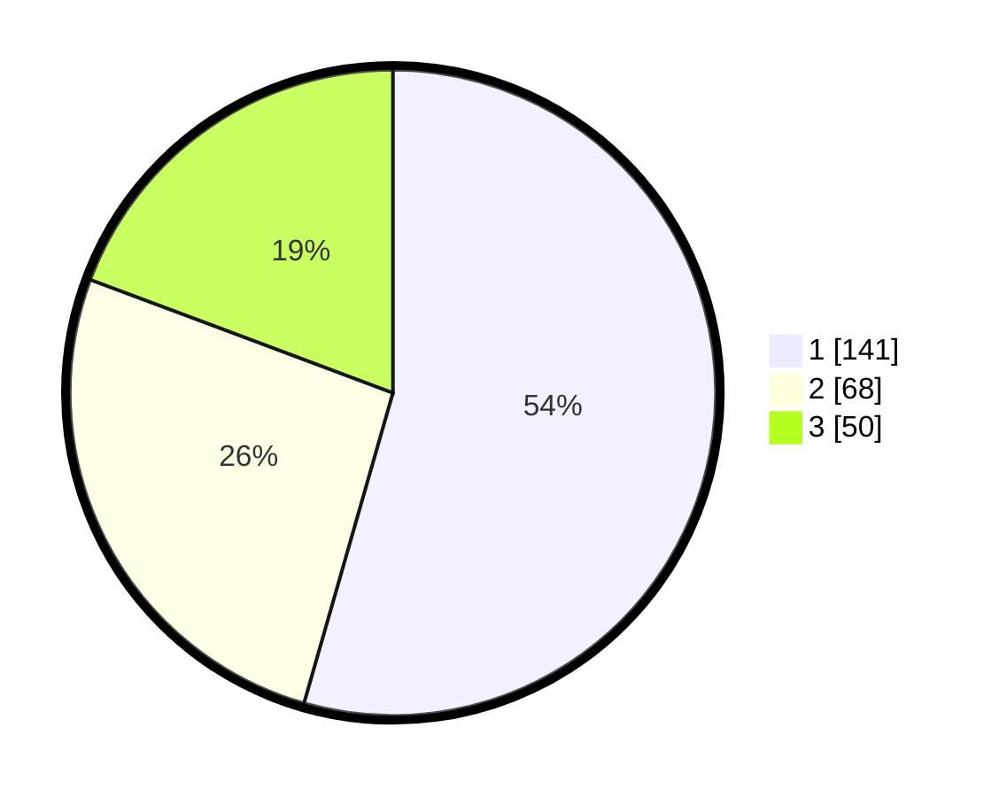

# Hasil

## Grafik

## Tabel

| No.    | Nama Paslon    | Suara | Suara (raw) | Persentase |
|:------ |:-------------- | -----:| -----------:| ----------:|
| 100025 | ANIES MUHAIMIN | 141   | [141][p-1]  | 54,44      |
| 100026 | PRABOWO GIBRAN | 68    | [68][p-2]   | 26,25      |
| 100027 | GANJAR MAHFUD  | 50    | [50][p-3]   | 19,31      |

[p-1]: https://github.com/gigit-pemilu/pemilu-2024/blob/main/pilpres/hitung-suara/sub/31-dki-jakarta/sub/74-jakarta-selatan/sub/01-tebet/sub/1004-kebon-baru/sub/115-tps/sub/paslon-1.txt
[p-2]: https://github.com/gigit-pemilu/pemilu-2024/blob/main/pilpres/hitung-suara/sub/31-dki-jakarta/sub/74-jakarta-selatan/sub/01-tebet/sub/1004-kebon-baru/sub/115-tps/sub/paslon-2.txt
[p-3]: https://github.com/gigit-pemilu/pemilu-2024/blob/main/pilpres/hitung-suara/sub/31-dki-jakarta/sub/74-jakarta-selatan/sub/01-tebet/sub/1004-kebon-baru/sub/115-tps/sub/paslon-3.txt

## Foto C Plano

https://sirekap-obj-formc.kpu.go.id/1eec/pemilu/ppwp/31/74/01/10/04/3174011004115-20240214-193017--c44958e9-ff8b-44c7-9678-0c10543c2124.jpg

https://sirekap-obj-formc.kpu.go.id/1eec/pemilu/ppwp/31/74/01/10/04/3174011004115-20240214-224751--a5953872-6775-4858-a188-0d8907fefe2d.jpg

https://sirekap-obj-formc.kpu.go.id/1eec/pemilu/ppwp/31/74/01/10/04/3174011004115-20240214-193250--507d1a5e-2b8f-48a6-9dd5-bb1b128336b1.jpg

## Metadata

| Key        | Value               |
| ---------- | ------------------- |
| Time Stamp | 2024-02-15 16:00:26 |

