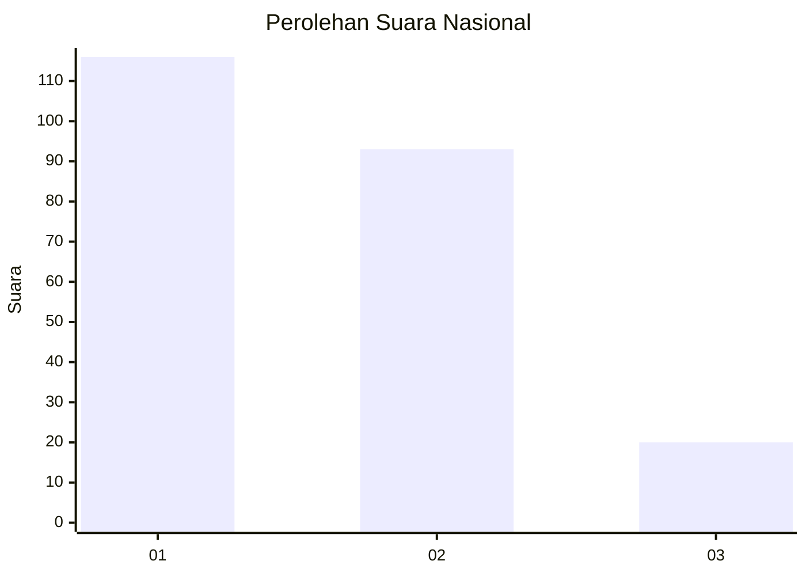
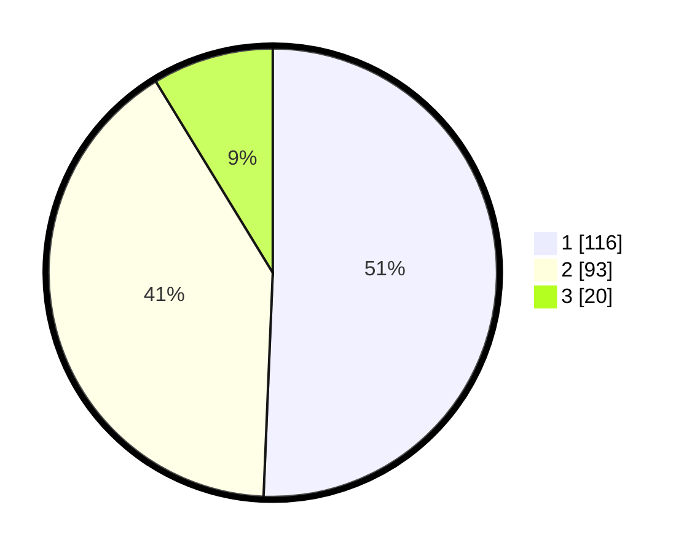

# Hasil

## Grafik

## Tabel

| No.    | Nama Paslon    | Suara | Suara (raw) | Persentase |
|:------ |:-------------- | -----:| -----------:| ----------:|
| 100025 | ANIES MUHAIMIN | 116   | [116][p-1]  | 50,66      |
| 100026 | PRABOWO GIBRAN | 93    | [93][p-2]   | 40,61      |
| 100027 | GANJAR MAHFUD  | 20    | [20][p-3]   | 8,73       |

[p-1]: https://github.com/gigit-pemilu/pemilu-2024/blob/main/pilpres/hitung-suara/sub/31-dki-jakarta/sub/74-jakarta-selatan/sub/01-tebet/sub/1005-bukit-duri/sub/002-tps/sub/paslon-1.txt
[p-2]: https://github.com/gigit-pemilu/pemilu-2024/blob/main/pilpres/hitung-suara/sub/31-dki-jakarta/sub/74-jakarta-selatan/sub/01-tebet/sub/1005-bukit-duri/sub/002-tps/sub/paslon-2.txt
[p-3]: https://github.com/gigit-pemilu/pemilu-2024/blob/main/pilpres/hitung-suara/sub/31-dki-jakarta/sub/74-jakarta-selatan/sub/01-tebet/sub/1005-bukit-duri/sub/002-tps/sub/paslon-3.txt

## Foto C Plano

https://sirekap-obj-formc.kpu.go.id/f785/pemilu/ppwp/31/74/01/10/05/3174011005002-20240215-002350--bb0d361c-04ac-4980-bd9c-98b332d7df29.jpg

https://sirekap-obj-formc.kpu.go.id/f785/pemilu/ppwp/31/74/01/10/05/3174011005002-20240215-002622--907a7fde-8374-439c-bfa4-539cb3569115.jpg

https://sirekap-obj-formc.kpu.go.id/f785/pemilu/ppwp/31/74/01/10/05/3174011005002-20240215-002513--a5331500-5908-452d-9aa4-a86ddf457d94.jpg

## Metadata

| Key        | Value               |
| ---------- | ------------------- |
| Time Stamp | 2024-02-24 22:31:28 |

