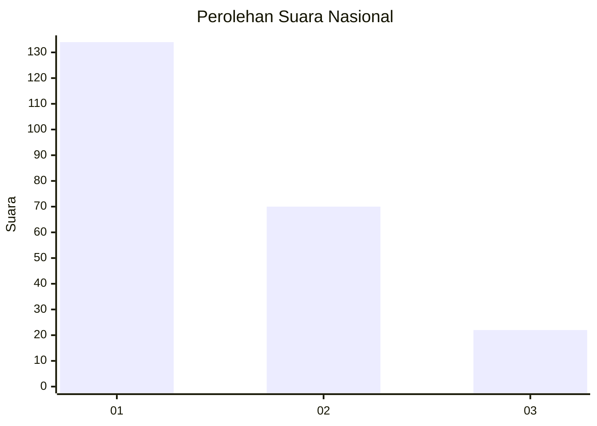
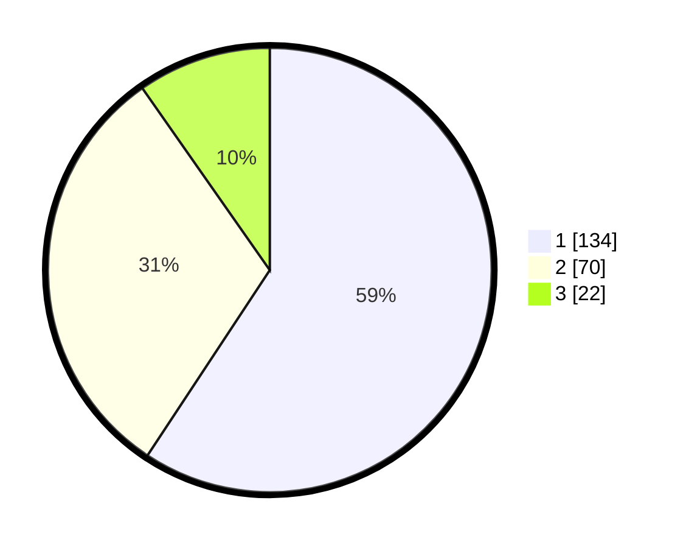

# Hasil

## Grafik

## Tabel

| No.    | Nama Paslon    | Suara | Suara (raw) | Persentase |
|:------ |:-------------- | -----:| -----------:| ----------:|
| 100025 | ANIES MUHAIMIN | 134   | [134][p-1]  | 59,29      |
| 100026 | PRABOWO GIBRAN | 70    | [70][p-2]   | 30,97      |
| 100027 | GANJAR MAHFUD  | 22    | [22][p-3]   | 9,73       |

[p-1]: https://github.com/gigit-pemilu/pemilu-2024/blob/main/pilpres/hitung-suara/sub/31-dki-jakarta/sub/74-jakarta-selatan/sub/01-tebet/sub/1005-bukit-duri/sub/003-tps/sub/paslon-1.txt
[p-2]: https://github.com/gigit-pemilu/pemilu-2024/blob/main/pilpres/hitung-suara/sub/31-dki-jakarta/sub/74-jakarta-selatan/sub/01-tebet/sub/1005-bukit-duri/sub/003-tps/sub/paslon-2.txt
[p-3]: https://github.com/gigit-pemilu/pemilu-2024/blob/main/pilpres/hitung-suara/sub/31-dki-jakarta/sub/74-jakarta-selatan/sub/01-tebet/sub/1005-bukit-duri/sub/003-tps/sub/paslon-3.txt

## Foto C Plano

https://sirekap-obj-formc.kpu.go.id/0389/pemilu/ppwp/31/74/01/10/05/3174011005003-20240214-205018--e1f7da8e-ec10-4a49-b8a2-55c84e438785.jpg

https://sirekap-obj-formc.kpu.go.id/0389/pemilu/ppwp/31/74/01/10/05/3174011005003-20240214-205036--9f352cbd-865f-46cf-836d-31db86ef03b5.jpg

https://sirekap-obj-formc.kpu.go.id/0389/pemilu/ppwp/31/74/01/10/05/3174011005003-20240214-205247--818dca1c-1b1f-4d1e-9bc8-37eebec9c325.jpg

## Metadata

| Key        | Value               |
| ---------- | ------------------- |
| Time Stamp | 2024-02-24 22:31:28 |

