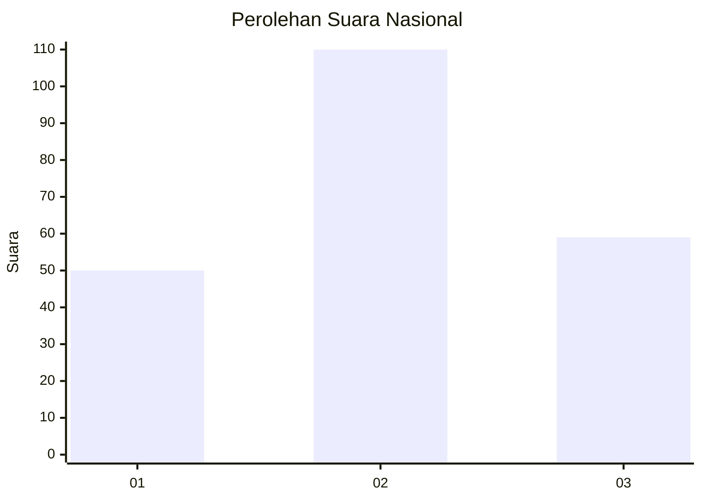
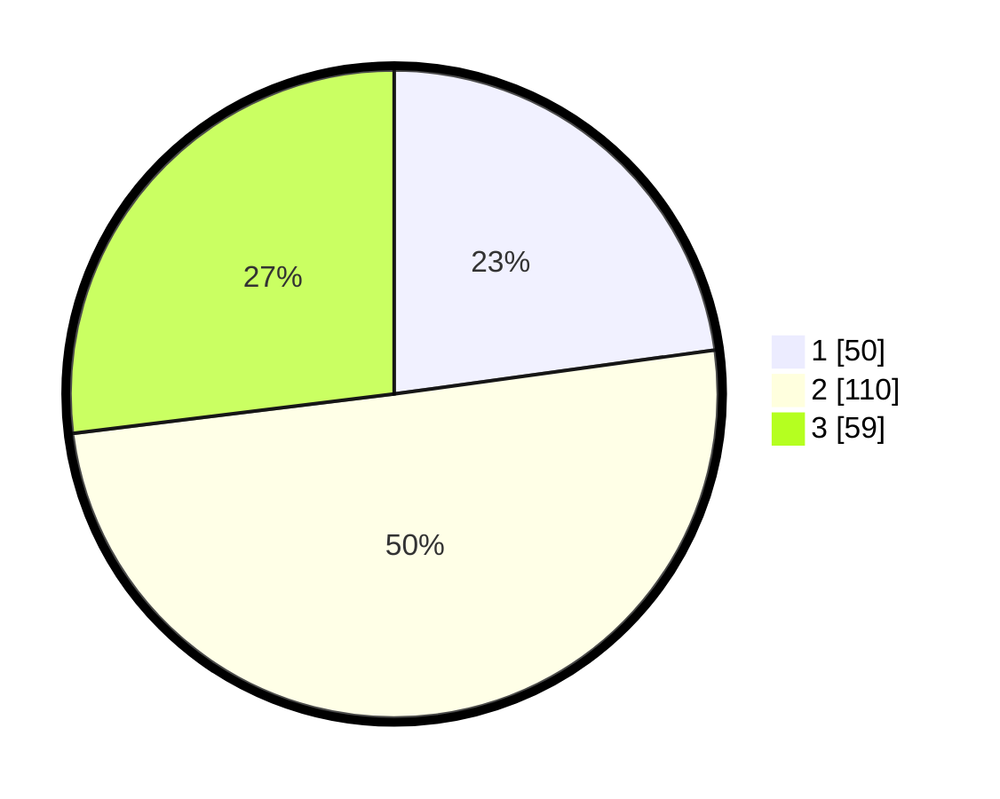

# Hasil

## Grafik

## Tabel

| No.    | Nama Paslon    | Suara | Suara (raw) | Persentase |
|:------ |:-------------- | -----:| -----------:| ----------:|
| 100025 | ANIES MUHAIMIN | 50    | [50][p-1]   | 22,83      |
| 100026 | PRABOWO GIBRAN | 110   | [110][p-2]  | 50,23      |
| 100027 | GANJAR MAHFUD  | 59    | [59][p-3]   | 26,94      |

[p-1]: https://github.com/gigit-pemilu/pemilu-2024/blob/main/pilpres/hitung-suara/sub/31-dki-jakarta/sub/74-jakarta-selatan/sub/01-tebet/sub/1005-bukit-duri/sub/008-tps/sub/paslon-1.txt
[p-2]: https://github.com/gigit-pemilu/pemilu-2024/blob/main/pilpres/hitung-suara/sub/31-dki-jakarta/sub/74-jakarta-selatan/sub/01-tebet/sub/1005-bukit-duri/sub/008-tps/sub/paslon-2.txt
[p-3]: https://github.com/gigit-pemilu/pemilu-2024/blob/main/pilpres/hitung-suara/sub/31-dki-jakarta/sub/74-jakarta-selatan/sub/01-tebet/sub/1005-bukit-duri/sub/008-tps/sub/paslon-3.txt

## Foto C Plano

https://sirekap-obj-formc.kpu.go.id/6ba3/pemilu/ppwp/31/74/01/10/05/3174011005008-20240215-003916--2e05b525-32e1-4400-99cf-acc60d45e424.jpg

https://sirekap-obj-formc.kpu.go.id/6ba3/pemilu/ppwp/31/74/01/10/05/3174011005008-20240215-004153--cd710b74-898b-4c1a-b107-4fa0f2db0f3e.jpg

https://sirekap-obj-formc.kpu.go.id/6ba3/pemilu/ppwp/31/74/01/10/05/3174011005008-20240215-004321--30566643-af0e-4898-9cfd-715540330ac4.jpg

## Metadata

| Key        | Value               |
| ---------- | ------------------- |
| Time Stamp | 2024-02-24 22:31:28 |

