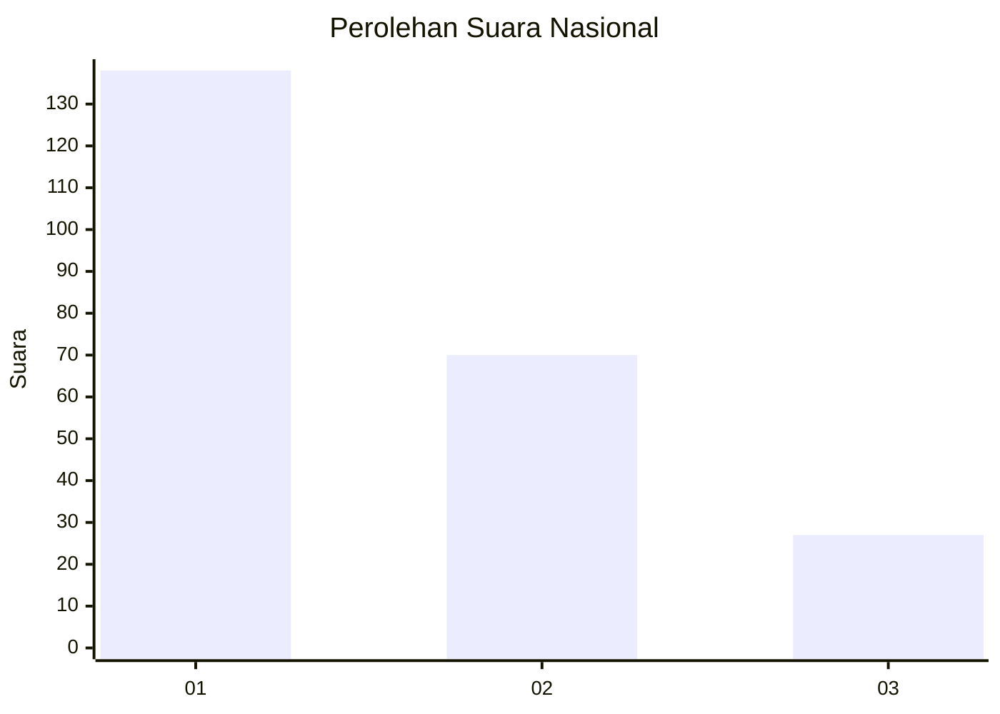
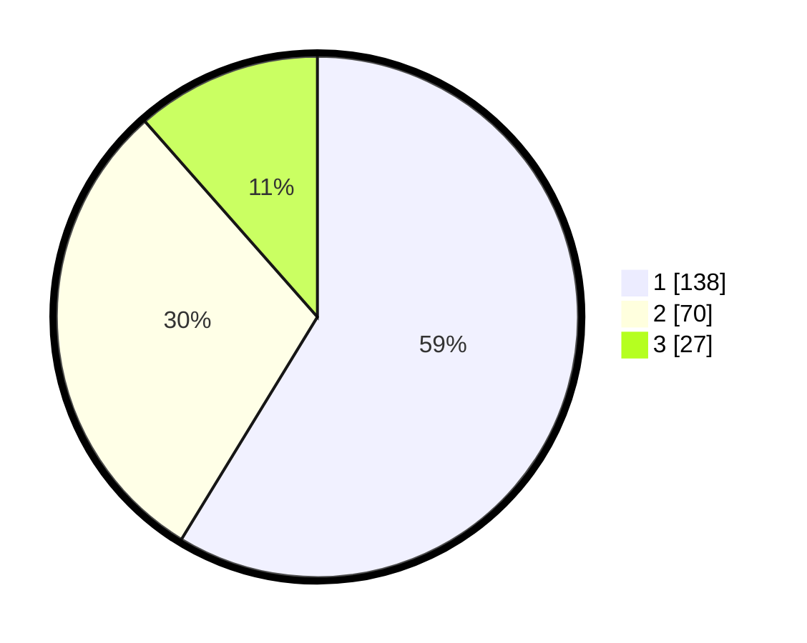

# Hasil

## Grafik

## Tabel

| No.    | Nama Paslon    | Suara | Suara (raw) | Persentase |
|:------ |:-------------- | -----:| -----------:| ----------:|
| 100025 | ANIES MUHAIMIN | 138   | [138][p-1]  | 58,72      |
| 100026 | PRABOWO GIBRAN | 70    | [70][p-2]   | 29,79      |
| 100027 | GANJAR MAHFUD  | 27    | [27][p-3]   | 11,49      |

[p-1]: https://github.com/gigit-pemilu/pemilu-2024/blob/main/pilpres/hitung-suara/sub/31-dki-jakarta/sub/74-jakarta-selatan/sub/01-tebet/sub/1005-bukit-duri/sub/013-tps/sub/paslon-1.txt
[p-2]: https://github.com/gigit-pemilu/pemilu-2024/blob/main/pilpres/hitung-suara/sub/31-dki-jakarta/sub/74-jakarta-selatan/sub/01-tebet/sub/1005-bukit-duri/sub/013-tps/sub/paslon-2.txt
[p-3]: https://github.com/gigit-pemilu/pemilu-2024/blob/main/pilpres/hitung-suara/sub/31-dki-jakarta/sub/74-jakarta-selatan/sub/01-tebet/sub/1005-bukit-duri/sub/013-tps/sub/paslon-3.txt

## Foto C Plano

https://sirekap-obj-formc.kpu.go.id/fc8e/pemilu/ppwp/31/74/01/10/05/3174011005013-20240214-203505--0261d26a-a74e-41e3-a1ac-7af93d8f30c3.jpg

https://sirekap-obj-formc.kpu.go.id/fc8e/pemilu/ppwp/31/74/01/10/05/3174011005013-20240214-203834--0dabddd6-9374-4cfe-a410-ae3d491e8b53.jpg

https://sirekap-obj-formc.kpu.go.id/fc8e/pemilu/ppwp/31/74/01/10/05/3174011005013-20240214-195739--46783695-28fc-426c-8a87-67fd6092c66e.jpg

## Metadata

| Key        | Value               |
| ---------- | ------------------- |
| Time Stamp | 2024-02-24 22:31:28 |

