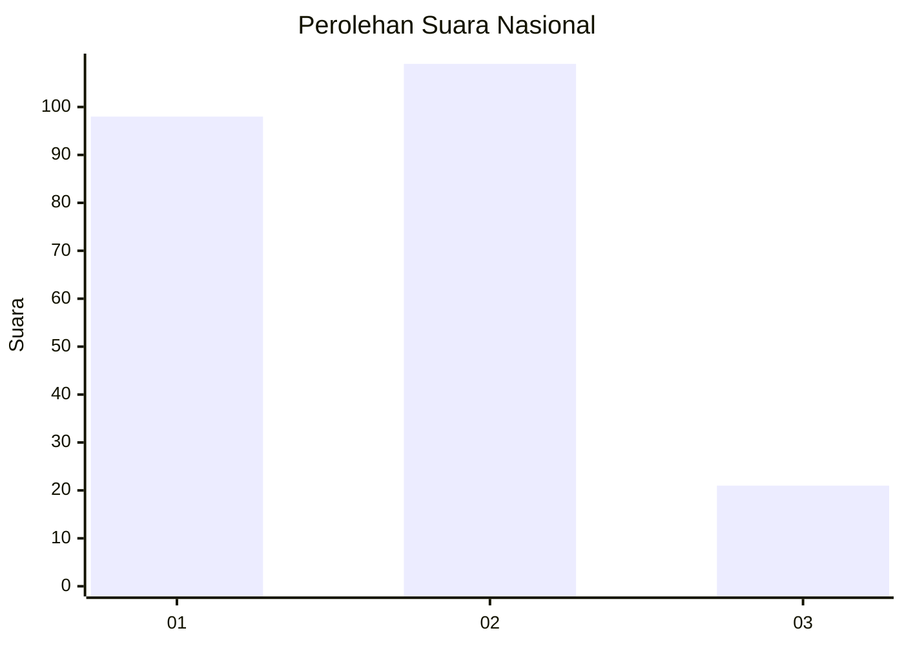
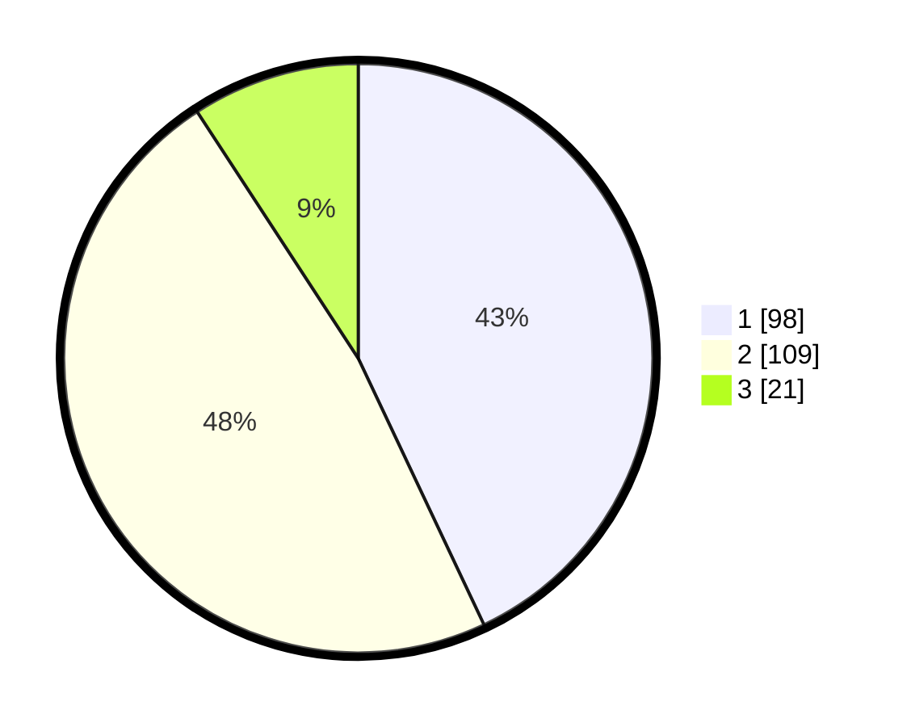

# Hasil

## Grafik

## Tabel

| No.    | Nama Paslon    | Suara | Suara (raw) | Persentase |
|:------ |:-------------- | -----:| -----------:| ----------:|
| 100025 | ANIES MUHAIMIN | 98    | [98][p-1]   | 42,98      |
| 100026 | PRABOWO GIBRAN | 109   | [109][p-2]  | 47,81      |
| 100027 | GANJAR MAHFUD  | 21    | [21][p-3]   | 9,21       |

[p-1]: https://github.com/gigit-pemilu/pemilu-2024/blob/main/pilpres/hitung-suara/sub/31-dki-jakarta/sub/74-jakarta-selatan/sub/01-tebet/sub/1005-bukit-duri/sub/021-tps/sub/paslon-1.txt
[p-2]: https://github.com/gigit-pemilu/pemilu-2024/blob/main/pilpres/hitung-suara/sub/31-dki-jakarta/sub/74-jakarta-selatan/sub/01-tebet/sub/1005-bukit-duri/sub/021-tps/sub/paslon-2.txt
[p-3]: https://github.com/gigit-pemilu/pemilu-2024/blob/main/pilpres/hitung-suara/sub/31-dki-jakarta/sub/74-jakarta-selatan/sub/01-tebet/sub/1005-bukit-duri/sub/021-tps/sub/paslon-3.txt

## Foto C Plano

https://sirekap-obj-formc.kpu.go.id/0341/pemilu/ppwp/31/74/01/10/05/3174011005021-20240217-092830--ce831a92-af29-4ad4-be29-6377c0ce7a50.jpg

https://sirekap-obj-formc.kpu.go.id/0341/pemilu/ppwp/31/74/01/10/05/3174011005021-20240217-091236--e36e9455-636d-4b75-af0b-7e3b9300f530.jpg

https://sirekap-obj-formc.kpu.go.id/0341/pemilu/ppwp/31/74/01/10/05/3174011005021-20240217-091413--ddd13b66-821c-4929-801f-18e1b86121d9.jpg

## Metadata

| Key        | Value               |
| ---------- | ------------------- |
| Time Stamp | 2024-02-28 10:00:00 |

