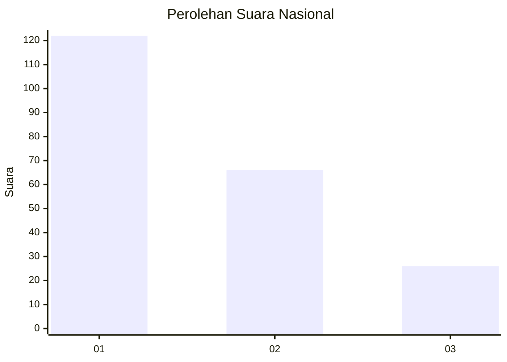
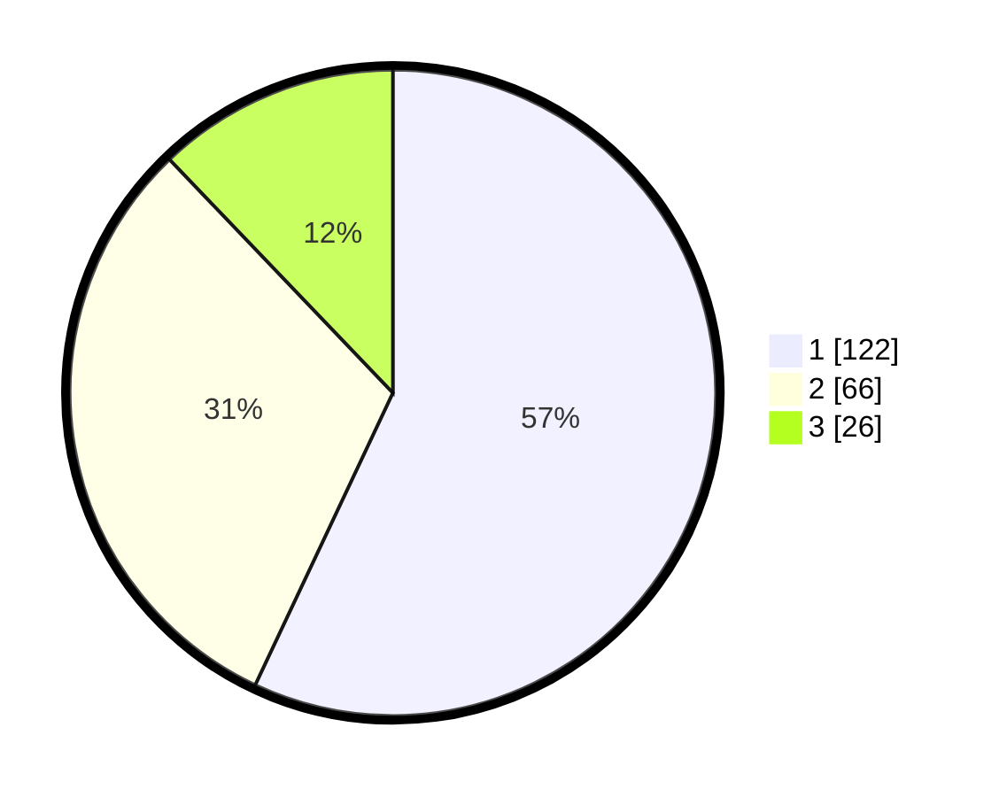

# Hasil

## Grafik

## Tabel

| No.    | Nama Paslon    | Suara | Suara (raw) | Persentase |
|:------ |:-------------- | -----:| -----------:| ----------:|
| 100025 | ANIES MUHAIMIN | 122   | [122][p-1]  | 57,01      |
| 100026 | PRABOWO GIBRAN | 66    | [66][p-2]   | 30,84      |
| 100027 | GANJAR MAHFUD  | 26    | [26][p-3]   | 12,15      |

[p-1]: https://github.com/gigit-pemilu/pemilu-2024/blob/main/pilpres/hitung-suara/sub/31-dki-jakarta/sub/74-jakarta-selatan/sub/01-tebet/sub/1005-bukit-duri/sub/053-tps/sub/paslon-1.txt
[p-2]: https://github.com/gigit-pemilu/pemilu-2024/blob/main/pilpres/hitung-suara/sub/31-dki-jakarta/sub/74-jakarta-selatan/sub/01-tebet/sub/1005-bukit-duri/sub/053-tps/sub/paslon-2.txt
[p-3]: https://github.com/gigit-pemilu/pemilu-2024/blob/main/pilpres/hitung-suara/sub/31-dki-jakarta/sub/74-jakarta-selatan/sub/01-tebet/sub/1005-bukit-duri/sub/053-tps/sub/paslon-3.txt

## Foto C Plano

https://sirekap-obj-formc.kpu.go.id/b1ad/pemilu/ppwp/31/74/01/10/05/3174011005053-20240214-222747--dfe70b0d-f865-45c9-ab8d-225465d30c14.jpg

https://sirekap-obj-formc.kpu.go.id/b1ad/pemilu/ppwp/31/74/01/10/05/3174011005053-20240214-222812--115e52de-9cf6-4a3a-b2ee-e74f3887b3e6.jpg

https://sirekap-obj-formc.kpu.go.id/b1ad/pemilu/ppwp/31/74/01/10/05/3174011005053-20240214-222838--676c75b8-b330-44d2-9340-de602f59a91b.jpg

## Metadata

| Key        | Value               |
| ---------- | ------------------- |
| Time Stamp | 2024-02-25 11:00:00 |

