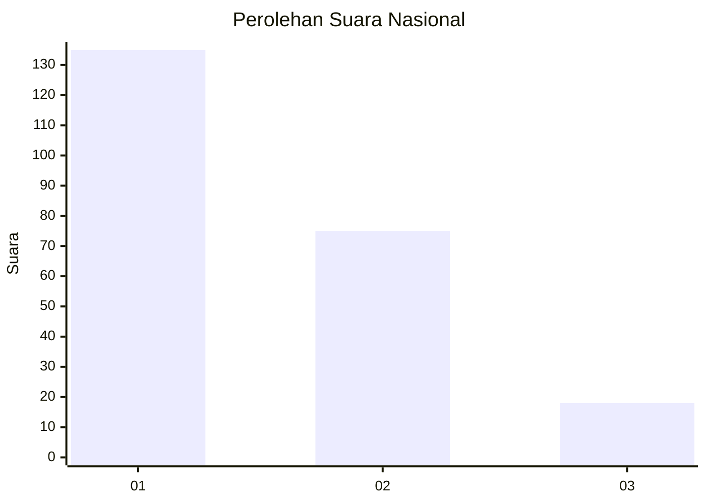
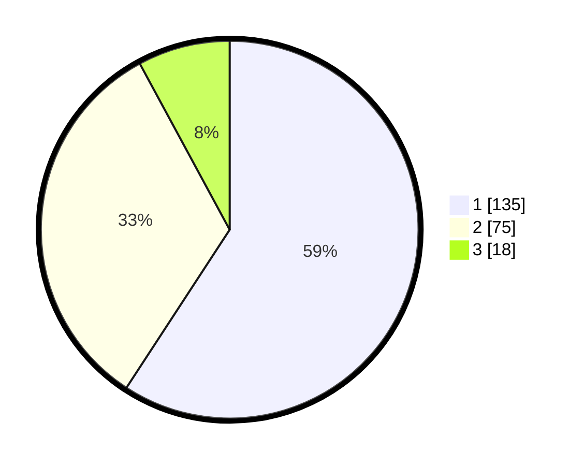

# Hasil

## Grafik

## Tabel

| No.    | Nama Paslon    | Suara | Suara (raw) | Persentase |
|:------ |:-------------- | -----:| -----------:| ----------:|
| 100025 | ANIES MUHAIMIN | 135   | [135][p-1]  | 59,21      |
| 100026 | PRABOWO GIBRAN | 75    | [75][p-2]   | 32,89      |
| 100027 | GANJAR MAHFUD  | 18    | [18][p-3]   | 7,89       |

[p-1]: https://github.com/gigit-pemilu/pemilu-2024/blob/main/pilpres/hitung-suara/sub/31-dki-jakarta/sub/74-jakarta-selatan/sub/01-tebet/sub/1005-bukit-duri/sub/056-tps/sub/paslon-1.txt
[p-2]: https://github.com/gigit-pemilu/pemilu-2024/blob/main/pilpres/hitung-suara/sub/31-dki-jakarta/sub/74-jakarta-selatan/sub/01-tebet/sub/1005-bukit-duri/sub/056-tps/sub/paslon-2.txt
[p-3]: https://github.com/gigit-pemilu/pemilu-2024/blob/main/pilpres/hitung-suara/sub/31-dki-jakarta/sub/74-jakarta-selatan/sub/01-tebet/sub/1005-bukit-duri/sub/056-tps/sub/paslon-3.txt

## Foto C Plano

https://sirekap-obj-formc.kpu.go.id/2adc/pemilu/ppwp/31/74/01/10/05/3174011005056-20240215-193039--76894d6d-88c9-47df-b931-2ab2d9285d77.jpg

https://sirekap-obj-formc.kpu.go.id/2adc/pemilu/ppwp/31/74/01/10/05/3174011005056-20240215-193056--8e912785-d032-400e-bd8b-294e0cdcc1a1.jpg

https://sirekap-obj-formc.kpu.go.id/2adc/pemilu/ppwp/31/74/01/10/05/3174011005056-20240215-193102--048cd866-9765-4886-86c7-82f73b8e461a.jpg

## Metadata

| Key        | Value               |
| ---------- | ------------------- |
| Time Stamp | 2024-02-24 22:31:28 |

