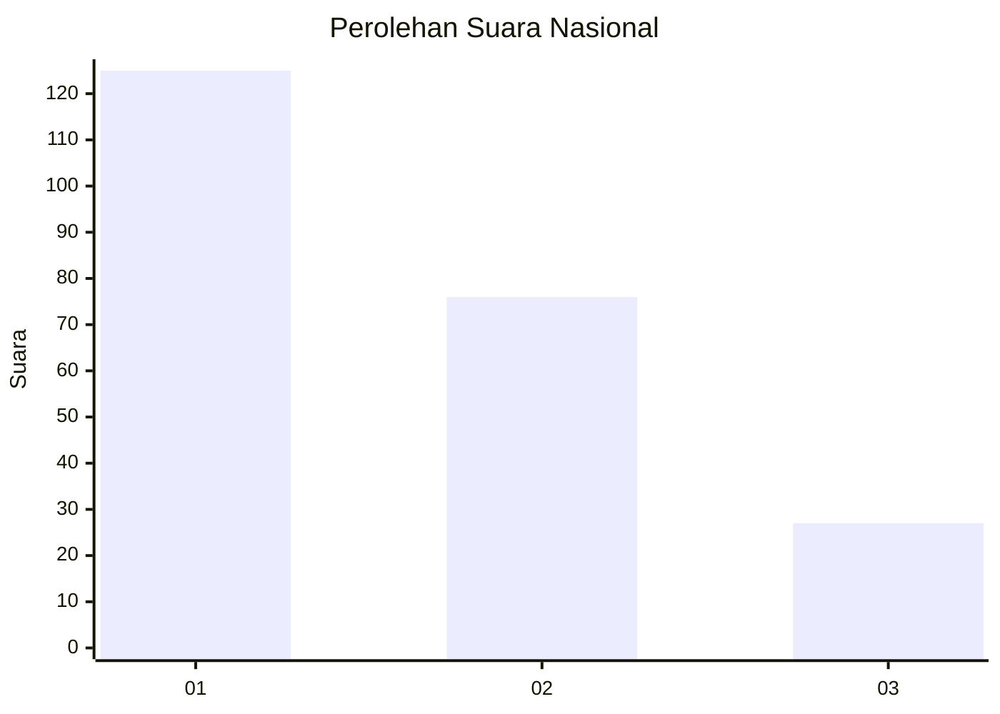
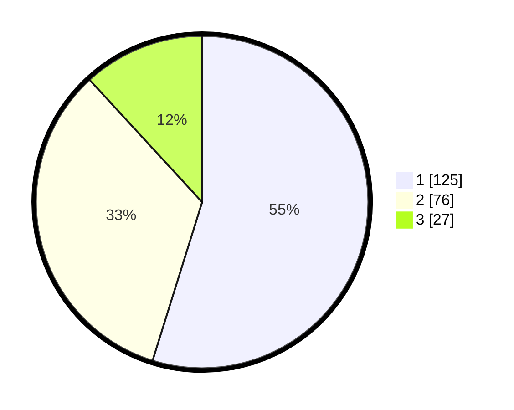

# Hasil

## Grafik

## Tabel

| No.    | Nama Paslon    | Suara | Suara (raw) | Persentase |
|:------ |:-------------- | -----:| -----------:| ----------:|
| 100025 | ANIES MUHAIMIN | 125   | [125][p-1]  | 54,82      |
| 100026 | PRABOWO GIBRAN | 76    | [76][p-2]   | 33,33      |
| 100027 | GANJAR MAHFUD  | 27    | [27][p-3]   | 11,84      |

[p-1]: https://github.com/gigit-pemilu/pemilu-2024/blob/main/pilpres/hitung-suara/sub/31-dki-jakarta/sub/74-jakarta-selatan/sub/01-tebet/sub/1005-bukit-duri/sub/067-tps/sub/paslon-1.txt
[p-2]: https://github.com/gigit-pemilu/pemilu-2024/blob/main/pilpres/hitung-suara/sub/31-dki-jakarta/sub/74-jakarta-selatan/sub/01-tebet/sub/1005-bukit-duri/sub/067-tps/sub/paslon-2.txt
[p-3]: https://github.com/gigit-pemilu/pemilu-2024/blob/main/pilpres/hitung-suara/sub/31-dki-jakarta/sub/74-jakarta-selatan/sub/01-tebet/sub/1005-bukit-duri/sub/067-tps/sub/paslon-3.txt

## Foto C Plano

https://sirekap-obj-formc.kpu.go.id/cfe2/pemilu/ppwp/31/74/01/10/05/3174011005067-20240215-011121--de12166d-28de-48d2-b3a4-f7b5a94fdcfa.jpg

https://sirekap-obj-formc.kpu.go.id/cfe2/pemilu/ppwp/31/74/01/10/05/3174011005067-20240215-011223--ec11c7e7-3abc-4b1c-a5fb-87175d330faa.jpg

https://sirekap-obj-formc.kpu.go.id/cfe2/pemilu/ppwp/31/74/01/10/05/3174011005067-20240215-011430--4d3c2e6e-1fa2-4d16-97dd-3ce387dc22ee.jpg

## Metadata

| Key        | Value               |
| ---------- | ------------------- |
| Time Stamp | 2024-02-24 22:31:28 |

