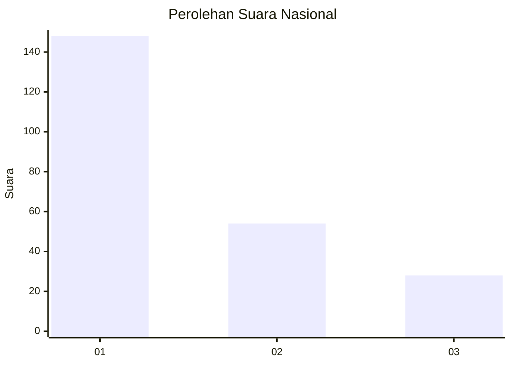
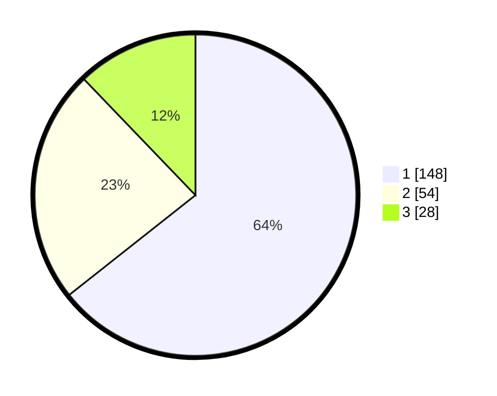

# Hasil

## Grafik

## Tabel

| No. | Nama Paslon    | Suara | Suara (raw) | Persentase |
|:--- |:-------------- | -----:| -----------:| ----------:|
| 1   | ANIES MUHAIMIN | 148   | [148][p-1]  | 64,35      |
| 2   | PRABOWO GIBRAN | 54    | [54][p-2]   | 23,48      |
| 3   | GANJAR MAHFUD  | 28    | [28][p-3]   | 12,17      |

[p-1]: https://github.com/gigit-pemilu/pemilu-2024/blob/main/pilpres/hitung-suara/sub/31-dki-jakarta/sub/74-jakarta-selatan/sub/01-tebet/sub/1005-bukit-duri/sub/069-tps/sub/paslon-1.txt
[p-2]: https://github.com/gigit-pemilu/pemilu-2024/blob/main/pilpres/hitung-suara/sub/31-dki-jakarta/sub/74-jakarta-selatan/sub/01-tebet/sub/1005-bukit-duri/sub/069-tps/sub/paslon-2.txt
[p-3]: https://github.com/gigit-pemilu/pemilu-2024/blob/main/pilpres/hitung-suara/sub/31-dki-jakarta/sub/74-jakarta-selatan/sub/01-tebet/sub/1005-bukit-duri/sub/069-tps/sub/paslon-3.txt

## Foto C Plano

https://sirekap-obj-formc.kpu.go.id/3857/pemilu/ppwp/31/74/01/10/05/3174011005069-20240214-155732--96188e4e-1c5b-4b12-93ff-79dcbf45b41d.jpg

https://sirekap-obj-formc.kpu.go.id/3857/pemilu/ppwp/31/74/01/10/05/3174011005069-20240214-155754--b93c1586-ac5d-47a7-bf94-9355872aafaa.jpg

https://sirekap-obj-formc.kpu.go.id/3857/pemilu/ppwp/31/74/01/10/05/3174011005069-20240214-155809--6181ea7b-4d59-4a00-aeef-0eaf8f317edd.jpg

## Metadata

| Key        | Value               |
| ---------- | ------------------- |
| Time Stamp | 2024-02-15 16:30:25 |

