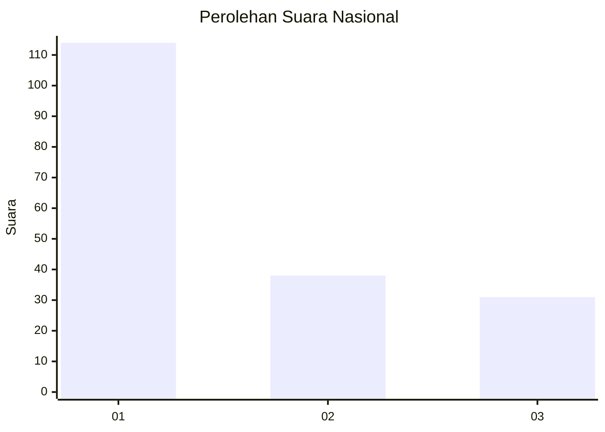
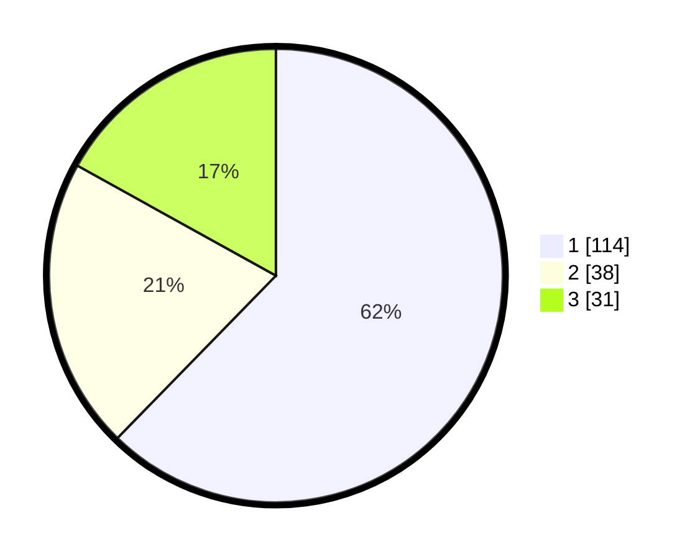

# Hasil

## Grafik

## Tabel

| No.    | Nama Paslon    | Suara | Suara (raw) | Persentase |
|:------ |:-------------- | -----:| -----------:| ----------:|
| 100025 | ANIES MUHAIMIN | 114   | [114][p-1]  | 62,30      |
| 100026 | PRABOWO GIBRAN | 38    | [38][p-2]   | 20,77      |
| 100027 | GANJAR MAHFUD  | 31    | [31][p-3]   | 16,94      |

[p-1]: https://github.com/gigit-pemilu/pemilu-2024/blob/main/pilpres/hitung-suara/sub/31-dki-jakarta/sub/74-jakarta-selatan/sub/01-tebet/sub/1005-bukit-duri/sub/077-tps/sub/paslon-1.txt
[p-2]: https://github.com/gigit-pemilu/pemilu-2024/blob/main/pilpres/hitung-suara/sub/31-dki-jakarta/sub/74-jakarta-selatan/sub/01-tebet/sub/1005-bukit-duri/sub/077-tps/sub/paslon-2.txt
[p-3]: https://github.com/gigit-pemilu/pemilu-2024/blob/main/pilpres/hitung-suara/sub/31-dki-jakarta/sub/74-jakarta-selatan/sub/01-tebet/sub/1005-bukit-duri/sub/077-tps/sub/paslon-3.txt

## Foto C Plano

https://sirekap-obj-formc.kpu.go.id/d291/pemilu/ppwp/31/74/01/10/05/3174011005077-20240214-202546--b5bdc744-3158-4296-b288-d8572f58075e.jpg

https://sirekap-obj-formc.kpu.go.id/d291/pemilu/ppwp/31/74/01/10/05/3174011005077-20240214-194230--38224b29-1cd8-4e29-905b-68ed4b89932e.jpg

https://sirekap-obj-formc.kpu.go.id/d291/pemilu/ppwp/31/74/01/10/05/3174011005077-20240214-202924--20bf7d46-b22e-4f2a-84c8-9bd22eaf3419.jpg

## Metadata

| Key        | Value               |
| ---------- | ------------------- |
| Time Stamp | 2024-02-14 21:46:01 |

