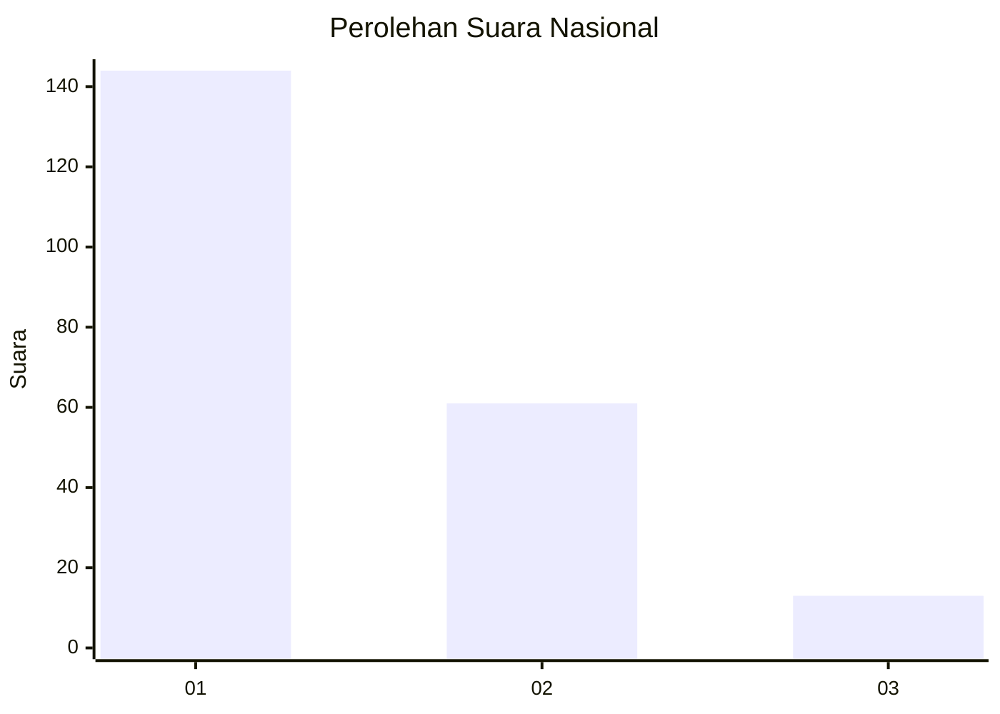
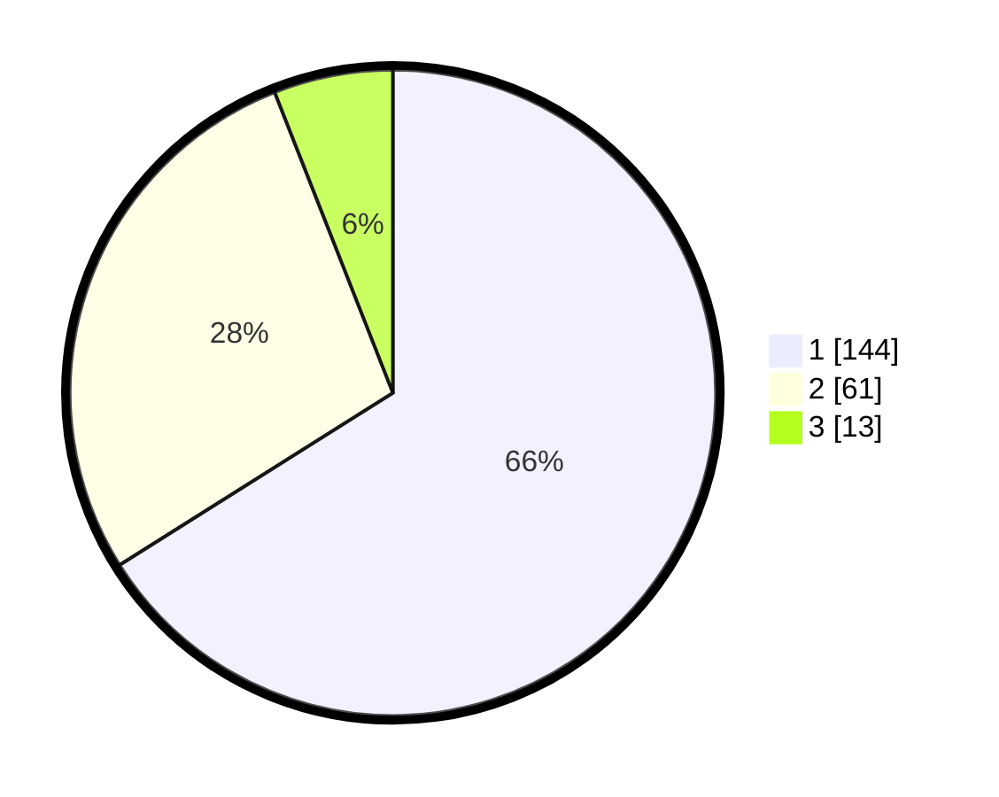

# Hasil

## Grafik

## Tabel

| No.    | Nama Paslon    | Suara | Suara (raw) | Persentase |
|:------ |:-------------- | -----:| -----------:| ----------:|
| 100025 | ANIES MUHAIMIN | 144   | [144][p-1]  | 66,06      |
| 100026 | PRABOWO GIBRAN | 61    | [61][p-2]   | 27,98      |
| 100027 | GANJAR MAHFUD  | 13    | [13][p-3]   | 5,96       |

[p-1]: https://github.com/gigit-pemilu/pemilu-2024/blob/main/pilpres/hitung-suara/sub/31-dki-jakarta/sub/74-jakarta-selatan/sub/01-tebet/sub/1005-bukit-duri/sub/079-tps/sub/paslon-1.txt
[p-2]: https://github.com/gigit-pemilu/pemilu-2024/blob/main/pilpres/hitung-suara/sub/31-dki-jakarta/sub/74-jakarta-selatan/sub/01-tebet/sub/1005-bukit-duri/sub/079-tps/sub/paslon-2.txt
[p-3]: https://github.com/gigit-pemilu/pemilu-2024/blob/main/pilpres/hitung-suara/sub/31-dki-jakarta/sub/74-jakarta-selatan/sub/01-tebet/sub/1005-bukit-duri/sub/079-tps/sub/paslon-3.txt

## Foto C Plano

https://sirekap-obj-formc.kpu.go.id/8cc8/pemilu/ppwp/31/74/01/10/05/3174011005079-20240214-160140--bbe97339-2281-4efc-8263-013b885f837c.jpg

https://sirekap-obj-formc.kpu.go.id/8cc8/pemilu/ppwp/31/74/01/10/05/3174011005079-20240214-155342--43ca1a98-3fc3-4ca6-8eaf-01017f3bc5b6.jpg

https://sirekap-obj-formc.kpu.go.id/8cc8/pemilu/ppwp/31/74/01/10/05/3174011005079-20240214-155422--cb90c245-945c-49a6-84a3-b0cf5c70e652.jpg

## Metadata

| Key        | Value               |
| ---------- | ------------------- |
| Time Stamp | 2024-02-25 19:00:00 |

